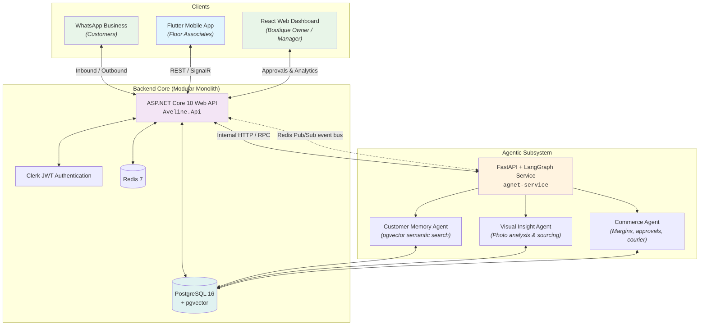

# Aveline — Boutique Concierge AI

[](https://github.com/KavinduNirmal/aveline/actions/workflows/ci.yml)
[](https://dotnet.microsoft.com/)
[](https://www.python.org/)
[-02569B?logo=flutter)](https://flutter.dev/)
[](https://langchain-ai.github.io/langgraph/)
[](https://github.com/pgvector/pgvector)
[](https://bun.sh/)

**Aveline (Boutique Concierge AI)** is a full-stack, multi-agent commerce and concierge platform designed for semi-luxury boutiques in Sri Lanka. It automates personalized customer relationship management, catalog visual intelligence, margin optimization, and human-in-the-loop approval workflows across WhatsApp, mobile floor associates, and boutique owners.

---

> [!TIP]
> **New to the project?** Head over to [GET_STARTED.md](GET_STARTED.md) for step-by-step developer environment setup, prerequisite installation, agent skills integration, and local development instructions.

---

## System Architecture

Aveline follows a **Modular Monolith** architecture pattern with an internal agentic AI subsystem:



### End-to-End Assured Workflow
1. **WhatsApp Inbound**: A customer inquires about availability or style recommendations via WhatsApp.
2. **Backend Ingestion**: ASP.NET Core captures the interaction and triggers the Python LangGraph workflow.
3. **Multi-Agent Orchestration**:
   - **Customer Memory Agent**: Parses intent, matches identity, and performs pgvector semantic memory retrieval.
   - **Visual Insight Agent**: Searches inventory or identifies supplier sourcing matches.
   - **Commerce Agent**: Evaluates margin thresholds and loyalty rules, triggering a **Human-in-the-Loop** interrupt when thresholds are exceeded.
4. **Owner Review & Resumption**: The boutique owner reviews pending approvals on the React Web Dashboard. Upon approval, LangGraph resumes from its checkpoint.
5. **Associate Notification**: Outbound updates are dispatched to the customer and the Flutter associate app.

---

## The Three Vertical Slices

| Slice | Domain & Ownership | Key Responsibilities | Core Entities |
|---|---|---|---|
| **Slice 1: Customer Concierge & Memory** | Customer relationships, messaging & preferences *(Student 1)* | WhatsApp webhook handling, customer profile management, semantic memory search via pgvector, interaction brief generation. | `Customers`, `CustomerPreferences`, `CustomerEvents`, `CustomerMemory`, `CustomerInteractions` |
| **Slice 2: Visual Intelligence & Sourcing** | Inventory, visual analysis & sourcing *(Student 2)* | Product image attribute extraction, customer-to-item matching, outfit composition, sourcing requests, supplier catalogs. | `InventoryItems`, `InventoryImages`, `OutfitCompositions`, `SourcingRequests`, `Suppliers`, `CustomerMatches` |
| **Slice 3: Commerce Validation & Optimization** | Pricing, payments, approvals & delivery *(Student 3)* | Margin calculation, dynamic business rules, payment link generation, approval queue state machine, delivery planning. | `Orders`, `OrderItems`, `Payments`, `ApprovalQueue`, `DeliveryPlans`, `BusinessRules` |

These three are the graded vertical slices. `Aveline.Api/Modules/` also carries the platform
modules they build on — `Admin`, `Analytics`, `ApiAccess`, `Attendance`, `Audit`, `Billing`,
`Conversations` (the Salon), `Handbook`, `Home`, `Integrations`, `Media`, `Notifications`,
`Organizations`, `Revenue`, `Statistics`, `SystemHealth`, and `Shared`.

---

## Technology Stack

| Layer | Technology | Purpose |
|---|---|---|
| **Public Backend** | ASP.NET Core 10 (C#) | Modular Monolith API, business validation, data persistence, integrations |
| **Agentic AI Subsystem** | Python 3.12 + FastAPI + LangGraph | Multi-agent orchestration, stateful graph execution, human-in-the-loop pauses |
| **Database** | PostgreSQL 16 + `pgvector` | Relational business data + vector embeddings for semantic memory |
| **Cache** | Redis 7 | High-performance session & query caching + Pub/Sub event bus (ADR-014) |
| **Mobile App** | Flutter (Dart SDK 3.13+) | Boutique floor associate mobile interface (Clean Architecture) |
| **Web App** | React 19 / Vite 8 + TypeScript (`@clerk/react`, React Router, Tailwind CSS) | Public landing page and product documentation, the boutique owner/manager dashboard, and the administrator console |
| **Authentication** | Clerk | Unified JWT authentication & role-based authorization |
| **Realtime** | ASP.NET Core SignalR | Live conversation and notification delivery to both clients (ADR-018) |
| **Media & Vision** | Cloudinary + an OpenAI-compatible vision provider | Catalog and attachment byte storage, signed read URLs, image attribute extraction (ADR-020, ADR-022) |
| **Notifications** | Firebase Cloud Messaging, email, SignalR | Multi-channel notification gateway (ADR-013) |
| **Observability** | OpenTelemetry → Prometheus, Grafana, Jaeger | Traces, metrics, dashboards, and the API's `/metrics` endpoint |
| **Package Management** | Bun | Fast package execution and deterministic lockfile management (`bun.lock`) |
| **CI/CD** | GitHub Actions | Automated multi-project compilation, linting, analysis, and quality gates |

---

## Repository Structure

```
aveline/
├── Aveline.Api/                 # ASP.NET Core 10 Web API (Modular Monolith)
│   ├── Endpoints/               # Minimal-API endpoint groups (auth, catalog, media, webhooks, …)
│   ├── Modules/                 # One folder per vertical slice / platform module
│   │   ├── CustomerConcierge/   # Slice 1: customers, preferences, memory, interactions
│   │   ├── VisualIntelligence/  # Slice 2: inventory, images, outfits, sourcing, suppliers
│   │   ├── Commerce/            # Slice 3: orders, payments, approvals, delivery, business rules
│   │   ├── Conversations/       # The Salon inbox, attachments, and the conversation hub
│   │   ├── Notifications/       # Push (FCM), email, and realtime channels
│   │   ├── Handbook/            # Knowledge-base ingestion and search
│   │   ├── Admin/ Billing/ Revenue/ Statistics/ Analytics/ …   # Platform modules
│   │   └── Shared/
│   ├── Common/                  # Shared exceptions, extensions, middleware
│   ├── Configurations/          # Auth, authorization, CORS, logging, observability wiring
│   ├── Infrastructure/          # AppDbContext, pgvector config, event bus, external clients
│   └── Migrations/              # EF Core migrations
├── Aveline.Api.Tests/           # xUnit suite for the API (unit + integration)
├── agnet-service/               # Python 3.12 Agent Service (FastAPI + LangGraph)
│   ├── app/
│   │   ├── agents/              # customer_memory, visual_insight, and commerce agents
│   │   ├── api/                 # Internal HTTP surface (agents, health)
│   │   ├── tools/               # Allow-listed agent tools (DB queries, calculators, APIs)
│   │   ├── workflows/           # LangGraph orchestration, checkpointer, state events
│   │   ├── handbook/            # Knowledge-base store, chunking, and retrieval
│   │   ├── schemas/             # Pydantic input/output contracts
│   │   ├── db/                  # Async SQLAlchemy & pgvector similarity search
│   │   ├── events/              # Redis Pub/Sub event bus
│   │   ├── llm/ context/ core/  # Model access, conversation context, settings
│   │   └── observability/       # OpenTelemetry traces, metrics, telemetry
│   └── tests/                   # Agent graph and tool unit tests
├── frontend/
│   ├── aveline_mobile/          # Flutter Mobile App (Floor Associates)
│   │   └── lib/features/        # auth, catalog, commerce, conversations, customers, salon, …
│   └── web/                     # React web app: landing site, owner/tenant dashboard, admin console
│       └── src/docs/            # In-app product documentation (handbook corpus)
├── .agents/                     # Coding-agent knowledge, rules, skills, and plans
├── docs/                        # Architecture, ADRs, API contract, guides, reports, AI-usage logs
├── handbook/                    # Company knowledge base for Aveline's own answers
├── observability/               # Prometheus rules, Grafana provisioning, collector config
├── scripts/                     # Operational helpers (HITL checks, WhatsApp tunnel, validation)
├── spec/                        # CI/CD and process specifications
├── docker-compose.yml           # Local PostgreSQL (pgvector), Redis, API, agent, observability
├── GET_STARTED.md               # Developer & Agent onboarding instructions
└── package.json                 # Root tooling & Husky quality gates
```

---

## Quality & Automation

### Pre-commit Quality Gates (Husky)
Every commit is validated locally against 6 quality gates:
1. **.env Guard**: Blocks committing local environment files.
2. **Lockfile Enforcement**: Ensures only `bun.lock` / `bun.lockb` is tracked; blocks `package-lock.json`, `yarn.lock`, and `pnpm-lock.yaml`.
3. **Secret Scanner**: Prevents hardcoded tokens and credentials from entering version control.
4. **Backend Compilation**: Validates `dotnet build` on the ASP.NET Core project.
5. **Python Syntax Check**: Runs `py_compile` on staged Python files.
6. **Flutter Analysis**: Runs `flutter analyze` on the mobile application codebase.

### Continuous Integration (GitHub Actions)
All pull requests and commits targeting `development`, `main`, and `master` trigger the
[Aveline CI](.github/workflows/ci.yml) workflow:

| Job | What it does |
|---|---|
| **`hygiene`** | Repository hygiene, lockfile compliance, and committed-`.env` detection. |
| **`build-api`** | .NET 10 restore, build, test suite, coverage gate (line ≥ 30%), and `dotnet publish` artifact. |
| **`test-python`** | Ruff lint and pytest for the agent service, with a 90% coverage gate. |
| **`test-web`** | oxlint, three Vitest coverage runs (global, admin, and tenant-dashboard ratchets), and the Vite build (+ `dist` artifact). |
| **`test-flutter`** | `flutter analyze`, `flutter test --coverage`, and the LCOV artifact. |
| **`build-flutter-apk`** | Release APK build and artifact upload, split from the test job so a slow Gradle build cannot fail the tests. |
| **`security-scan`** | `.NET` vulnerable-package scan, `bun audit --audit-level high`, and a Trivy filesystem scan (SARIF uploaded to Code Scanning). |
| **`zap-baseline`** | OWASP ZAP baseline scan against a locally booted API (best effort, does not block). |
| **`observability-config`** | `promtool check config` / `check rules` and `scripts/validate_observability_config.py`. |
| **`release-android`** | Publishes the APK as a versioned GitHub Release on `master` pushes only. |
| **`release-ios`** | Packages and publishes an unsigned iOS IPA on `master` pushes only (or a manual dry run). |

Coverage thresholds, per-suite test commands, and the artifact list are documented in
[docs/tests/README.md](docs/tests/README.md).

A separate [APIsec workflow](.github/workflows/apisec-scan.yml) runs on `master` and on a weekly
schedule.

[Dependabot](.github/dependabot.yml) opens dependency update PRs and security alerts for all ecosystems (GitHub Actions, npm, pub, NuGet, pip).

---

## Documentation Index

### Onboarding
- [Developer Setup & Onboarding Guide](GET_STARTED.md)
- [Running Aveline Locally with Authentication](docs/guides/local-auth-development.md)
- [Granting a Team Owner Role Locally](docs/guides/grant-team-owner-local.md)
- Component READMEs: [Aveline.Api](Aveline.Api/README.md) · [agnet-service](agnet-service/README.md) · [handbook](handbook/README.md)

### Architecture
- [Authentication Architecture](docs/architecture/authentication.md)
- [Authorization Model](docs/architecture/authorization.md)
- [Redis Pub/Sub Event Bus](docs/architecture/eventing.md)
- [The Salon — Conversation Inbox](docs/architecture/inbox.md)
- [Conversation Context Propagation](docs/architecture/agent-context.md)
- [Customer Memory Agent (AVA)](docs/architecture/customer-memory.md)
- [Visual Intelligence & Sourcing](docs/architecture/visual-intelligence.md)
- [The Handbook Knowledge Base](docs/architecture/handbook.md)
- [Integrations](docs/architecture/integrations.md)
- [Tenant Account Awareness](docs/architecture/tenant-awareness.md)
- [Media Storage Rollout Flags](docs/architecture/media-rollout-flags.md)
- [Owner Onboarding Flow](docs/architecture/onboarding-flow.md)
- [Pricing Model](docs/architecture/pricing_plan.md)
- [Backend Requirements & Implementation Plan](docs/backend/README.md)
- Frontend: [Admin Console](docs/frontend/admin-console.md) · [Tenant Dashboard](docs/frontend/tenant-dashboard.md) · [Public Privacy & Consent Pages](docs/frontend/privacy-pages.md)

### Reference
- [API Endpoint Catalog](docs/api/README.md) and the normative [OpenAPI contract](docs/api/openapi.yaml)
- [Generated OpenAPI Spec](docs/OpenApi/README.md)
- [Test Suite Documentation](docs/tests/README.md)
- [Azure Deployment Plan](docs/deployment.md)

### Process & Security
- [Git Flow & Branching Strategy Guide](docs/git-flow.md)
- [Architecture Decision Records (ADRs)](docs/ADR/README.md)
- [CI/CD Workflow Specification](spec/spec-process-cicd-ci.md)
- Security reviews: [Authentication](docs/security/auth-security-review.md) · [Integrations](docs/security/integration-security-review.md) · [Media access](docs/security/media-access.md) · [Image URL fetching](docs/security/image-url-fetch-review.md)

### Reports & Logs
- [SE3090 Assignment Reports](docs/reports/README.md)
- [AI Usage Logs](docs/ai-usage/README.md)