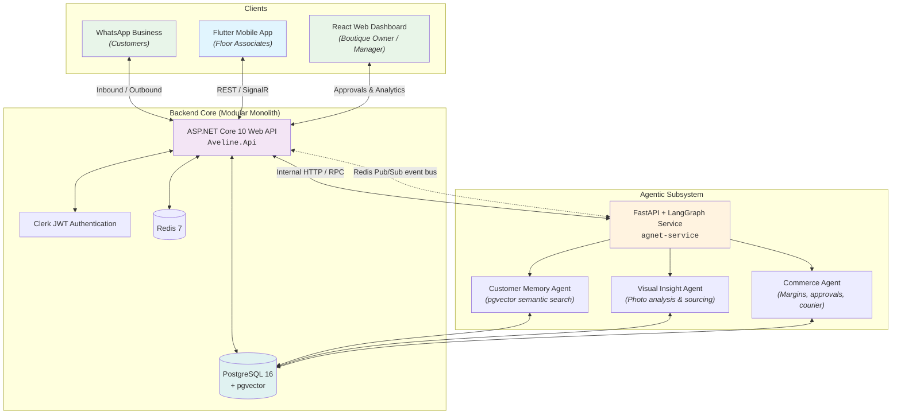

# Aveline — Boutique Concierge AI

[](https://github.com/KavinduNirmal/aveline/actions/workflows/ci.yml)
[](https://dotnet.microsoft.com/)
[](https://www.python.org/)
[-02569B?logo=flutter)](https://flutter.dev/)
[](https://langchain-ai.github.io/langgraph/)
[](https://github.com/pgvector/pgvector)
[](https://bun.sh/)

**Aveline (Boutique Concierge AI)** is a full-stack, multi-agent commerce and concierge platform designed for semi-luxury boutiques in Sri Lanka. It automates personalized customer relationship management, catalog visual intelligence, margin optimization, and human-in-the-loop approval workflows across WhatsApp, mobile floor associates, and boutique owners.

---

> [!TIP]
> **New to the project?** Head over to [GET_STARTED.md](GET_STARTED.md) for step-by-step developer environment setup, prerequisite installation, agent skills integration, and local development instructions.

---

## System Architecture

Aveline follows a **Modular Monolith** architecture pattern with an internal agentic AI subsystem:



### End-to-End Assured Workflow
1. **WhatsApp Inbound**: A customer inquires about availability or style recommendations via WhatsApp.
2. **Backend Ingestion**: ASP.NET Core captures the interaction and triggers the Python LangGraph workflow.
3. **Multi-Agent Orchestration**:
   - **Customer Memory Agent**: Parses intent, matches identity, and performs pgvector semantic memory retrieval.
   - **Visual Insight Agent**: Searches inventory or identifies supplier sourcing matches.
   - **Commerce Agent**: Evaluates margin thresholds and loyalty rules, triggering a **Human-in-the-Loop** interrupt when thresholds are exceeded.
4. **Owner Review & Resumption**: The boutique owner reviews pending approvals on the React Web Dashboard. Upon approval, LangGraph resumes from its checkpoint.
5. **Associate Notification**: Outbound updates are dispatched to the customer and the Flutter associate app.

---

## The Three Vertical Slices

| Slice | Domain & Ownership | Key Responsibilities | Core Entities |
|---|---|---|---|
| **Slice 1: Customer Concierge & Memory** | Customer relationships, messaging & preferences *(Student 1)* | WhatsApp webhook handling, customer profile management, semantic memory search via pgvector, interaction brief generation. | `Customers`, `Customer_Preferences`, `Customer_Events`, `Customer_Memory`, `Customer_Interactions` |
| **Slice 2: Visual Intelligence & Sourcing** | Inventory, visual analysis & sourcing *(Student 2)* | Product image attribute extraction, customer-to-item matching, outfit composition, sourcing requests, supplier catalogs. | `Inventory_Items`, `Inventory_Images`, `Outfit_Compositions`, `Sourcing_Requests`, `Suppliers`, `Customer_Matches` |
| **Slice 3: Commerce Validation & Optimization** | Pricing, payments, approvals & delivery *(Student 3)* | Margin calculation, dynamic business rules, payment link generation, approval queue state machine, delivery planning. | `Orders`, `Order_Items`, `Payments`, `Approval_Queue`, `Delivery_Plans`, `Business_Rules` |

---

## Technology Stack

| Layer | Technology | Purpose |
|---|---|---|
| **Public Backend** | ASP.NET Core 10 (C#) | Modular Monolith API, business validation, data persistence, integrations |
| **Agentic AI Subsystem** | Python 3.12 + FastAPI + LangGraph | Multi-agent orchestration, stateful graph execution, human-in-the-loop pauses |
| **Database** | PostgreSQL 16 + `pgvector` | Relational business data + vector embeddings for semantic memory |
| **Cache** | Redis 7 | High-performance session & query caching + Pub/Sub event bus (ADR-014) |
| **Mobile App** | Flutter (Dart SDK 3.13+) | Boutique floor associate mobile interface (Clean Architecture) |
| **Web Dashboard** | React 19 / Vite 8 + TypeScript (`@clerk/react`, React Router) | Boutique owner & manager dashboard for approvals, analytics, and rules |
| **Authentication** | Clerk | Unified JWT authentication & role-based authorization |
| **Package Management** | Bun | Fast package execution and deterministic lockfile management (`bun.lock`) |
| **CI/CD** | GitHub Actions | Automated multi-project compilation, linting, analysis, and quality gates |

---

## Repository Structure

```
aveline/
├── Aveline.Api/                 # ASP.NET Core 10 Web API (Modular Monolith)
│   ├── Modules/
│   │   ├── CustomerConcierge/   # Slice 1: Controllers, Services, Repos, Models, DTOs
│   │   ├── VisualIntelligence/  # Slice 2: Controllers, Services, Repos, Models, DTOs
│   │   └── Commerce/            # Slice 3: Controllers, Services, Repos, Models, DTOs
│   ├── Common/                  # Shared Exceptions, Extensions, Middleware
│   └── Infrastructure/          # AppDbContext, pgvector config, External API clients
├── agnet-service/               # Python 3.12 Agent Service (FastAPI + LangGraph)
│   ├── app/
│   │   ├── agents/              # Customer Memory, Visual Insight, and Commerce agents
│   │   ├── tools/               # Allow-listed agent tools (DB queries, calculators, APIs)
│   │   ├── workflows/           # Top-level LangGraph orchestration & checkpointers
│   │   ├── schemas/             # Pydantic input/output contracts
│   │   └── db/                  # Async SQLAlchemy & pgvector similarity search
│   └── tests/                   # Agent graph and tool unit tests
├── frontend/
│   ├── aveline_mobile/          # Flutter Mobile App (Floor Associates)
│   │   └── lib/features/        # Feature slices: data, domain, presentation
│   └── web/                     # Web Dashboard (Owner / Manager approvals)
├── .agents/                     # Coding agent knowledge, rules, and skills
├── docs/                        # Architecture Decision Records (ADRs), reports, specs
├── spec/                        # CI/CD and process specifications
├── docker-compose.yml           # Local PostgreSQL (pgvector), Redis, API, and Agent containers
├── GET_STARTED.md               # Developer & Agent onboarding instructions
└── package.json                 # Root tooling & Husky quality gates
```

---

## Quality & Automation

### Pre-commit Quality Gates (Husky)
Every commit is validated locally against 6 quality gates:
1. **.env Guard**: Blocks committing local environment files.
2. **Lockfile Enforcement**: Ensures only `bun.lock` / `bun.lockb` is tracked; blocks `package-lock.json`, `yarn.lock`, and `pnpm-lock.yaml`.
3. **Secret Scanner**: Prevents hardcoded tokens and credentials from entering version control.
4. **Backend Compilation**: Validates `dotnet build` on the ASP.NET Core project.
5. **Python Syntax Check**: Runs `py_compile` on staged Python files.
6. **Flutter Analysis**: Runs `flutter analyze` on the mobile application codebase.

### Continuous Integration (GitHub Actions)
All pull requests and commits targeting `development`, `main`, and `master` trigger the [Aveline CI](.github/workflows/ci.yml) workflow:
- **`hygiene`**: Repository hygiene and lockfile compliance.
- **`build-api`**: .NET 10 build, test suite, and `dotnet publish` artifact.
- **`test-python`**: Ruff lint and pytest for the agent service.
- **`test-web`**: oxlint, Vitest, and Vite build for the dashboard (+ `dist` artifact).
- **`test-flutter`**: `flutter analyze`, tests, and release APK artifact.
- **`security-scan`**: `.NET` vulnerable-package scan, `bun audit`, and a Trivy filesystem scan (SARIF uploaded to Code Scanning).

[Dependabot](.github/dependabot.yml) opens dependency update PRs and security alerts for all ecosystems (GitHub Actions, npm, pub, NuGet, pip).

---

## Documentation Index

- [Developer Setup & Onboarding Guide](GET_STARTED.md)
- [Running Aveline Locally with Authentication](docs/guides/local-auth-development.md)
- [Authentication Architecture](docs/architecture/authentication.md)
- [Redis Pub/Sub Event Bus Architecture](docs/architecture/eventing.md)
- [The Salon — Conversation Inbox Architecture](docs/architecture/inbox.md)
- [Authentication Security Review](docs/security/auth-security-review.md)
- [Owner Onboarding Flow Architecture](docs/architecture/onboarding-flow.md)
- [Test Suite Documentation](docs/tests/README.md)
- [Git Flow & Branching Strategy Guide](docs/git-flow.md)
- [Architecture Decision Records (ADRs)](docs/ADR/README.md)
- [CI/CD Workflow Specification](spec/spec-process-cicd-ci.md)
- [OpenAPI / Swagger Specifications](docs/OpenApi/README.md)
- [SE3090 Assignment Reports](docs/reports/README.md)
- [AI Usage Logs](docs/ai-usage/README.md)