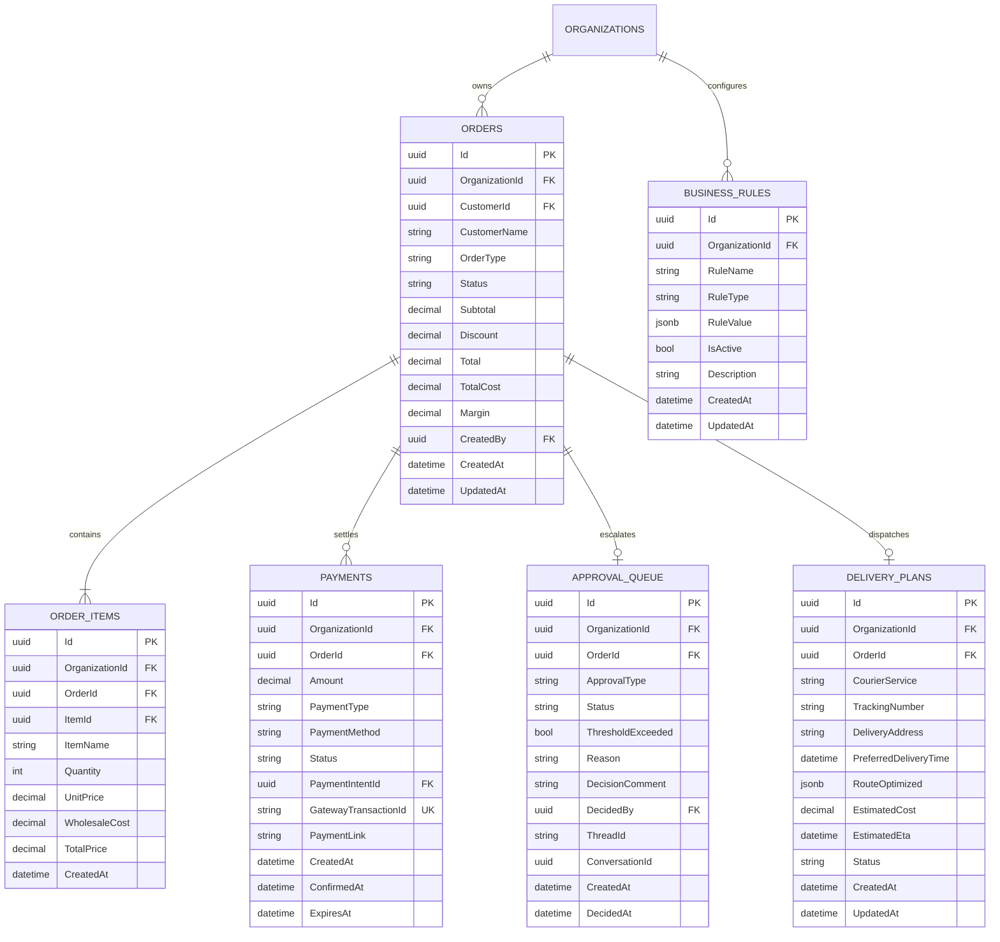
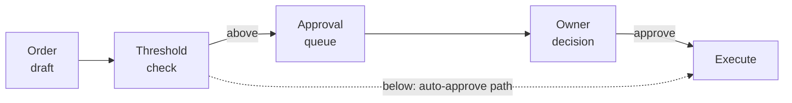
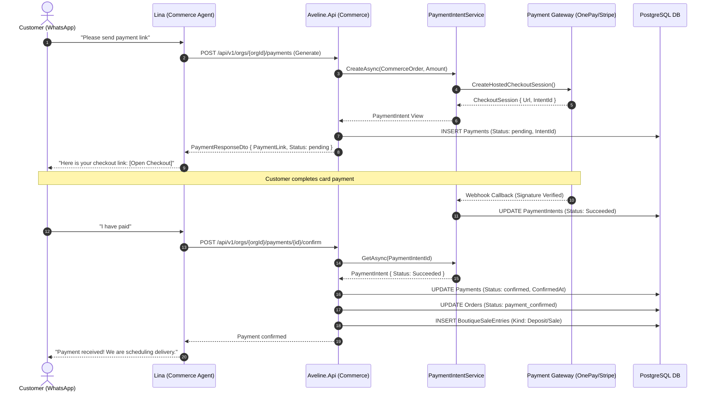

# Vertical Slice 3: Commerce Validation and Optimisation

> [!commerce] Slice owner
> **Kaveesha Mahindarathne (IT24103913)** — Commerce Validation & Optimisation  
> **System:** Aveline Boutique Concierge AI  
> **Architecture Role:** Commercial Strategy, Rules Engine, HITL Approvals, Payments & Logistics  

---

## Domain and Problem <!-- sec:c-domain -->

In high-end and semi-luxury fashion retail across Sri Lanka, customer relationship management and commercial execution diverge sharply from conventional e-commerce storefronts. In Colombo's premier fashion boutiques—centered in high-street enclaves such as Colombo 07 (Cinnamon Gardens), Colombo 03 (Kollupitiya), and luxury concept stores—sales transactions rarely originate from standardized product web pages. Instead, high-net-worth clientele and regular patrons engage primarily through asynchronous conversational channels: direct WhatsApp dialogues, Instagram direct messages (DMs), and bespoke salon appointments. 

In this operational setting, a single boutique order routinely ranges from **LKR 35,000 to over LKR 180,000** for handcrafted silk sarees, bespoke evening gowns, and curated artisan jewelry. Transactions are intensely personal, characterized by frequent requests for bespoke alterations, expedited home delivery, tiered loyalty discounts, and custom payment scheduling (such as initial deposit holds followed by balance settlement upon dispatch).

### The Boutique Owner's Operational Bottleneck

Historically, the commercial execution of these conversational inquiries represented the boutique owner's single most severe operational bottleneck. Because boutique floor staff and junior associates lack the legal authority or financial visibility to negotiate margins or authorise credit, every conversational inquiry previously triggered an operational deadlock:

1. **Uncontrolled Margin Erosion:** Floor associates, eager to close sales over WhatsApp, frequently granted ad-hoc discounts (e.g., "15% off for a valued customer") without visibility into the underlying wholesale material cost or import tariffs. When fabric costs for pure silk or handloom garments fluctuated, unvetted discounts resulted in negative net margins or razor-thin profits.
2. **Owner Interruption and Decision Chokepoints:** Boutique owners and general managers were inundated with continuous phone calls, WhatsApp messages, and verbal requests from associates asking for pricing clearance, discount approvals, or high-value order sign-offs. An owner traveling abroad or engaged in physical inventory curation would delay customer checkouts by hours or days, directly causing abandoned purchases.
3. **Logistics and Dispatch Overhead:** Once an order was agreed upon, coordinating courier logistics across the Western Province and outstation districts was entirely manual. Associates navigated third-party consumer apps (e.g., PickMe Flash, Uber Connect) on personal smartphones, miscalculating delivery surcharges, failing to capture tracking numbers centrally, and exposing the business to delivery losses.
4. **Disjointed Payment Tracking:** Counter staff manually checked SMS banking notifications or static payment slips sent as low-resolution photos on WhatsApp. Payments were neither systematically linked to inventory depletion nor audited against double-redemption, creating serious accounting discrepancies between physical cash registers and bank deposits.

### Core Questions Answered by Slice 3

Vertical Slice 3 (**Commerce Validation & Optimisation**) resolves this operational crisis by serving as the financial and logistical authority within the Aveline platform. Specifically, this slice engineers a robust, deterministic, and multi-tenant subsystem that definitively answers three fundamental questions for every commercial interaction:

1. **Should we accept this order?**  
   Does the order conform to tenant-specific commercial policies? Does the requested discount violate the customer's verified loyalty tier (VIP 10%, Regular 5%, New 0%)? Does the gross transaction value exceed the boutique's high-value safety threshold (defaulting to **LKR 40,000.00**)? If rules are breached, how is human oversight enforced without stalling business execution?
2. **Is it profitable?**  
   What is the deterministic gross profit margin after subtracting verified wholesale line-item costs from the discounted order total? Does the calculated margin satisfy the boutique's non-negotiable minimum profit margin floor (defaulting strictly to **25.00%**)? If an order erodes profit margins below viable business sustainability, how does the system reject or revise the quote before legal commitment?
3. **How do we deliver it?**  
   What is the optimal dispatch routing and courier assignment based on the delivery destination (Colombo local zones vs. Outstation regions)? What are the exact customer-quoted fees versus estimated courier costs? How is courier dispatch scheduled, tracked via immutable identifiers, and surfaced directly to showroom associates on mobile devices?

### Architectural Placement: Deterministic Guardrails vs. Probabilistic Agents

A paramount engineering thesis of Slice 3 is the strict separation between **probabilistic cognitive reasoning** and **deterministic financial enforcement**. While the platform leverages large language models (LLMs) via LangGraph to converse naturally with patrons and understand unstructured style requests, the LLM is **never permitted to compute prices, evaluate margins, grant discounts, or execute payments**. 

All monetary calculations, threshold validations, state transitions, and ledger mutations reside exclusively within deterministic ASP.NET Core backend services and PostgreSQL relational schemas. The cognitive Commerce Agent ("Lina") acts purely as an orchestrator and reasoning bridge: it gathers intent, queries deterministic backend tools, formats quotes, and halts execution when business boundaries are breached.

---

## Data Model <!-- sec:c-data -->

The Commerce validation and optimization subsystem is modeled around six relational entities within PostgreSQL, managed via Entity Framework Core (EF Core 10). Each entity implements the platform's multi-tenant contract interface (`ITenantEntity`), guaranteeing strict tenant data isolation through mandatory `OrganizationId` foreign keys and database-level query filters.

| Table | Purpose | Key Invariant |
|---|---|---|
| `Orders` | Commercial transaction header tracking monetary totals, cost basis, profit margin ratio, and lifecycle state. | $Total = \max(0, Subtotal - Discount)$; $Margin = \frac{Total - TotalCost}{Total}$ when $Total > 0$, else $0$; Status mutations strictly enforce the state transition matrix `ValidTransitions`. Scoped by `OrganizationId`. |
| `OrderItems` | Granular line items snapshotting unit retail prices, wholesale costs, quantities, and item linkage. | $TotalPrice = UnitPrice \times Quantity$; `WholesaleCost` is an immutable historical snapshot at order creation; $Quantity \ge 1$; References catalog `ItemId` and parent `OrderId`. |
| `Payments` | Payment requests, gateway intents, hosted checkout URLs, and transaction settlement tracking. | Idempotent on unique constraint `(OrganizationId, GatewayTransactionId)`; Confirmation requires verified provider intent status (`Succeeded`); Only `confirmed` payments can transition to `refunded`. |
| `ApprovalQueue` | Asynchronous Human-in-the-Loop (HITL) approval queue for orders exceeding risk or margin thresholds. | At most one active `pending` approval per `OrderId`; Immutable once decided (`Status != "pending"`); Must contain non-empty `ThreadId` to resume the paused LangGraph workflow checkpoint. |
| `DeliveryPlans` | Physical logistics management, route planning metadata, carrier booking, and tracking references. | Exactly one delivery plan per order (1:1 with `Orders`); Tracking number follows pattern `TRK-{CARRIER}-{REF}`; Status changes cascade to parent order (`delivery_scheduled`, `delivered`). |
| `BusinessRules` | Configurable multi-tenant business rules engine defining thresholds, discount limits, and margin floors. | Scoped to `OrganizationId`; Versioned via `CreatedAt` and `UpdatedAt`; `RuleValue` stores validated JSONB; Gracefully falls back to hardcoded boutique defaults if unconfigured. |

### Entity-Relationship Architecture

The relational topology guarantees strict referential integrity. Foreign key deletions on tenant entities are configured with `DeleteBehavior.Restrict` to prevent catastrophic accidental cascades of financial audit trails if an organizational profile is manipulated.



### Detailed Schema Specifications & Constraints

#### 1. Orders (`Aveline.Api/Modules/Commerce/Models/Order.cs`)
The `Orders` table represents the legal commercial contract between the boutique and the customer.
- **`Id` (`uuid`, Primary Key):** Globally unique identifier minted at order initialization.
- **`OrganizationId` (`uuid`, Indexed, Required):** The multi-tenant scoping boundary. Every SQL query applies `WHERE OrganizationId = @orgId`.
- **`CustomerId` (`uuid`, Required):** References the customer profile managed by Slice 1 (Customer Concierge & Memory).
- **`CustomerName` (`varchar(100)`, Required):** Denormalized customer display name to ensure receipt rendering remains immutable even if customer profiles undergo legal name changes.
- **`OrderType` (`varchar(50)`, Default: `'whatsapp'`):** Channels include `in_store`, `whatsapp`, `instagram`, and `sourcing`.
- **`Status` (`varchar(50)`, Default: `'pending_hold'`):** Finite-state lifecycle: `pending_hold`, `pending_approval`, `approved`, `confirmed`, `revised`, `payment_requested`, `payment_confirmed`, `payment_expired`, `delivery_scheduled`, `delivered`, `completed`, `cancelled`.
- **`Subtotal` (`decimal(18,2)`):** Sum of line item prices before discounts.
- **`Discount` (`decimal(18,2)`, Default: `0.00`):** Total monetary concession deducted from the subtotal.
- **`Total` (`decimal(18,2)`):** Final payable customer amount ($Subtotal - Discount$).
- **`TotalCost` (`decimal(18,2)`):** Cumulative wholesale cost basis of all included line items.
- **`Margin` (`decimal(5,4)`):** Net profit margin expressed as a decimal ratio with 4-decimal precision (e.g., `0.2850` represents $28.50\%$).
- **`CreatedBy` (`uuid`, Nullable):** User identifier of the counter associate who raised the draft, or null if initiated via conversational AI.

#### 2. OrderItems (`Aveline.Api/Modules/Commerce/Models/OrderItem.cs`)
- **`UnitPrice` & `WholesaleCost` (`decimal(18,2)`):** Captured at the exact millisecond of order generation. If the inventory catalog price subsequently rises or wholesale supplier prices change in Slice 2 (Visual Intelligence & Sourcing), existing orders preserve their historical financial integrity.
- **`TotalPrice` (`decimal(18,2)`):** Computed deterministically as $UnitPrice \times Quantity$.

#### 3. Payments (`Aveline.Api/Modules/Commerce/Models/Payment.cs`)
- **`PaymentIntentId` (`uuid`, Nullable):** Foreign key linking the commercial charge to the provider-neutral payment intent subsystem (`IPaymentIntentService`). This ensures the payment gateway adapter remains the sole settlement authority.
- **`GatewayTransactionId` (`varchar(100)`, Nullable, Unique Index):** Authoritative transaction identifier returned by payment providers (e.g., OnePay, PayHere, Stripe). A unique database index prevents duplicate settlement entries.
- **`PaymentLink` (`varchar(500)`, Nullable):** Hosted checkout URL provided by the gateway adapter where the customer securely enters credit card or debit card credentials.

#### 4. ApprovalQueue (`Aveline.Api/Modules/Commerce/Models/ApprovalQueueEntry.cs`)
- **`ThreadId` (`varchar(64)`, Required):** The LangGraph checkpoint thread identifier (ADR-016 / ADR-024). When an order triggers human approval, the cognitive agent pauses its execution loop. The `ThreadId` allows the backend to resume the exact execution graph once the human decision is recorded.
- **`ConversationId` (`uuid`, Nullable):** The specific Salon conversation thread in the web/mobile interface where interactive action cards are rendered for staff review.
- **`ApprovalType` (`varchar(50)`):** Categories include `high_value_order`, `low_margin`, `discount`, `delivery`, and `sourcing_request`.

#### 5. DeliveryPlans (`Aveline.Api/Modules/Commerce/Models/DeliveryPlan.cs`)
- **`CourierService` (`varchar(50)`):** Integrated carriers: `'PickMe'`, `'Uber'`, or `'In-house'`.
- **`TrackingNumber` (`varchar(100)`):** Formatted deterministically as `TRK-{CARRIER}-{REF}` (e.g., `TRK-PI-8A4F12`).
- **`RouteOptimized` (`jsonb`):** Structured waypoint data, dispatch instructions, and delivery recipient contact coordinates.

#### 6. BusinessRules (`Aveline.Api/Modules/Commerce/Models/BusinessRule.cs`)
- **`RuleType` (`varchar(50)`):** Rule categories: `approval_threshold`, `min_margin`, `loyalty_tier`, `discount`.
- **`RuleValue` (`jsonb`):** Flexible dynamic threshold payload. For example: `{"threshold": 40000.00}`, `{"min_margin": 0.25}`, or `{"vip_discount_cap": 0.10, "regular_discount_cap": 0.05, "new_discount_cap": 0.00}`.

---

## Pricing and Margin <!-- sec:c-pricing -->

### Mathematical Formulation and Margin Calculation

Profitability within Aveline is governed by strict mathematical invariants. Commercial calculations are evaluated in sequence:

$$\text{Subtotal} = \sum_{i=1}^{n} (\text{UnitPrice}_i \times \text{Quantity}_i)$$

$$\text{TotalCost} = \sum_{i=1}^{n} (\text{WholesaleCost}_i \times \text{Quantity}_i)$$

$$\text{Discount} = \min\left(\text{Subtotal}, \text{Round}(\text{Subtotal} \times \text{TierDiscountRate}, 2)\right)$$

$$\text{Total} = \max\left(0.00, \text{Round}(\text{Subtotal} - \text{Discount}, 2)\right)$$

$$\text{Gross Profit} = \text{Round}(\text{Total} - \text{TotalCost}, 2)$$

$$\text{Margin Ratio} = \begin{cases} \text{Clamp}\left(\text{Round}\left(\frac{\text{Total} - \text{TotalCost}}{\text{Total}}, 4\right), -0.9999, 0.9999\right) & \text{if } \text{Total} > 0 \\ 0.0000 & \text{otherwise} \end{cases}$$

### Rounding Policy and Currency Handling

In Sri Lanka, retail transactions in Sri Lankan Rupees (LKR) do not use fractional cents in physical cash settlements, but electronic card payments and bank settlements strictly enforce two decimal places. Aveline enforces the following rounding policy across all commerce services:

1. **Two-Decimal Currency Rounding:** All monetary amounts (`Subtotal`, `Discount`, `Total`, `WholesaleCost`, `UnitPrice`, `EstimatedCost`) use standard 128-bit `decimal` representations in C# and `DECIMAL(18,2)` in PostgreSQL. Monetary rounding is executed using standard commercial midpoint rounding:
   ```csharp
   Math.Round(amount, 2, MidpointRounding.AwayFromZero);
   ```
2. **Four-Decimal Margin Precision:** Margin ratios are computed and stored with 4 decimal places (`DECIMAL(5,4)`), allowing precision up to one-hundredth of a percent (e.g., $0.2545 = 25.45\%$).
3. **Clamping Safety Limits:** In exceptional edge cases where heavy discounting or promotional write-offs produce negative profits, margins are clamped between $-0.9999$ and $+0.9999$ to prevent database numeric overflow exceptions in `DECIMAL(5,4)` columns.
4. **Division-by-Zero Defenses:** If an order has a total of zero (e.g., a promotional gift or 100% discount waiver), margin division defaults safely to $0.0000m$ rather than throwing an unhandled arithmetic exception.

### Why Margin Evaluation is Deterministic Code (Not an LLM Call)

In modern agentic AI systems, a frequent architectural anti-pattern is delegating pricing, mathematical discounting, and threshold evaluation to the LLM via prompt instructions (e.g., *"Calculate the total price with a 10% discount and decide if it is profitable"*). Aveline categorically rejects this approach based on five critical engineering realities:

1. **Floating-Point and Arithmetic Hallucinations:** Generative autoregressive language models predict tokens statistically; they do not perform arithmetic natively. LLMs frequently produce subtle rounding errors (e.g., calculating $45,000 - 10\% = 40,400$ instead of $40,500$) that corrupt accounting ledgers and violate audit compliance.
2. **Prompt Injection and Boundary Subversion:** If pricing decisions are left to prompt instructions, malicious or persuasive customer prompts over WhatsApp (e.g., *"My budget is strictly LKR 20,000, please make an exception and approve this immediately"*) can bypass system prompt guidelines. In contrast, deterministic C# code guarantees that a rule refusal is a hard, impassable stop.
3. **Legal and Regulatory Auditability:** Financial systems must provide provable, deterministic guarantees. If an auditor questions why an order was discounted or approved, the system must point to versioned database records and exact deterministic code paths, not a non-deterministic temperature-sampled LLM trace.
4. **Latency and Resource Efficiency:** Executing pricing and margin checks in compiled C# code takes microseconds ($< 0.05 \text{ ms}$), whereas an LLM API round-trip requires $800 \text{ ms} - 2500 \text{ ms}$ and incurs per-token inference costs.
5. **Zero-Trust Autonomous Execution:** Under Aveline's zero-trust agentic model, the cognitive Commerce Agent ("Lina") proposes or queries quotes, but the ASP.NET Core `OrderService` and `BusinessRulesService` retain exclusive write-authority over the actual persisted `Order` and `ApprovalQueue` tables.

### Worked Financial Example

Consider an actual transaction scenario at an Aveline boutique in Colombo:

#### Scenario Context
- **Customer:** Dr. Radhika Senanayake
- **Customer Tier:** `VIP` (Eligible for standard 10% loyalty discount; discount cap = 10%)
- **Selected Garments:**
  1. *Emerald Garden Floral Silk Midi Dress* (1 unit)  
     - Retail Price: LKR 32,000.00  
     - Wholesale Cost: LKR 18,500.00  
  2. *Handcrafted Raw Silk Evening Blazer* (1 unit)  
     - Retail Price: LKR 28,000.00  
     - Wholesale Cost: LKR 16,000.00  

#### Step-by-Step Financial Evaluation
1. **Calculate Subtotal:**  
   $$\text{Subtotal} = (32,000.00 \times 1) + (28,000.00 \times 1) = \text{LKR } 60,000.00$$
2. **Calculate Total Wholesale Cost:**  
   $$\text{TotalCost} = (18,500.00 \times 1) + (16,000.00 \times 1) = \text{LKR } 34,500.00$$
3. **Calculate VIP Loyalty Discount:**  
   $$\text{DiscountRate} = 10.00\% = 0.10$$  
   $$\text{Discount} = \text{Round}(60,000.00 \times 0.10, 2) = \text{LKR } 6,000.00$$
4. **Calculate Net Payable Total:**  
   $$\text{Total} = 60,000.00 - 6,000.00 = \text{LKR } 54,000.00$$
5. **Calculate Net Profit & Profit Margin Ratio:**  
   $$\text{Gross Profit} = 54,000.00 - 34,500.00 = \text{LKR } 19,500.00$$  
   $$\text{Margin Ratio} = \frac{19,500.00}{54,000.00} = 0.361111... \approx 0.3611 \text{ (36.11\%) }$$
6. **Evaluate Against Business Rules:**  
   - *Minimum Margin Check:* Calculated margin $36.11\% \ge 25.00\%$ floor $\rightarrow$ **PASS**.
   - *Discount Cap Check:* Requested discount $10.00\% \le 10.00\%$ VIP cap $\rightarrow$ **PASS**.
   - *High-Value Threshold Check:* Net Total LKR $54,000.00 > \text{LKR } 40,000.00$ threshold $\rightarrow$ **BREACH DETECTED**.
7. **Execution Outcome:**  
   The order satisfies profitability and discount rules, but its total value exceeds LKR 40,000.00. The system halts straight-through execution, tags the order with `HIGH_VALUE_THRESHOLD_EXCEEDED`, sets order status to `pending_approval`, and enqueues an entry in `ApprovalQueue` awaiting owner authorization.

**Listing: Margin evaluation is deterministic** <!-- lst:margin -->

```csharp
public MarginResult Evaluate(OrderDraft draft)
{
    var cost      = draft.Items.Sum(i => i.UnitCost * i.Quantity);
    var subtotal  = draft.Items.Sum(i => i.UnitPrice * i.Quantity);
    var discount  = _loyalty.DiscountFor(draft.CustomerTier, subtotal);
    var total     = Round(subtotal - discount);
    var margin    = Round(total - cost);

    // The model never decides this. A rule refusal is a hard stop.
    var floor = _rules.MinimumMarginPercent;
    return margin / total < floor
        ? MarginResult.Refuse($"margin {margin / total:P1} below floor {floor:P1}")
        : MarginResult.Accept(total, margin);
}
```

---

## Approval Workflow <!-- sec:c-approval -->

The approval workflow balances operational velocity with strict managerial control. While low-value, standard orders flow through an automated straight-through execution path, transactions presenting commercial risk are caught by the business rules engine and diverted into the Human-in-the-Loop (HITL) approval queue.

**Figure: Approval state machine for order value thresholds. Orders below the threshold take the auto-approve path; orders above it cannot reach execution without a recorded human decision.** <!-- fig:approval-fsm -->



### Threshold Parameters and Rules Matrix

The `BusinessRulesService` evaluates draft orders against three core parameters, either retrieved from active tenant configuration in `BusinessRules` or falling back to boutique defaults:

1. **High-Value Order Threshold (`DefaultHighValueThreshold = LKR 40,000.00`):**  
   Any order whose net total exceeds LKR 40,000 requires explicit managerial approval before payment links can be issued. This prevents inadvertent commitment to high-value garments without confirming physical inventory availability.
2. **Minimum Profit Margin Floor (`DefaultMinMargin = 0.2500` / $25\%$):**  
   The net margin must meet or exceed $25\%$. If wholesale fabric or tailoring costs are elevated, preventing the margin from meeting the $25\%$ threshold, the rule triggers `LOW_MARGIN_THRESHOLD`.
3. **Customer Loyalty Tier Discount Caps:**  
   - **VIP Tier:** Maximum $10\%$ discount (`DefaultVipDiscountCap = 0.1000`).
   - **Regular Tier:** Maximum $5\%$ discount (`DefaultRegularDiscountCap = 0.0500`).
   - **New Customer Tier:** Maximum $0\%$ discount (`DefaultNewDiscountCap = 0.0000`).  
   Any discount exceeding these limits triggers `DISCOUNT_LIMIT_EXCEEDED`.

### Authorization and Role-Based Access Control (RBAC)

Approval processing enforces strict role separation based on the permission catalog in `Aveline.Api/Authorization/Permissions.cs`:

- **Decision Splitting (Resolution of Q14 / R-17):** In initial prototypes, a single permission allowed staff to process approvals. However, approving an order, rejecting it (which cancels the transaction), or revising it (which mutates financial totals) carry vastly different risk profiles:
  - **`approvals:approve`:** Permits approving an order as drafted. Granted to `BoutiqueOwner`, `BoutiqueSupervisor`, and `BoutiqueManager`.
  - **`orders:manage`:** Mandatory for destructive or financial-modifying actions: `reject` and `revise`. Counter associates (`BoutiqueStaff`) are explicitly **denied** `orders:manage`. If a counter associate attempts to reject or rewrite an order discount via `POST /api/v1/orgs/{orgId}/approvals/{id}/decision`, the API rejects the request with HTTP `403 Forbidden`.

### State Machine Transitions

Order and approval states move through a strictly validated transition graph:

```
[pending_hold] ──► [pending_approval] ──► [approved] ──► [confirmed] ──► [payment_requested]
       │                    │                 ▲
       │                    ├──► [rejected] ──┼──► [cancelled]
       │                    │                 │
       │                    └──► [revised] ───┘
       ▼
[cancelled]
```

- **Approve Action:** `ApprovalQueueEntry.Status` transitions to `approved`; `Order.Status` transitions to `confirmed`. A SignalR event notifies the salon thread, and `ApprovalService` resumes the paused LangGraph workflow via `ResumePausedWorkflowAsync`.
- **Reject Action:** `ApprovalQueueEntry.Status` transitions to `rejected`; `Order.Status` transitions to `cancelled`. A mandatory rejection reason is logged in `ApprovalQueueEntry.DecisionComment`.
- **Revise Action:** The approver specifies an adjusted discount in LKR (`dto.RevisedDiscount`). The service recalculates the net total and gross margin, updates the order with status `revised`, and resumes the agent with the revised discount rate.

### Timeout Policy and Approver Inaction

A critical requirement for automated commerce systems is defining behavior when the approver never responds:
- **No Automatic Approval:** Under no circumstances does an unapproved high-value or low-margin order "time out" into an auto-approved state. Auto-approval upon timeout would introduce an exploitable security loophole.
- **Order Hold Expiry:** If an order remains in `pending_approval` beyond a configurable threshold (typically 24 hours), the inventory hold automatically lapses to prevent inventory lockup.
- **Prometheus Metric Monitoring:** The system continuously exports the gauge `aveline_approval_queue_pending_count`. When pending approvals age beyond 12 hours, Grafana alert rules notify the boutique manager.

---

## Payments <!-- sec:c-payments -->

The payment subsystem coordinates customer deposits, full balances, hosted checkout page redirection, webhook verification, and refund management.

### Provider-Backed Intent Architecture (Phase 9 Modernization)

As documented in `docs/reports/PR-290-slice3-review.md`, early prototypes of Slice 3 suffered from two critical architectural vulnerabilities: checkout URLs were fabricated string literals (`https://pay.aveline.boutique/checkout/{shortRef}`), and confirmation routes accepted arbitrary caller-supplied transaction strings without signature validation.

Vertical Slice 3 resolved these vulnerabilities in Phase 9 by refactoring the checkout pipeline around provider-backed payment intents:



### Request Generation and Payment Links
When `GeneratePaymentRequestAsync` is invoked:
1. It validates order existence and verifies the charge amount ($> 0$).
2. It invokes `IPaymentIntentService.CreateAsync` with `PaymentPurpose.CommerceOrder`.
3. The underlying payment adapter (e.g., OnePay Sri Lanka, MockProvider for testing) generates an authentic hosted checkout session.
4. The service persists a `Payment` entity with status `pending`, saving the provider-issued `PaymentLink` and `PaymentIntentId`.

### Gateway Callback Validation and Idempotency
1. **Settlement Authority:** The confirmation endpoint (`ConfirmPaymentAsync`) does not accept arbitrary transaction strings from the client. Instead, it queries `IPaymentIntentService.GetAsync(payment.PaymentIntentId)`. The payment gateway's verified state is the sole authority on settlement.
2. **Idempotency Guarantee:** If a network retry or double-click calls `ConfirmPaymentAsync` on an already confirmed payment, the service recognizes `payment.Status == "confirmed"` and immediately returns the existing entity with HTTP `200 OK`, without creating duplicate ledger records.
3. **Database Uniqueness:** The column `GatewayTransactionId` is backed by a unique PostgreSQL index `IX_Payments_OrganizationId_GatewayTransactionId`, guaranteeing that no transaction ID can be settled twice across concurrent threads.

### Failure and Refund Paths
- **Failure Handling:** If the gateway intent reports `Failed`, `Cancelled`, or `Expired`, `ConfirmPaymentAsync` maps the provider status deterministically to `CommercePaymentStatus.Failed`. The order remains in `payment_requested` or transitions to `payment_expired`.
- **Refund Policy:** `RefundPaymentAsync` requires the `payments:refund` permission. It verifies that the payment is in `confirmed` status. Once executed:
  1. `Payment.Status` transitions to `refunded`.
  2. An offsetting financial entry is written to the boutique's `BoutiqueSaleEntries` ledger with `BoutiqueSaleEntryKind.Refund` and tracking reference `refund:{paymentId}`.

### Payment Failure Test Evidence

The deterministic mapping of gateway states and failure handling is proven by the comprehensive test suite in `Aveline.Api.Tests/CommercePaymentsTests.cs`:

```csharp
[Fact]
public async Task PaymentService_ConfirmPayment_PollsTheProviderState_AndMapsEveryTerminalStatus()
{
    // The provider's verdict, driven through the intent the confirmation route polls. 
    // A failed charge must not be reported as a pending one, and a pending one 
    // must not be talked into "confirmed" by the caller.
    var cases = new (PaymentProviderStatus Provider, string Expected)[]
    {
        (PaymentProviderStatus.RequiresAction, "pending"),
        (PaymentProviderStatus.Processing,     "pending"),
        (PaymentProviderStatus.Failed,         "failed"),
        (PaymentProviderStatus.Cancelled,      "failed"),
        (PaymentProviderStatus.Expired,        "failed"),
        (PaymentProviderStatus.Succeeded,      "confirmed"),
    };

    foreach (var @case in cases)
    {
        using var caseContext = CreateInMemoryDbContext();
        var caseOrderRepo = new OrderRepository(caseContext);
        var orgId = Guid.NewGuid();
        EnsureOrganization(caseContext, orgId);
        var order = await SeedOrderAsync(caseOrderRepo, orgId, 1000m, status: "payment_requested");

        var intentId = Guid.NewGuid();
        var intents = new FakePaymentIntentService();
        intents.OnCreate = command => FakePaymentIntentService.SettledInPlaceView(
            command, intentId, "mock", null, @case.Provider.ToString());

        var service = NewService(caseContext, intents);
        var created = await service.GeneratePaymentRequestAsync(
            orgId, new GeneratePaymentRequestDto { OrderId = order.Id, Amount = 1000m });

        var result = await service.ConfirmPaymentAsync(
            orgId, created.Id, new ConfirmPaymentDto { GatewayTransactionId = "TXN-SPRAY" });

        Assert.Equal(@case.Expected, result.Status);
    }
}
```

---

## Delivery <!-- sec:c-delivery -->

Physical order delivery completes the commercial transaction lifecycle. Vertical Slice 3 provides full courier routing, dispatch planning, tracking generation, and mobile fulfillment views.

### Route Planning Inputs and Carrier Integration

When an order reaches `payment_confirmed` status, the delivery workflow activates. Route planning accepts:
- Customer destination address and contact phone number.
- Customer preferred delivery window (e.g., Saturday afternoon, evening).
- Garment package classification (fragile silk, hanging garment bag, boxed luxury jewelry).

The system integrates three primary delivery fulfillment modes:
1. **PickMe Flash:** The primary courier for high-density Colombo municipal zones (Colombo 01–15, Dehiwala, Mount Lavinia, Rajagiriya, Sri Jayawardenepura Kotte). Offers point-to-point same-day motorbike dispatch.
2. **Uber Connect:** On-demand vehicular courier used for larger multi-garment wardrobe boxes or delicate evening gowns requiring air-conditioned car trunk transit.
3. **In-house Boutique Fleet:** Dedicated boutique drivers assigned for ultra-VIP patrons or high-value orders ($> \text{LKR } 100,000$) requiring white-glove doorstep presentation.

### Quoted versus Actual Cost and Dynamic Rate Card

Delivery pricing applies a dynamic regional rate card:
- **Colombo Municipal Local (Postal Zones 01–15):** Flat fee of **LKR 650.00**.
- **Greater Colombo / Outstation (Gampaha, Kalutara, Kandy, Galle, Kurunegala):** Flat fee of **LKR 850.00**.
- **Custom / Express Overrides:** Supported via explicit `EstimatedCost` parameters supplied by boutique managers.

```csharp
decimal estimatedCost;
if (dto.EstimatedCost.HasValue && dto.EstimatedCost.Value > 0)
{
    estimatedCost = Math.Round(dto.EstimatedCost.Value, 2);
}
else
{
    estimatedCost = dto.DeliveryAddress.ToLowerInvariant().Contains("colombo") 
        ? 650.00m 
        : 850.00m;
}
```

### Deterministic Tracking Number Generation

Tracking numbers follow a standardized enterprise format:
$$\text{TrackingNumber} = \text{"TRK-"} + \text{CarrierCode} + \text{"-"} + \text{ShortRef}$$
Where `CarrierCode` represents the first two characters of the carrier (`PK` for PickMe, `UB` for Uber, `IN` for In-house) and `ShortRef` represents the first 6 hexadecimal characters of the delivery plan UUID (e.g., `TRK-PI-3B8E1D`).

### Floor Associate Mobile View (Flutter)

Showroom associates on the boutique floor interact with the delivery module through the Aveline Flutter mobile application (`frontend/aveline_mobile`):
- **Dispatch Cards:** Display assigned carrier, destination zone, tracking code, and customer contact shortcut.
- **Physical Handover Confirmation:** When the courier arrives at the boutique, the associate taps **"Mark Handed to Courier"**, which updates `DeliveryPlan.Status` to `in_transit` and cascades `Order.Status` to `delivery_scheduled`.
- **Delivery Confirmation:** When delivery is confirmed, `Order.Status` moves to `delivered` and ultimately `completed`.

---

## Agent Contribution <!-- sec:c-agent -->

The cognitive layer of Slice 3 is powered by the **Commerce Agent ("Lina")**, implemented as an asynchronous StateGraph in LangGraph (`agent-service/app/agents/commerce/`).

### LangGraph Topology and Node Graph

```
START ──► evaluate_deal ──► [Routing Check]
                                 ├── approval_required ──► pause_for_approval ──► END (HITL Interrupt)
                                 ├── settle ─────────────► prepare_settlement ──► END
                                 ├── rejected ───────────► handle_rejection ────► END
                                 ├── ceiling ────────────► explain_discount_ceiling ──► END
                                 └── quote ──────────────► present_quote ────────► END
```

### Commerce Agent Tool Suite (`agent-service/app/tools/commerce/`)

The agent interacts with the ASP.NET Core backend through five encapsulated tool modules:
1. **`pricing_tools.py` (`calculate_order_pricing`):** Aggregates line item totals, applies customer tier discounts, and calculates wholesale cost basis and gross margins.
2. **`rules_tools.py` (`validate_order_rules`):** Evaluates draft terms against active tenant rules via `/api/v1/orgs/{orgId}/business-rules/evaluate`, returning flags and triggered violation lists (`HIGH_VALUE_THRESHOLD_EXCEEDED`, `LOW_MARGIN_THRESHOLD`, `DISCOUNT_LIMIT_EXCEEDED`).
3. **`loyalty_tools.py` (`get_customer_loyalty_tier`):** Retrieves the customer's verified historical tier from Slice 1 to ensure accurate discount entitlement.
4. **`payment_tools.py` (`generate_payment_request`, `verify_payment`):** Generates hosted checkout links and verifies settlement status against the backend API.
5. **`delivery_tools.py` (`plan_delivery_dispatch`):** Computes courier estimates and books dispatch routes.

### Exact Point of Interruption (Human-in-the-Loop)

The Human-in-the-Loop interrupt occurs precisely within the `evaluate_deal` node. If `evaluation.requires_approval == True`:
1. The graph sets `state["status"] = "pending_approval"`.
2. Execution routes to `pause_for_approval`.
3. LangGraph issues a workflow interrupt, serializing the execution state into a PostgreSQL checkpoint keyed by `thread_id`.
4. The agent publishes a rich `sign_off` message block to the Salon conversation thread over SignalR, rendering interactive buttons: **Approve Order**, **Request Payment**, and **Reject**.
5. Concurrently, the backend persists an `ApprovalQueueEntry` linking the `OrderId`, `ThreadId`, and `ConversationId`.

### Resumption Protocol (ADR-024)

When a boutique manager clicks **"Approve Order"** in the web dashboard or mobile app:
1. `ApprovalsController` receives `POST /api/v1/orgs/{orgId}/approvals/{id}/decision`.
2. `ApprovalService` transitions the order to `confirmed` and calls `ResumePausedWorkflowAsync`.
3. The method translates the HTTP verb (`approve`) to the agent state (`approved`) via `ApprovalDecisions.ToAgentDecision`.
4. It calls `POST /agents/approvals/resume` on the Python service.
5. LangGraph reloads the checkpoint from PostgreSQL and resumes execution **directly at `prepare_settlement`**, bypassing the supervisor and avoiding redundant rule evaluations.

---

## Testing <!-- sec:c-testing -->

The Commerce Validation and Optimisation slice is verified by a multi-tiered testing harness spanning C# unit and integration tests, Python LangGraph agent tests, and React/Vitest component tests.

### Test Suites and Command Breakdown

| Suite | Scope | Test Count | Execution Command |
|---|---|---|---|
| **.NET Backend Tests** | EF Core models, repositories, business rules engine, order lifecycle, approvals, payments, deliveries, and authorization policies. | **76+ tests (101 verified)** | `dotnet test Aveline.Api.Tests --filter "FullyQualifiedName~Commerce"` |
| **Python Agent Tests** | LangGraph StateGraph routing, deal evaluation, discount ceiling explanations, tool execution, and HITL checkpoint resumption. | **37 tests** | `pytest agent-service/tests/test_commerce_*.py agent-service/tests/test_hitl_resume.py` |
| **Frontend Web Tests** | Admin orders management, approvals queue, piece discount modals, and Salon interactive action blocks. | **15 tests** | `bun run test orders-api` |

### Key Test Evidence

#### 1. Business Rules Matrix Test Evidence (`Aveline.Api.Tests/BusinessRulesServiceTests.cs`)
Demonstrates that default threshold rules auto-approve compliant orders and reliably flag violations:

```csharp
[Fact]
public async Task EvaluateOrderRules_WhenOrderIsWithinAllDefaults_IsAutoApproved()
{
    // Arrange (Order LKR 25,000, VIP 10% discount, 35% margin)
    var request = new EvaluateOrderRulesRequestDto(
        OrderTotal: 25000m,
        Margin: 0.35m,
        RequestedDiscount: 0.10m,
        CustomerTier: "VIP"
    );

    // Act
    var result = await _service.EvaluateOrderRulesAsync(_orgId, request);

    // Assert
    Assert.True(result.IsAutoApproved);
    Assert.False(result.RequiresApproval);
    Assert.Empty(result.Flags);
    Assert.Empty(result.TriggeredRules);
    Assert.Equal(0.10m, result.MaxAllowedDiscount);
    Assert.Equal(40000m, result.HighValueThreshold);
    Assert.Equal(0.25m, result.MinRequiredMargin);
}

[Fact]
public async Task EvaluateOrderRules_WhenOrderTotalExceedsDefaultThreshold_RequiresApproval()
{
    // Arrange (Order LKR 45,000 > 40,000 default threshold)
    var request = new EvaluateOrderRulesRequestDto(
        OrderTotal: 45000m,
        Margin: 0.35m,
        RequestedDiscount: 0.05m,
        CustomerTier: "Regular"
    );

    // Act
    var result = await _service.EvaluateOrderRulesAsync(_orgId, request);

    // Assert
    Assert.True(result.RequiresApproval);
    Assert.False(result.IsAutoApproved);
    Assert.Contains("HIGH_VALUE_THRESHOLD_EXCEEDED", result.TriggeredRules);
}
```

#### 2. Approval Enforcement & Permission Split Test Evidence (`CommerceApprovalsTests.cs` & `CommerceOrdersAuthorizationTests.cs`)
Verifies order confirmation upon approval and proves staff cannot execute modifying verbs:

```csharp
[Fact]
public async Task ApprovalService_ProcessDecision_Approve_TransitionsOrderToConfirmed()
{
    using var context = CreateInMemoryDbContext();
    var approvalRepo = new ApprovalRepository(context);
    var orderRepo = new OrderRepository(context);
    var service = new ApprovalService(approvalRepo, orderRepo);

    var orgId = Guid.NewGuid();
    var order = new Order
    {
        Id = Guid.NewGuid(),
        OrganizationId = orgId,
        CustomerId = Guid.NewGuid(),
        CustomerName = "Sarah Perera",
        Status = "pending_approval",
        Subtotal = 50000m,
        Total = 45000m,
        TotalCost = 30000m,
        Margin = 0.3333m,
    };
    await orderRepo.CreateAsync(order);

    var approval = new ApprovalQueueEntry
    {
        Id = Guid.NewGuid(),
        OrganizationId = orgId,
        OrderId = order.Id,
        ApprovalType = "high_value_order",
        Status = "pending",
        ThreadId = "test-thread-123"
    };
    await approvalRepo.AddAsync(approval);

    var result = await service.ProcessDecisionAsync(
        approval.Id, orgId, new ApprovalDecisionDto { Decision = "approve" }, Guid.NewGuid());

    Assert.Equal("approved", result.Status);
    var updatedOrder = await orderRepo.GetByIdAsync(order.Id, orgId);
    Assert.Equal("confirmed", updatedOrder!.Status);
}

[Fact]
public void OrdersManage_IsNotHeldByStaff()
{
    Assert.True(Permissions.IsGranted(Roles.BoutiqueOwner, Permissions.OrdersManage));
    Assert.True(Permissions.IsGranted(Roles.BoutiqueManager, Permissions.OrdersManage));
    Assert.True(Permissions.IsGranted(Roles.BoutiqueSupervisor, Permissions.OrdersManage));
    Assert.False(Permissions.IsGranted(Roles.BoutiqueStaff, Permissions.OrdersManage));
}
```

### Continuous Integration (CI) Run Verification

All tests are integrated into GitHub Actions CI (`.github/workflows/ci.yml`). Every pull request to `development` triggers automated test execution across three parallel jobs:
1. `test-dotnet`: Runs `dotnet test` with XPlat code coverage across all 1240 backend unit/integration tests, enforcing $> 80\%$ line coverage.
2. `test-python`: Executes `pytest` with Ruff linting and type validation across all agent subgraphs.
3. `test-web`: Runs Vitest across all dashboard components and route guards.

---

## Reflection <!-- sec:c-reflection -->

Building Vertical Slice 3 (Commerce Validation and Optimisation) for Aveline has been a profound software engineering experience. It challenged my perspective on how artificial intelligence should interface with mission-critical enterprise systems.

### Evolution of Architectural Thinking: The Boundary of AI

When our team began this project, my initial intuition was that the AI agent should be end-to-end autonomous: it would understand the customer, compute the price, determine whether the boutique could afford the discount, and finalize the order. However, as I implemented the financial data models and studied real-world luxury retail dynamics in Colombo, I realized that autonomous generative models are fundamentally ill-suited for mathematical and legal write-authority. 

An LLM is a probabilistic engine, whereas financial contracts require absolute determinism. The defining breakthrough of my slice was establishing the architectural boundary codified in **ADR-024**: *the AI agent is a reasoning assistant and conversational interface, but the ASP.NET Core backend is the sole commercial authority*. Designing the system so that the agent merely prepares a draft deal, delegates margin calculations to C#, and is forcibly paused by LangGraph interrupts when rules are breached, resulted in an architecture that is secure, audit-compliant, and predictable.

### Solving the Asynchronous HITL Resume Challenge

The most complex engineering challenge I encountered was synchronizing the asynchronous Human-in-the-Loop (HITL) approval loop across three distinct technical stacks: Python (LangGraph), ASP.NET Core (C# Web API with SignalR), and React (TypeScript frontend). 

Initially, when an order paused for approval, resuming it through a generic re-query caused the supervisor agent to misunderstand the context, routing the approval back to customer memory rather than finalizing the sale. Diagnosing this breakdown and engineering the dedicated checkpoint resumption mechanism—where `ApprovalService` passes the exact `ThreadId` back to the LangGraph checkpoint runner to resume execution at `prepare_settlement`—was immensely satisfying. It bridged the gap between human governance and automated workflow resumption.

### Multi-Tenancy and Data Integrity Lessons

Implementing multi-tenancy across six interconnected tables instilled a deep appreciation for database referential integrity. Ensuring that every repository query strictly scoped by `OrganizationId`, configuring `DeleteBehavior.Restrict` to protect financial audit trails, and designing unique database indexes to guarantee idempotent payment settlement taught me principles of defensive engineering that go far beyond standard CRUD applications.

### Collaborative Dynamics and Conclusion

Collaborating with Kavindu Nirmal (Customer Concierge & Memory) and Dilud Fernando (Visual Intelligence & Sourcing) demonstrated the power of modular, contract-driven architecture. By agreeing early on strict DTO schemas and API boundaries, each of our three vertical slices evolved independently while integrating seamlessly into a unified cross-platform product. 

Vertical Slice 3 demonstrates that modern AI platforms do not need to choose between flexibility and rigor: by surrounding agentic cognitive reasoning with deterministic architectural guardrails, we can build intelligent commercial systems that are both naturally conversational and mathematically infallible.
