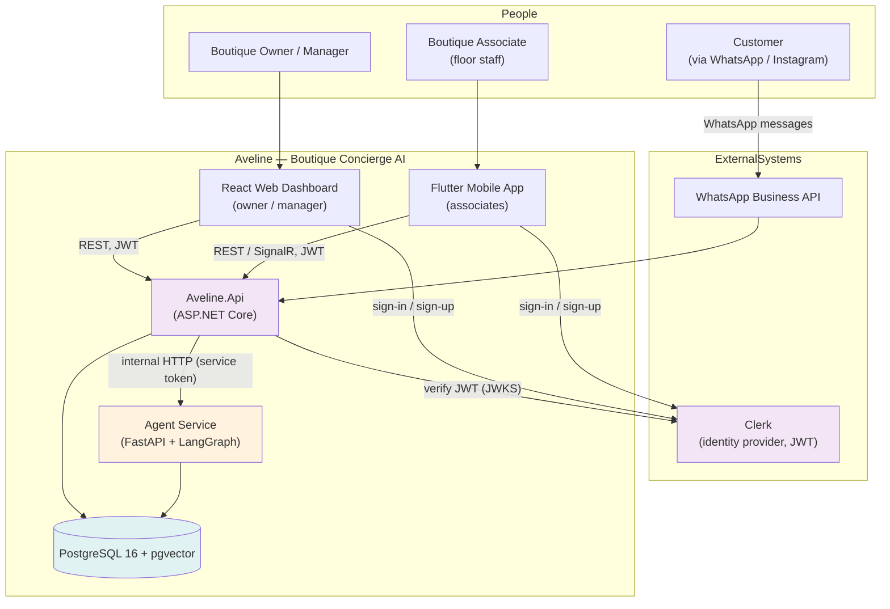
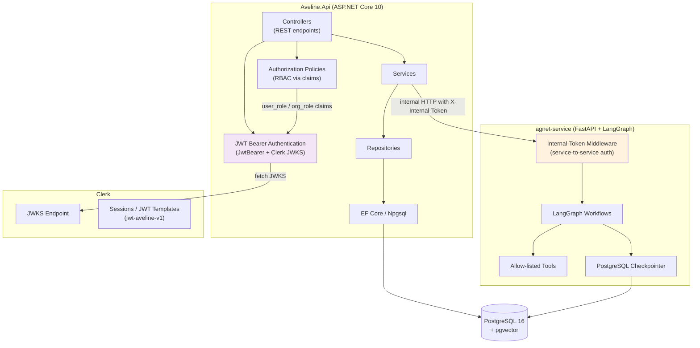
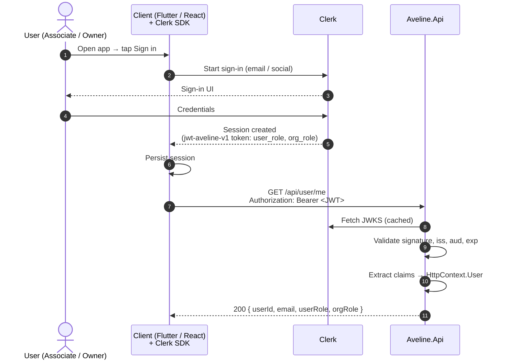
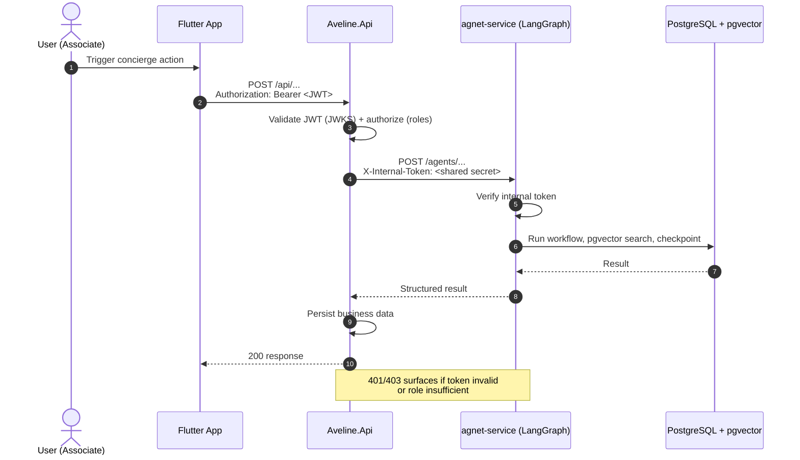

# Authentication Flow — Architecture

> **Status:** Approved (see [ADR-007](../ADR/ADR-007-clerk-authentication.md)).
> Diagrams use the **C4 model** (context → container) plus UML-style sequence diagrams, rendered with Mermaid.

---

## 1. C4 Context Diagram

Shows the system boundary, the external actors, and the systems Aveline integrates with.

---

## 2. C4 Container Diagram

Decomposes the two runtime backends and shows where authentication is enforced.

**Where authentication lives:**
- **Client side (Flutter / React):** Clerk SDK manages sessions, sign-in/up UI, and mints JWTs from the `jwt-aveline-v1` template.
- **Aveline.Api:** validates every bearer token against Clerk's JWKS (signature, issuer, audience) and enforces role-based authorization from `user_role` / `org_role` claims.
- **agnet-service:** does **not** accept user tokens. It only trusts an internal service token issued by Aveline.Api (shared secret header), so the agent is never directly reachable by clients.

---

## 3. Sequence Diagram — Login & Session

---

## 4. Sequence Diagram — Authenticated API Call (with agent)

---

## 5. Role Model

| Claim | Source | Semantics |
|---|---|---|
| `user_role` | `{{user.public_metadata.role}}` | Aveline **team-level** role (`staff`, `customer_relations`, `moderator`, `admin`, `owner`) |
| `org_role` | `{{org.role}}` | **Per-boutique** role (`org:boutique_staff`, `org:boutique_manager`, `org:boutique_supervisor`, `org:boutique_owner`) |
| `org_id` / `org_slug` | `{{org.id}}` / `{{org.slug}}` | Current organization context |

Authorization policies in the backend consume `user_role` / `org_role`; see [the authorization model](authorization.md) and [ADR-007](../ADR/ADR-007-clerk-authentication.md).
