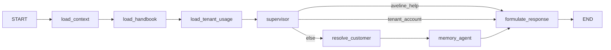

# The Handbook Knowledge Base

> **Status:** Approved (see [ADR-025](../ADR/ADR-025-handbook-knowledge-base.md)).

This document describes what Aveline can look up about herself: the corpus that feeds the index, how
it is chunked and retrieved, how the answer reaches a prompt, and what the feature deliberately does
not do.

---

## 1. What it is for

A boutique owner or staff member asks how the product works — "How do I invite a staff member?",
"What does the Orchid plan include?", "Can I message my clients from Aveline?" — and Aveline answers
from the product documentation and the company's own facts rather than from the model's general
knowledge. The answer names where it came from, and when the handbook does not cover something,
Aveline says so instead of inventing an answer.

It is **staff-facing**. `Audience` (`staff` | `customer` | `both`) is a column on every chunk and
retrieval always filters on it, so a customer-facing lane later is a filter change, not a migration.

---

## 2. The corpus

| Corpus | Location | How it is found |
|---|---|---|
| Product documentation | `frontend/web/src/docs/*.md` | discovered automatically, read **in place** |
| Company knowledge | `handbook/company/*.md` | listed explicitly in `app/handbook/sources.py` |

The product docs are read in place rather than copied, because a copy is a second thing to edit and
will drift from the documentation it claims to describe. Each page's title comes from its own `H1`.
The company pages cover what a file name cannot: what Aveline is, plans and pricing, Blossoms,
support, the legal terms, an explicit page about what is *not* covered, and a cross-page FAQ.

---

## 3. Chunking

`app/handbook/chunker.py` turns a page into chunks. Three rules:

- **Chunk on `H2` boundaries.** A whole page is too coarse to retrieve; an `H3`-only chunk fragments a
  table from the heading that explains it. `H3` sections therefore stay inside their parent, except
  under a heading named in `promote_h3` (the catalog's `Pieces` procedures), where each `H3` is a real
  procedure and gets its own chunk.
- **Never split a line block.** Splitting only happens at a heading, so a markdown table always stays
  whole, and nothing is stripped: inline code such as `/app/b/<your-boutique>/<section>` survives
  verbatim, because an HTML-stripping pre-cleaner would eat exactly the route facts people ask about.
- **The page intro is its own chunk, not a prefix on every chunk.** With a lexical retrieval leg,
  prefixing the intro would put its terms in every chunk and match every query equally. The page title
  and heading trail carry the same context through the weighted `SearchVector` instead, without
  duplication.

Each chunk stores its source key, kind, title and URL, its heading trail and anchor, the content, a
sha256 content hash, its audience, and an ordinal that makes the upsert idempotent.

---

## 4. Seeding is not querying

There are two operations, and only one of them is on a request path.

**Seeding** is offline and release-time:

```
repo checkout                              Postgres
─────────────                              ────────
frontend/web/src/docs/*.md ─┐
handbook/company/*.md  ─────┴─▶ chunker ─▶ embed ─▶ upsert
                                 (Python)   (.NET)  (.NET)
                                      │        ▲       ▲
                                      └── HTTP POST /internal/handbook/chunks ──┘
                                           (seeder → API)
```

A CLI (`agnet-service/scripts/seed_handbook.py`) reads markdown from a repository checkout with
ordinary filesystem access and POSTs each chunk to the `.NET` API, which embeds the content and
upserts it. **No frontend is involved at any point** — the frontend directory is only where the
product documentation is authored. Re-running the seeder against unchanged sources writes nothing,
because a chunk whose content hash is unchanged is a true no-op.

```bash
cd agnet-service
python scripts/seed_handbook.py --dry-run                      # no HTTP at all
python scripts/seed_handbook.py --token "$INTERNAL_API_TOKEN"  # upsert everything
python scripts/seed_handbook.py --source web-docs/salon --prune
```

**Querying** is online and per-turn: the agent POSTs to `/internal/handbook/search`, and the API runs
one SQL statement in Postgres. No files are read and nothing is scraped; Postgres is the runtime
source of truth.

---

## 5. Retrieval

Search is **hybrid**: a dense leg and a lexical leg over the same filter, fused with Reciprocal Rank
Fusion.

| Leg | Column | Index | Answers |
|---|---|---|---|
| dense | `embedding vector(1536)` | HNSW `vector_cosine_ops` | "the page about people joining my shop" |
| lexical | `SearchVector tsvector` (generated, weighted A/B/C) | GIN | "invite a staff member", "Code Expiration" |

`score(d) = Σ_leg 1 / (60 + rank_leg(d))`, with a candidate pool per leg so a document ranked 12th by
one leg and 1st by the other still surfaces.

Design points worth knowing:

- **`websearch_to_tsquery`, not `to_tsquery`.** The input is a chat message, and the natural-language
  parser does not raise on punctuation.
- **`ts_rank_cd` is lexical but not BM25.** ADR-025 records the difference and keeps the lexical leg
  behind one SQL statement, so `pg_search` is an upgrade rather than a rewrite.
- **Degradation is built in.** If the embedding provider is unavailable the lexical leg answers alone
  (`VectorRank` is `NULL`); if a query is all stop words the dense leg answers. Neither is a
  precondition for the other.
- **`minSimilarity` gates the vector leg only.** A floor applied after fusion would delete
  lexical-only hits, which is the failure hybrid retrieval exists to fix.
- **Both ranks are returned**, not just the fused score, so retrieval quality can be measured per leg.

---

## 6. How the answer reaches a prompt



`load_tenant_usage` sits between the handbook and the supervisor and reads the boutique's own account
figures for the `tenant_account` intent; the two lanes are mutually exclusive by intent, so exactly
one of them does any work on a given turn. See
[`tenant-awareness.md`](./tenant-awareness.md).

- `load_handbook` retrieves for the two intents the supervisor is consulted for (`general_inquiry`
  and `aveline_help`). The trigger is deterministic, so the model never has to decide to search and is
  never handed excerpts it did not need.
- The supervisor composes the answer with the `reply` field (ADR-023) from a `HANDBOOK` block built by
  `app.context.render_handbook_block`: numbered excerpts, each labelled with its page and heading.
- `aveline_help` routes **no specialist** — a platform question has no customer to brief on — so the
  run goes straight to `formulate_response`.
- The citation is a **`sources` block** built from the chunks that were actually retrieved, never
  from the model's text: a model that names a page it did not use cannot put that citation in a
  thread. It is a block of its own rather than a line appended to the prose, so both frontends can
  render each citation as a link; see `docs/architecture/inbox.md` §5.1. The prompt tells the model
  not to list sources in its text, because they are drawn beside the reply already.

---

## 7. Configuration

| Side | Key | Default | Purpose |
|---|---|---|---|
| `.NET` | `Handbook:CandidatePool` | `20` | per-leg candidates before fusion |
| `.NET` | `Handbook:FusionK` | `60` | RRF constant |
| `.NET` | `Handbook:TopK` | `5` | default result count |
| `.NET` | `Handbook:MinSimilarity` | `0.0` | cosine floor, vector leg only |
| `.NET` | `Embeddings:*` | existing | reused from customer memory (ADR-017) |
| Python | `HANDBOOK_ENABLED` | `true` | master switch |
| Python | `HANDBOOK_TOP_K` | `5` | excerpts injected into the prompt |
| Python | `HANDBOOK_MIN_SIMILARITY` | `0.0` | pass-through floor |
| Python | `HANDBOOK_AUDIENCE` | `staff` | audience filter |
| Seeder | `SUPPORT_EMAIL` / `--support-email` | `contact@aveline.lk` | the one deployment-specific fact; substituted before hashing so a production change is a re-seed |

`Embeddings:ApiKey` must be configured for the dense leg, as it already must be for customer memory.
An unconfigured provider is a deployment error; a provider *failure* degrades to lexical-only.

---

## 8. Internal endpoints

All under `/internal/handbook`, authorised by `X-Internal-Token` (ADR-009). There is no user-facing
write path and no admin UI.

| Method | Route | Purpose |
|---|---|---|
| `POST` | `/chunks` | upsert one chunk, embedding its content; idempotent on `(SourceKey, Ordinal)` + hash |
| `POST` | `/search` | `{ query, topK, mode, audience, minSimilarity, sourceKinds }` → fused top-k with both ranks |
| `DELETE` | `/sources/{**sourceKey}` | remove every chunk for a source (re-seed / retire) |
| `GET` | `/sources` | indexed sources with chunk counts and the last update time |

`mode` is `hybrid` (default), `lexical` or `vector`. The single-leg modes exist so the evaluation can
report per-leg recall; the agent always asks for hybrid.

---

## 9. Security and limits

- **Tenancy.** The corpus is global and holds no tenant data, so there is no cross-boutique leak by
  construction. `Audience` is the only access dimension and defaults to `staff`.
- **Prompt surface.** Handbook text enters a privileged prompt, so `SYSTEM_PROMPT.md` states the
  data-not-instruction rule for it and the supervisor is told the excerpts are the only source for a
  platform question.
- **No invented facts.** The corpus is authored, writes are token-gated, and the "not covered" page
  gives the model somewhere honest to land.
- **Known limits.** **Published** Blossom amounts and per-action costs are never quoted: what a
  Blossom costs, or what an action is charged, is pricing policy and the corpus does not carry it.
  That is a limit of the *documentation* lane, not of Aveline — a boutique's own balance is answered
  from live figures by the separate account lane ([`tenant-awareness.md`](./tenant-awareness.md),
  ADR-026), which never reads this corpus. Instagram and payment
  integration messaging is not described as working. The source documentation's contradictions (see
  ADR-025) must be fixed and re-seeded before the answers are trustworthy.
- **Cost.** One embedding call and one indexed query per help-shaped turn, bounded by `topK` and the
  candidate pool.
