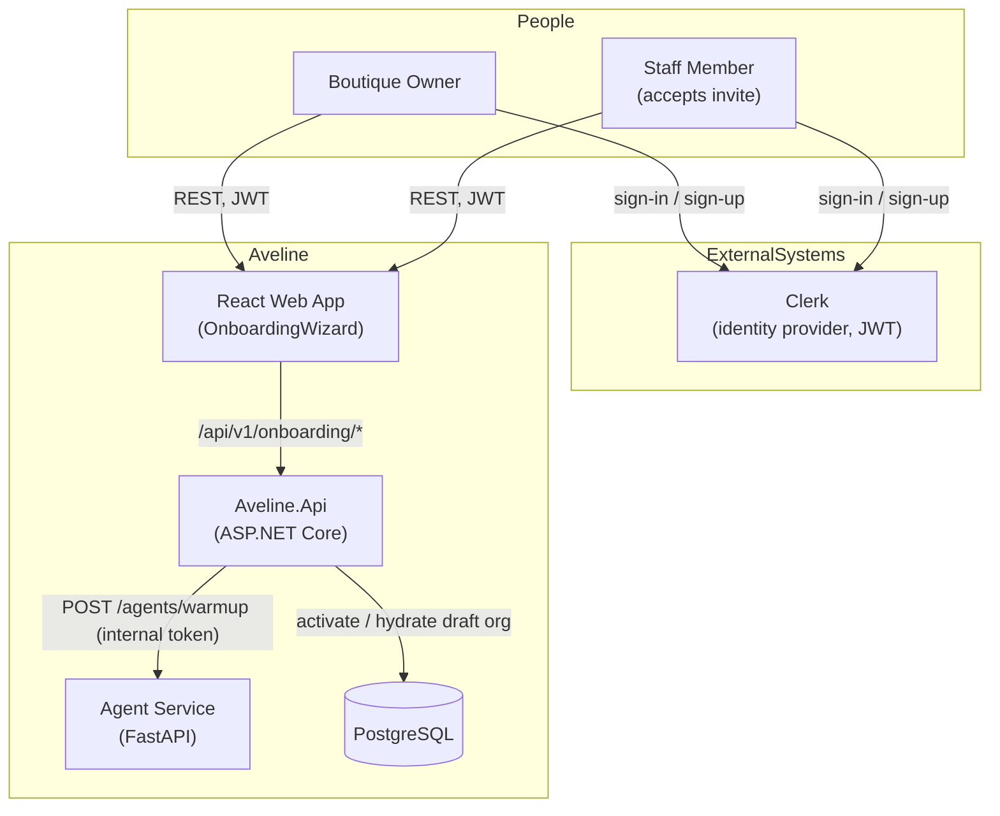
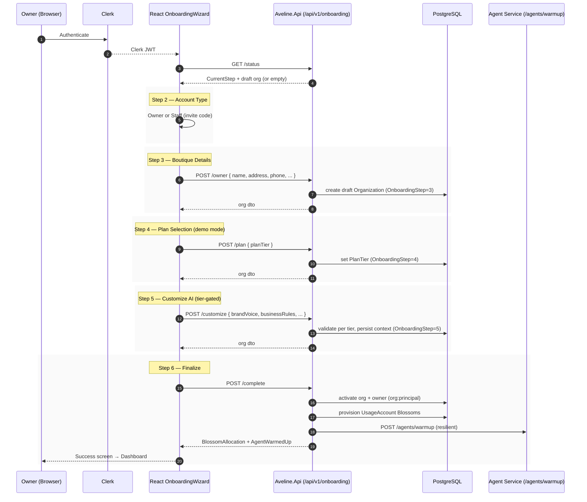

# Owner Onboarding Flow — Architecture

> **Status:** Implemented (feature branch `feature/69-owner-account-creation-flow`, PR #70) —
> extended with integrations & team invitations (#71/#72).
> **Related:** [Pricing Plan](pricing_plan.md) · [Authentication](authentication.md) · [Authorization](authorization.md)
> Diagrams use the **C4 model** plus UML-style **sequence diagrams**, rendered with Mermaid.

---

## 1. Purpose

This document describes the **Owner Account Creation Flow** — the luxury, multi-step
onboarding experience a boutique owner completes before entering the Aveline dashboard.

The flow:

1. Confirms the account holder's role (Owner vs Staff).
2. Captures boutique identity and contact details.
3. Selects a subscription plan (demo mode — no payment).
4. Customizes the AI concierge context, with fields unlocking by plan tier.
5. Optionally connects third-party channels (WhatsApp, Instagram, payment gateway) —
   credentials stored encrypted and tenant-scoped.
6. Optionally invites team members by email / generated code / shareable link.
7. Finalizes: activates the organization, provisions the Blossom allowance, and warms up the agents.

It is intentionally **resumable** — a partially completed wizard is hydrated from the backend
so the owner can continue where they left off. Integrations and team invitations are optional
and can also be completed later from Settings.

---

## 2. System Context

The flow lives primarily in the **web React app**, orchestrated by the **Aveline.Api**
onboarding module, with the **Agent Service** handling the final warm-up call.

---

## 3. The 8-Step Flow

> **Note (integrations & team):** Steps 6 and 7 are **optional/skippable** and are
> inserted between AI customization (step 5) and finalize (step 8). Because the two optional
> steps are additive, the backend `OnboardingStep` transitions still treat AI customization as
> the last *required* milestone before `POST /complete` — resumed sessions continue from the
> AI-context step and may skip straight to finalize.

---

## 4. Backend (Aveline.Api)

### 4.1 Endpoints

Mapped under the `/api/v1` group as `/api/v1/onboarding/*`. All require an authenticated
Clerk JWT. `RequireAuthorization()` is applied per endpoint.

| Method | Path                    | Purpose                                                        |
| ------ | ----------------------- | -------------------------------------------------------------- |
| GET    | `/api/v1/onboarding/status`    | Resume progress; returns current step + draft organization.    |
| POST   | `/api/v1/onboarding/owner`     | Step 3 — create/update the draft organization (boutique).      |
| POST   | `/api/v1/onboarding/plan`      | Step 4 — set the selected `PlanTier`.                          |
| POST   | `/api/v1/onboarding/customize` | Step 5 — validate & persist AI context (tier-gated).           |
| POST   | `/api/v1/onboarding/complete`  | Step 6 — activate org/user, provision Blossoms, warm up agents.|

**Files:** `Endpoints/OnboardingEndpoints.cs`,
`Modules/Organizations/Services/{IOnboardingService,OnboardingService}.cs`,
`Modules/Organizations/DTOs/OnboardingDtos.cs`.

### 4.2 Data model additions

`Modules/Organizations/Models/Organization.cs` gained boutique + onboarding metadata:

- **Identity:** `Address`, `PhoneNumber`, `Description`, `LogoUrl`
- **Plan:** `PlanTier` (default `Seed`)
- **AI context:** `BrandVoice`, `BusinessRules`, `PreferredColorsFabrics`, `CustomerPreferences`
- **Progress:** `OnboardingStep` (default 2), `HasCompletedOnboarding` (default false)

Column lengths, defaults, and the string conversion for `PlanTier` are configured in
`OrganizationConfiguration.cs`. A `GetByOwnerUserIdAsync` query was added to the repository
to find the owner's single draft organization.

> **Note:** A new EF Core migration for these columns is outstanding and will be generated when
> a database is accessible. See Open Questions.

### 4.3 Service responsibilities (`OnboardingService`)

| Method                          | Behaviour                                                                                                                                                |
| ------------------------------- | -------------------------------------------------------------------------------------------------------------------------------------------------------- |
| `GetStatusAsync`                | Reads the user and their draft org; derives the current wizard step (defaults to 2).                                                                     |
| `SaveBoutiqueDetailsAsync`      | Creates (or updates) the draft org with the user as owner, slugifies the name, and adds an `org:boutique_owner` membership. Advances to step 3.           |
| `SelectPlanAsync`               | Persists `PlanTier`; requires the org to exist first. Advances to step 4.                                                                                |
| `SaveAiCustomizationAsync`      | Validates input against the tier (below), persists AI context, advances to step 5.                                                                       |
| `CompleteOnboardingAsync`       | Activates org (`HasCompletedOnboarding=true`), sets the user to `owner` / `org:principal` / `Active`, provisions the `UsageAccount` Blossom allowance, invalidates user cache, and (resiliently) warms up agents. |

### 4.4 Tier-gated AI context

Enforcement aligns with `pricing_plan.md`:

| Tier     | Custom AI context                                                                        |
| -------- | ---------------------------------------------------------------------------------------- |
| Seed     | **Locked.** Custom fields rejected — the boutique runs on standard concierge presets.    |
| Bloom    | **Basic.** Brand voice, business rules, and store preferences. Deep memory rules locked. |
| Orchid   | **Full.** Brand voice, business rules, fabrics/colors, and customer memory rules.        |
| Rose     | **Full** (everything in Orchid).                                                         |
| Enterprise | Full (highest Blossom allowance).                                                       |

The React wizard mirrors this by sending only the permitted fields per tier; the backend
re-validates independently.

### 4.5 Demo-mode Blossom provisioning

Plans currently run in **demo mode — no payment**. On completion the service provisions the
monthly allowance for the chosen plan into a `UsageAccount` for the current billing period:

| PlanTier | Monthly Blossom limit |
| -------- | ---------------------:|
| Seed     | 150                   |
| Bloom    | 750                   |
| Orchid   | 2,000                 |
| Rose     | 5,000                 |
| Enterprise | 9,999               |

The owner is informed with a luxury notice: _"Your account is in demo mode. You'll be
contacted for payment."_

---

### 4.6 Team invitations (owner-facing)

Owner invitation-management endpoints are org-scoped (`BoutiqueMembershipManagePolicy`) and
tenant-isolated under the same `/orgs/{organizationId}` route used by memberships:

| Method | Path | Purpose |
| ------ | ---- | ------- |
| POST | `/api/v1/orgs/{organizationId}/invitations` | Create an invitation (role + optional email); returns one-time code + shareable link and sends an invitation email. |
| GET | `/api/v1/orgs/{organizationId}/invitations` | List pending invitations. |
| POST | `/api/v1/orgs/{organizationId}/invitations/{invitationId}/revoke` | Revoke a pending invitation. |

Creation reuses `OrganizationService.InviteMemberAsync`; a one-time **24-hour** code is issued and
mapped to the invitation in a transient store (Redis via `IDistributedCache`,
`IInvitationCodeStore`), while the SHA-256 hash and full lifecycle remain in Postgres as a durable
audit log + fallback (see [ADR-012](../ADR/ADR-012-invitation-code-lifecycle.md)). Acceptance
resolves the code through the store, falling back to the hash; the transient mapping is removed on
redemption. `POST /invitations/accept` is rate-limited per client IP (default 10/min, 429 when
exceeded). Email delivery is behind an `IEmailService` abstraction whose demo
`LoggingEmailService` records dispatch **without** logging the one-time code — the link's
`code` query parameter is stripped from log output. The link points to `/invite?code=…`
(`InvitePage`), which accepts the invitation and routes the new member to the app. The response
also carries a `mobileLink` (`{App:MobileScheme}://invite?code=…`, scheme defaults to `aveline`)
that opens the Flutter mobile app directly into the invite-code step, skipping manual entry.

### 4.7 Integration credentials (secure tenant secrets)

Owners connect channels during step 6 through org-scoped endpoints under
`/api/v1/orgs/{organizationId}/integrations` (see `IntegrationEndpoints.cs`):

| Method | Path | Purpose |
| ------ | ---- | ------- |
| GET | `/api/v1/orgs/{organizationId}/integrations` | Masked connection status for all configured types. |
| PUT | `/api/v1/orgs/{organizationId}/integrations/{type}` | Save/upsert credentials for `whatsapp`/`instagram`/`paymentgateway`. |
| DELETE | `/api/v1/orgs/{organizationId}/integrations/{type}` | Disconnect / remove stored credentials. |

Secrets are **AES-256-GCM encrypted** (`CredentialEncryptionService`, key
`Credentials:EncryptionKey`) and stored as a `nonce:tag:ciphertext` blob in a new
`IntegrationCredentials` table keyed by `(OrganizationId, IntegrationType)` — one row per
integration per boutique, so tenant isolation is enforced at the data layer. Status responses
return only a masked preview (`****Wxyz`); plaintext is decrypted transiently by
`IntegrationService` for backend outbound calls only. See
[ADR-011](../ADR/ADR-011-credential-encryption.md).

---

## 5. Agent Service integration

After the organization is finalized, `OnboardingService` calls
`POST /agents/warmup` through `IAgentServiceClient`, passing the boutique seed context
(`organizationId`, `boutiqueName`, `planTier`, `brandVoice`, `businessRules`,
`preferredColorsFabrics`, `customerPreferences`).

- The call is **resilient / non-fatal** — a warm-up failure logs a warning but does not fail
  onboarding.
- The Agent Service endpoint (`agnet-service/app/api/agents.py`) is protected by
  `require_internal_token` and logs a structured `agent_warmup` event, returning
  `{ "status": "warmed", "ready": true, ... }`.

---

## 6. Frontend (React Web App)

### 6.1 Routing

- `/onboarding` (`routes/OnboardingPage.tsx`) renders `OwnerOnboardingWizard`.
- `RequireAccountState` redirects any **OnboardingPending** account to `/onboarding`, where the
  unified wizard handles both owner setup and staff invitation acceptance.
- Once `POST /complete` succeeds the account becomes **Active** and the owner enters the
  tenant dashboard: `/app` resolves the caller's boutique and redirects to `/app/b/{slug}`
  (`routes/Dashboard.tsx` → `routes/TenantDashboard.tsx`). See issue #74.

### 6.2 Wizard architecture

`components/onboarding/` was split into modular pieces:

- **`OwnerOnboardingWizard.tsx`** — shell: supplies the provider and renders the shared chrome
  (animated background, brand header, progress stepper, error alert) plus the active step page.
- **`wizard-context.tsx`** — owns all shared state (`WizardDraft`), the on-mount status
  hydration, and every submission handler; exposed via `useOwnerOnboardingWizard()`.
- **`plans.ts`** — shared plan data (`PLANS`) and helpers used by the plan, review, and success
  screens.
- **`steps/`** — one page per stage: `AccountTypeStep`, `BoutiqueDetailsStep`,
  `PlanSelectionStep`, `AiCustomizationStep`, `ReviewStep`, `SuccessStep`.

### 6.3 Step pages

| Step | Component                | Notes                                                                  |
| ---- | ------------------------ | ---------------------------------------------------------------------- |
| 2    | `AccountTypeStep`        | Owner vs Staff; staff path accepts an invitation code to join an org.  |
| 3    | `BoutiqueDetailsStep`    | Boutique name (with live slug preview), address, phone, description, logo. |
| 4    | `PlanSelectionStep`      | Seed / Bloom / Orchid / Rose cards; demo-mode banner.                  |
| 5    | `AiCustomizationStep`    | Fields unlock per tier (Seed = locked; Bloom basic; Orchid/Rose full). |
| 6    | `IntegrationsStep`       | Optional: connect WhatsApp / Instagram / payment gateway (encrypted, masked status). |
| 7    | `InviteStaffStep`        | Optional: invite staff by email, generated code, or copyable link; pending list + revoke. |
| 8    | `ReviewStep` + `SuccessStep` | Summary, agent warm-up state, Blossom allocation, dashboard CTA.   |

### 6.4 Visual treatment

The onboarding page reuses the marketing site's **`AuroraField`** animated background
(drifting gradient blobs and blossoms) layered with a soft radial "paper" vignette so the
wizard remains legible — consistent with the **Quiet Luxury** brand system.

### 6.5 API client

`lib/onboarding.ts` provides typed wrappers (`fetchOnboardingStatus`,
`saveBoutiqueDetails`, `selectPlan`, `saveAiCustomization`, `completeOnboarding`) matching the
backend DTO contracts. Step 6 uses `lib/integrations.ts`, and step 7 uses `lib/invitations.ts`
(plus the shared `acceptInvitation` in `lib/organizations.ts`). Staff joining from an emailed
link land on `routes/InvitePage.tsx` (`/invite?code=…`).

---

## 7. Security notes

- Every onboarding endpoint requires a valid **Clerk JWT**.
- **OnboardingPending** accounts are only allowed to reach onboarding, profile, and
  organization/invitation endpoints (see `OnboardingMiddleware`); they cannot reach business
  endpoints until the flow completes.
- The `/agents/warmup` call is a service-to-service request authenticated by the internal
  token (see [ADR-009](../ADR/ADR-009-internal-service-authentication.md)).
- The owner is the `org:principal`; staff join only via an invitation code accepted on their
  side.

---

## 8. Verification

- **.NET:** `Aveline.Api.Tests/OnboardingServiceTests.cs` and
  `OnboardingEndpointsIntegrationTests.cs` exercise the full onboarding flow end-to-end
  (step transitions, Seed/Bloom/Orchid tier gating, completion, Blossom provisioning,
  status resumption). The integrations slice is covered by `CredentialEncryptionServiceTests`,
  `IntegrationServiceTests`, and `IntegrationEndpointsIntegrationTests`; the team-invitation
  slice by `OrganizationInvitationLifecycleTests`, `InvitationManagementEndpointsIntegrationTests`,
  `EmailServiceTests`, `DistributedInvitationCodeStoreTests`, `DistributedRateLimiterTests`, and
  `InvitationAcceptRateLimitIntegrationTests`. `dotnet test Aveline.Api.Tests` passes (206 tests).
- **Agent Service:** `agnet-service/tests/test_agents_warmup.py` covers warmup auth and payload.
- **Frontend:** `vitest run` (onboarding/integration/invitation contracts), `tsc -b`, `oxlint`, and `vite build`.

---

## 9. Open questions / follow-ups

1. The migration `AddIntegrationCredentials` also carries previously-outstanding
   Organization-onboarding and Billing model diffs (they had been reflected in the model
   snapshot but never shipped as a migration). Verify it applies cleanly to a fresh PostgreSQL
   database before release.
2. The plan document described dual-prefix mapping (`/api/onboarding` and `/api/v1/onboarding`);
   only the `/api/v1/onboarding` group is currently mapped, consistent with the React client.
3. Python warm-up tests were authored to mirror the existing internal-auth tests but were not
   executed locally (no Python environment); they should run in CI.
4. Demo-mode banner copy and Blossom figures should be confirmed against `pricing_plan.md` before
   billing is enabled.
5. `IEmailService` is a logging/no-op sender; wire a real provider (SMTP/SendGrid) before launch.
6. Instagram connection currently uses manual credential entry; a full Meta OAuth redirect flow
   is a follow-up.
