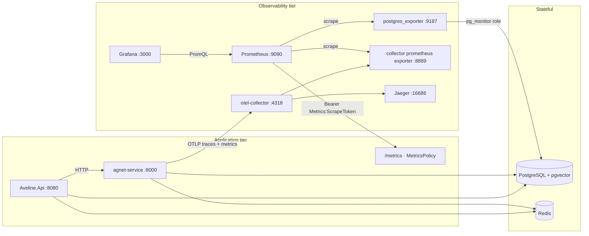

# Observability — Prometheus, Grafana and the metric contract

This is the operator-facing companion to the metrics infrastructure slices
(`.agents/plans/prometheus-grafana-metrics-implementation.ignore.md`, Revision 4). It states what
runs, where each series comes from, how to change a dashboard, and what is deliberately deferred.

One issue per slice, all on `feature/prometheus-and-grafana-monitoring`:

| Slice | Issue | What landed |
| --- | --- | --- |
| 1 | [#315](https://github.com/KavinduNirmal/aveline/issues/315) | `Metrics:ScrapeToken` with no default, the `prometheus` service, `observability/prometheus/**`, the naming contract and its test, the `observability-config` CI job |
| 2 | [#316](https://github.com/KavinduNirmal/aveline/issues/316) | Meter registrations (`Aveline.Api.Eventing`, `Npgsql`), `MetricSnapshotReader.Flatten`, the twenty bridged business gauges, publish-before-write, decimal decision |
| 3 | [#317](https://github.com/KavinduNirmal/aveline/issues/317) | Grafana at `13.2.2`, file provisioning, the Overview / Business dashboards, one contact point and the operator alerts |
| 4a | [#318](https://github.com/KavinduNirmal/aveline/issues/318) | Agent `MeterProvider` + OTLP, the collector `metrics:` pipeline, the additive agent instruments, `test_metrics_are_recorded` |
| 4b | [#319](https://github.com/KavinduNirmal/aveline/issues/319) | The step-record producer, the two dead call sites wired, `AgentDataQualityDto.Derive` called |
| 5 | [#320](https://github.com/KavinduNirmal/aveline/issues/320) | `.AddMeter("Npgsql")`, the neutralised pool-name label, the collector-emitted saturation ratio, the `db.pool.saturated` rule and its migration |
| 6 | [#321](https://github.com/KavinduNirmal/aveline/issues/321) | `postgres_exporter` (digest-pinned, internal), the least-privilege `pg_monitor` role, the Database dashboard |
| 7 | [#322](https://github.com/KavinduNirmal/aveline/issues/322) | The notification metric family, emitted; the Notifications dashboard; the HTTP routes stay deferred |
| 8 | [#323](https://github.com/KavinduNirmal/aveline/issues/323) | This document, the corrections commit, `DocsConsistencyTests`, the deployment note |

---

## 1. Architecture



The API's OTLP export is **off** unless `Observability:OtlpEndpoint` is set, and compose does not
set it for the API. The API's metrics therefore reach the world only through the pull-scraped
`/metrics`, which is what makes the label discipline in §5 enforceable: a push path would let any
instrument attribute a series to a tenant.

## 2. What each store is authoritative for

| Question | Authoritative store | Why |
| --- | --- | --- |
| What is happening *now* to this process? | **Prometheus** | Sub-minute resolution; the exporter already produces it |
| What happened last week / last quarter? | **Postgres** | 30 d samples, 90 d hourly, 400 d daily; Prometheus retention is deliberately short |
| Which org consumed how many API calls? | **Postgres** | Dimensions are tenant-scoped; Prometheus labels must never carry a tenant |
| Are alert thresholds breached? | **Both, for different audiences** | `AlertEvaluationJob` + `SystemAlerts` are the *product* alerts surfaced at `/admin/statistics/system/alerts`; Prometheus/Grafana alerting is *operator* alerting. They must not share a contact point |
| What is the database *server* doing? | **Prometheus, via `postgres_exporter`** | Server-side `pg_stat_*` views; Npgsql sees only this client |
| Is *this application's* connection pool exhausted? | **Prometheus, via Npgsql's meter** | `postgres_exporter` can never answer this |

`SystemMetricSample` is a **durable fallback**, not the primary store
(`docs/backend/backend-requirements.md`): if Prometheus is deployed, the table is a cache, and the
bridge is the requirement in action rather than a design choice.

## 3. The two-name contract (read this before writing a query)

The pinned exporter (`OpenTelemetry.Exporter.Prometheus.AspNetCore 1.18.0-beta.1`) defaults to
`UnderscoreEscapingWithSuffixes`. It:

1. replaces invalid characters with `_`;
2. maps and appends the instrument unit unless the sanitised name already ends with it
   (`ms → milliseconds`, `ratio → ratio`, `count → count`);
3. appends `_total` to counters unless the name already ends there;
4. writes `_bucket`, `_sum` and `_count` literally for histograms.

**The dotted name is the internal key** (the Postgres `SystemMetricSamples.MetricName` value and the
key the seeded alert-rule guard watches). **The Prometheus name is what a PromQL expression, a
Grafana panel or a recording rule must say.** `MetricsCatalog` in
`Aveline.Api/Configurations/MetricsConfiguration.cs` is the one place a Prometheus name is authored,
and `MetricsNamingTests` asserts every entry against a live scrape.

Do not hand-apply the rule. The plan's own hand-applied table was wrong in three of nineteen rows:
`aveline.process.cpu_seconds` gains `_count`, and both `ratio` metrics (`aveline.api.error_rate`,
`aveline.agent.success_rate`) gain `_ratio` rather than passing through. That is what the naming
test caught, and it is why the test ships before any dashboard.

### 3.1 Gauge or counter? Get this right or `rate()` lies

`MetricsCatalog` records each bridged metric's kind, and `AvelineMetrics` creates the matching
instrument. The rule:

| Source value | Instrument | Example |
| --- | --- | --- |
| Cumulative since process start, only ever increases (a reset means a restart) | **Counter** | `aveline.process.cpu_seconds`, `aveline.api.telemetry.dropped`, `aveline.eventbus.failed` |
| A level that can go up or down | Gauge | `aveline.blossom.balance`, `aveline.eventbus.backlog`, `aveline.db.pool.saturation`, `aveline.process.working_set_bytes` |
| Already a rate, ratio or percentile over a window | Gauge | `aveline.api.requests_per_second`, `aveline.api.error_rate`, `aveline.api.latency_p95` |

Three bridged metrics were originally exposed as gauges and read with `rate()` on the System
overview. That is wrong twice over: Grafana flags a rate over a non-counter, and Prometheus can only
handle a counter reset (an API restart) correctly when the series is typed as a counter. They are now
counters with **no unit**, which the exporter renders as the idiomatic `<name>_total`. The
persistence path is unchanged — `SystemMetricSamples` still stores them with unit `count`.

**Expect a naming surprise in the metadata API.** Prometheus normalises a counter family by stripping
`_total`, so after a scrape:

```
GET /api/v1/metadata?metric=aveline_process_cpu_seconds   ->  "type": "counter"
count(aveline_process_cpu_seconds_total)                  ->  1
```

The *series* is `aveline_process_cpu_seconds_total`; the *metadata family* is
`aveline_process_cpu_seconds`. A query for metadata under the `_total` name returns nothing, which
looks like a missing type but is not.

## 4. Series inventory

### 4.1 Library series (present as soon as there is traffic)

| Series | Owner | Notes |
| --- | --- | --- |
| `http_server_request_duration_seconds_{bucket,sum,count}` | ASP.NET Core's `Microsoft.AspNetCore.Hosting` meter | On `net10.0` the instrument is ASP.NET Core's; `AddAspNetCoreInstrumentation()` merely enables the meter. Labels include `http_response_status_code`, `http_request_method`, `http_route` |
| `http_client_request_duration_seconds_*` | `System.Net.Http` | |
| `db_client_connection_count` / `db_client_connection_max` | Npgsql (`Npgsql` meter) | Labels `db_client_connection_state` (`idle`/`used`) and `db_client_connection_pool_name` |
| `db_client_operation_duration_*`, `db_client_operation_failed_total`, … | Npgsql | Names changed in Npgsql 10 (`db.client.commands.*` → `db.client.operation.*`) |
| `pg_locks_count`, `pg_stat_database_blks_hit`, `pg_database_size_bytes`, `pg_stat_activity_count`, `pg_replication_is_replica` | `postgres_exporter` | Server-side views; see §7 |

### 4.2 Application series

`MetricsCatalog.All` is the authority; the naming test proves the list. Groups:

- the twenty bridged business metrics (Slice 2 plus `aveline.db.pool.saturation` from Slice 5),
- the four event-bus instruments (`aveline_events_*`),
- the ten notification series (Slice 7),
- **the privacy and consent family** (privacy plan §9.1, catalogued by Phase 6 item 6.3):

  | Series | Kind | Notes |
  | --- | --- | --- |
  | `aveline_consent_state_total{status}` | snapshot gauge | Republished every 60 s by `ConsentMetricCollector`; replaces the plan's separate `consent_customers_total`/`consent_state_distribution` names with one keyed series |
  | `aveline_message_skip_total{reason}` | counter | Phase 1's processing counter |
  | `aveline_otp_issued_total`, `aveline_otp_verified_total`, `aveline_otp_failed_total{reason}` | counters | The opt-out codes |
  | `aveline_privacy_endpoint_rate_limited_total{reason}` | counter | **Renamed from `aveline_otp_start_refused`** in Phase 6; now covers the start, verify and data-rights budgets |
  | `aveline_disclosure_shown_total`, `aveline_disclosure_unshown_total` | counters | The transparency alarm is `unshown` |
  | `aveline_privacy_delivery_delivered_total{kind}`, `aveline_privacy_delivery_failed_total{kind,reason}` | counters | `disclosure_delivery_failed_total` in the plan is `..._failed_total{kind="disclosure"}` - no second name |
  | `aveline_data_export_requests_total{status}`, `aveline_data_delete_requests_total{status}` | counters | Terminal status only (`completed`/`not_found`/`conflict`/`verification_failed`/`unavailable`) |
  | `aveline_data_delete_time_to_complete_seconds_{bucket,sum,count}` | histogram (unit `s`) | Recorded once per first execution; a replayed deletion did not complete again |

  The family deliberately has **no route**: the consent tables stay off every read surface but the
  authenticated scrape (`docs/backend/statistics-catalog.md`, "Privacy and consent metrics").
  `dpia_retention_breach_total` is **not** authored - question Q-6 (the retention window) is open,
  and a breach counter needs a threshold before it can exist.

### 4.3 Payment series (Phase 2)

`Modules/Payments/Services/PaymentMetrics.cs` authors the ten `aveline.payment.*` instruments of the
payment plan's §12.1 on the same `Aveline.Api` meter, so `AddMeter(InstrumentationName)` exports
them with no second registration site. The family is deliberately **not** in `MetricsCatalog.All`
yet: putting it there is what pins each Prometheus name through `MetricsNamingTests`, and that is
the follow-up once the P2-B2 settlement services are the only producers. Labels are `provider`,
`purpose`, `outcome`, `type`, `reason`, `operation` and `error_code`; none is in
`ForbiddenLabelKeys`. `aveline_payment_mock_provider_active` is the alertable one: it reads `1` for
`provider="mock"` and is Critical outside Development (plan §7.4 guardrail 4).

## 5. Cardinality and label discipline

A Prometheus TSDB falls over on label cardinality, and this data model is full of unbounded ids.

**Forbidden as a label value:** `organizationId`, `userId`, `customerId`, `conversationId`,
`messageId`, `workflowId`, `runId`, `apiKeyId`, a raw request path, a user-agent string, a hashed
IP, **and a connection string**.

**Allowed:** route *templates* (never the literal path — see
`Modules/Statistics/Telemetry/RouteTemplateResolver.cs`), HTTP method, status code/class,
`event_type`, `node`, `tool`, `provider`/`model`, severity, `datname`, lock `mode`, `state`.

`MetricsCatalog.ForbiddenLabelKeys` holds the list, `MetricsCardinalityTests` asserts it two ways,
and `NpgsqlPoolMetricsListener` keys its dictionary by the pool name — which is why
`DatabaseConfiguration.PoolName` sets an explicit `NpgsqlDataSourceBuilder.Name`: without it, the
label defaults to the connection string minus the password.

## 6. Operating it

### 6.1 Local

```bash
# 1. Secrets (never committed)
export METRICS_SCRAPE_TOKEN="$(openssl rand -hex 32)"
printf '%s' "$METRICS_SCRAPE_TOKEN" > observability/prometheus/secrets/scrape_token
export POSTGRES_EXPORTER_PASSWORD="$(openssl rand -hex 32)"
printf '%s' "$POSTGRES_EXPORTER_PASSWORD" > postgres-exporter-password
export GRAFANA_ADMIN_PASSWORD="$(openssl rand -hex 32)"

# 2. Bring the observability tier up
docker compose up -d postgres redis api agent otel-collector prometheus grafana postgres-exporter
```

- Grafana: <http://localhost:3000> (datasource, dashboards and alerting are provisioned as files).
- Prometheus: <http://localhost:9090>.
- `/metrics` needs the token: `curl -H "Authorization: Bearer $METRICS_SCRAPE_TOKEN" localhost:5091/metrics`.
- `postgres_exporter` has **no host port**; it is reachable only inside the compose network.

> `docker compose` fails fast when `METRICS_SCRAPE_TOKEN`, `POSTGRES_EXPORTER_PASSWORD` or
> `GRAFANA_ADMIN_PASSWORD` is unset. That is deliberate (R-1/S-1): the alternative is silently
> falling back to the committed internal service token.

### 6.2 Rotating the scrape token

1. Generate a new value and update the platform secret store.
2. Write it to `observability/prometheus/secrets/scrape_token` (or the mounted equivalent) and
   restart Prometheus: `docker compose restart prometheus`.
3. Set `METRICS_SCRAPE_TOKEN` on the API and restart it.
4. Order matters only in that a mismatch between steps 2 and 3 shows as `up{job="aveline-api"} == 0`
   and fires `AvelineApiScrapeDown`.

The internal service token still authenticates `/metrics` (`MetricsPolicy` accepts both), so a
rotation error degrades visibility without breaking anything else.

### 6.3 Adding a dashboard or a panel

1. Dashboards are **code**: edit the JSON under `observability/grafana/dashboards/` and commit.
   `allowUiUpdates: false` means a UI edit is discarded on restart, and Grafana 13 migrates
   dashboards to unified storage on startup, so a UI edit can appear to revert.
2. Every `expr` must use the **Prometheus** name (§3). If it is an `aveline_*` series, it must exist
   in `MetricsCatalog` — `GrafanaProvisioningTests` fails the build otherwise.
3. Never set `connectNulls: true`, and never fill a gap with `0`: a `null` point is an omission
   (BR-7.10) and must render as a break.
4. Panel shape: `LineChart`/`AreaChart` semantics for time series, stat tiles for single values,
   bar charts for bounded distributions. A stat is not a one-point line.

### 6.4 Why a panel is empty (read this before filing a bug)

Five causes, and only some of which are defects:

| What you see | Cause | Correct? |
| --- | --- | --- |
| A break in a line, or `no data` on a stat | The value could not be determined, so the gauge published nothing (BR-7.10). Examples: `aveline_agent_success_rate_ratio` with no terminal runs in the window; `aveline_eventbus_publish_latency_ms_milliseconds` below the 5-sample floor | **Yes** — a gap is the honest answer |
| Every `aveline_*` panel empty, but `up{job="aveline-api"}` is 1 | The API image predates the bridge, or the collector has not completed a pass | Check **Bridge freshness** on the System overview; rebuild the image if it is old |
| The error-ratio panel empty while the service is healthy | Was a real defect until it was fixed: a PromQL division whose numerator is an empty vector returns *no series*, not `0`. The recording rule now uses `… or vector(0)` on the numerator only, so it reads `0%` with traffic and no 5xx, and still has no data when there is no traffic at all | Fixed (Slice 8 follow-up) |
| A counter panel empty (`events published`, `delivery attempts`) | The counter has no samples yet — nothing has been published this window | **Yes**; it populates with traffic |
| **Runs running** and **Runs paused** both flat at zero while the agent is clearly answering | Was a real defect. `agent.runs_running` counted `AgentWorkflowRuns.Status='Running'`, but the agent reported a run only *after* it finished, so every row was born terminal — 42 runs, all `Succeeded`, and no other state had ever existed. The agent now opens a `Running` row when a run starts (ADR-027) | Fixed. These are still **instantaneous** counts and read zero between runs; **Runs completed** is the panel that answers "is the agent being used?" |

**Bridge freshness** (`time() - max(timestamp(aveline_process_cpu_seconds_total))`) is the one panel
that separates "the value is 0" from "the bridge stopped". Since the gauges are only written when a
value exists, a stalled collector looks exactly like a gap, and a gap is what a stopped series should
look like.

**A gauge of a state is not a measure of activity.** Three of the four agent panels show a condition
that is usually false — nothing running, nothing paused — so a healthy idle system and a broken one
look identical on them. Before concluding a panel is broken, check whether its metric can be non-zero
at all: `agent.runs_running` needed a writer, and for a long time it had none. `agent.runs_total` is
the counter to reach for when the question is really "did anything happen?".

### 6.5 Adding a new metric

1. Add the dotted name and its Prometheus translation to `MetricsCatalog` (one edit).
2. If it is produced from Postgres, add it to `MetricSnapshot` **and** `MetricSnapshotReader.Flatten`
   **and** `SystemMetricCollector.ProducedMetricNames` — the three-way test fails if they drift.
3. If a seeded alert rule watches it, add the rule in the same commit; the C-5 guard compares
   `SystemAlertRuleSeed` against `ProducedMetricNames`.
4. Run `MetricsNamingTests` to confirm the translation rather than assuming it.

### 6.6 Validation

```bash
python3 scripts/validate_observability_config.py        # fast, dependency-light
# The authoritative check (the real Prometheus image), as CI runs it:
mkdir -p observability/prometheus/secrets && echo placeholder > observability/prometheus/secrets/scrape_token
docker run --rm -v "$PWD/observability/prometheus:/etc/prometheus" --entrypoint promtool \
  prom/prometheus:v3.13.3 check config /etc/prometheus/prometheus.yml
```

`promtool check config` **stats the files it references**, so the placeholder token file must exist
even for a syntax check.

## 7. PostgreSQL server-side metrics (`postgres_exporter`)

All five needs are **on by default** at v0.20.1; this slice is mostly a list of things not to do.

| Need | Series |
| --- | --- |
| Lock analysis | `pg_locks_count{datname,mode}` (mode values are **lowercased**: `accesssharelock`, `exclusivelock`), `pg_stat_database_deadlocks` |
| Buffer-cache hit ratio | `pg_stat_database_blks_hit` / `_blks_read` (counters **without** `_total`). The ratio needs `clamp_min(…, 1)` or it is NaN whenever `blks_read` is 0 in the window |
| Database growth | `pg_database_size_bytes{datname}`, `pg_stat_user_tables_size_bytes` |
| Backends | `pg_stat_activity_count` |
| Replication | `pg_replication_is_replica` (the honest signal), `pg_stat_replication_pg_wal_lsn_diff` |

**Never set** `--metric-prefix` (silently ignored by the standalone collectors since v0.20.0,
producing a mixed-prefix exposition), `--auto-discover-databases` (deprecated and unnecessary) or
`--disable-settings-metrics` (removed in v0.20.0; a pre-0.20 compose file will not start).

**The replication trap.** `pg_replication_lag_seconds` short-circuits with
`WHEN NOT pg_is_in_recovery() THEN 0`, so on a single-node primary it reports a healthy flat zero
for a system with no replication at all. This stack has one primary and no standby, so the Database
dashboard charts `pg_replication_is_replica`; the lag panels belong to a deployment that has a
standby (R-23).

**One gotcha that cost a rebuild, recorded so it does not cost another.** Npgsql's pool
instruments are `ObservableUpDownCounter<T>` and **`T` is not `long`** on the pinned version. The
collector's `MeterListener` originally registered only a `long` callback, so it captured nothing
while 32 `db_client_*` series still appeared in the scrape — the pool-name label looked correct and
the only symptom was a silently absent `aveline_db_pool_saturation_ratio`. The listener now registers
every numeric width OpenTelemetry can emit. `TryGetSaturation_CapturesInstrumentsWhoseNumericTypeIsNotLong`
pins it, and `NpgsqlPoolSaturationIntegrationTests` drives a real pool, because the original unit test
created its own `long` instrument and could not have caught it.

**Least privilege.** `observability/postgres-exporter/role.sql` creates a `postgres_exporter` role
with `pg_monitor` and `CONNECT` only — no superuser, no application-table access.
`PostgresExporterRoleTests` proves the role cannot read an application table.
`init-role.sh` runs it on first database initialisation; on an existing volume run it by hand:

```bash
psql -v exporter_password="$POSTGRES_EXPORTER_PASSWORD" -v database_name=aveline \
     -f observability/postgres-exporter/role.sql
```

**The Database dashboard filters PostgreSQL's own template databases.** `template0` and `template1`
are constant, empty and noisy in every `datname`-grouped panel, so the dashboard carries a `$datname`
variable sourced from `label_values(pg_database_size_bytes{datname!~"template.*"}, datname)` — the
selector keeps them out of the variable itself, so "All" means the real databases only.

## 8. The agent service

`agnet-service` has no inbound metrics port; it pushes OTLP metrics (`MeterProvider` +
`OTLPMetricExporter`, cumulative temporality) to `otel-collector`, which re-exposes them on
`:8889` for the `aveline-agent` scrape job. `http://agent:8000/metrics` still 404s by design.

**Additive instruments only.** The LangChain instrumentor already emits
`gen_ai.client.token.usage` (input/output) and `gen_ai.client.operation.duration`, and the FastAPI
instrumentors emit HTTP metrics. Building a second input/output token counter would guarantee two
panels that disagree, so the agent adds only: per-node duration and failures, tool calls, retries,
unattributed runs, streaming runs and the **cached** token direction.
`test_metrics_are_recorded` drives a real query and asserts a non-zero counter — existence testing
is what would have passed for the two telemetry objects that were already dead.

The semconv convention is pinned (`OTEL_SEMCONV_STABILITY_OPT_IN=http`) so the agent's HTTP metrics
use seconds, like the API's.

## 9. Notification metrics, and what is deferred

The notification family is **emitted** for Grafana (Slice 7) and **not routed**. The HTTP routes
(`/orgs/{id}/stats/notifications`, `/admin/statistics/system/notifications`) remain deferred:
exposing them requires the catalog `S-n` allocation, both paths in `docs/api/openapi.yaml` and the
API-catalogue section in `docs/api/README.md`, **in the same commit**
(`docs/backend/statistics-catalog.md`). §5.2 of the plan is the deferred register.

Four constraints the family must keep:

1. `aveline_notification_inbox_backlog` counts work items a user has not acted upon. It is **not**
   S-36's `notification_backlog`, which counts delivery rows with `Status = Pending`. Different
   denominators; never merge them.
2. `aveline_notification_delivery_total{channel,status}` is incremented **in the dispatcher**, not
   derived at scrape time.
3. `aveline_notification_fcm_credential_configured` is a gauge: `0` means push is a silent no-op.
4. `aveline_notification_time_to_read_p50_minutes` is **absent**, not zero, below
   `Telemetry:MinSampleForPercentile`.

**Recorded deviations from the plan.** The plan called `failure_reasons`, `volume_by_type` and
`push_dispatch_failures` counters. They are exposed as **windowed gauges** (24 h): deriving a
monotonic Prometheus counter from a table needs delta bookkeeping across collector passes, and a
counter that double-counts or resets is worse than an honest gauge. Also deferred with the routes:
the notification HTTP surface and the `inbound_message_backlog` schema change (M-7).

## 10. Deployment note (OQ-2)

Production is self-hosted Prometheus + Grafana on Azure, from the same committed files (the compose
config is the production config). Three operational facts:

1. **Two services must be always-on.** A TSDB cannot scale to zero and keep its data, so Prometheus
   and Grafana need `minReplicas: 1` plus persistent storage — on Container Apps that is an Azure
   Files mount. This is a `deploy/main.bicep` change and is **not part of the slices**; it is
   recorded here as the follow-up.
2. **Two new Key Vault secrets**: `METRICS_SCRAPE_TOKEN` and `GRAFANA_ADMIN_PASSWORD` (plus
   `POSTGRES_EXPORTER_PASSWORD` for the exporter's database role), alongside the existing ones.
3. **A scale-to-zero API makes "the series stopped" and "the container slept" the same event.**
   The API still runs at `minReplicas: 0`, so its process counters restart on every cold start and
   its 15 s overview cache is per-replica. The runbook must say so: a flat line during a quiet
   period is not necessarily an outage.

## 11. Documentation corrections landed with this work

The metrics plan found nine stale "deferred" claims across `docs/`; the strategy found five more.
Corrected here (Slice 8), each keyed on a code reference by `DocsConsistencyTests`:

| Claim | Correction |
| --- | --- |
| The five `/api/v1/admin/statistics/billing/*` routes return 404 | They are mapped (`BillingStatisticsEndpoints.cs`) and in OpenAPI. N-3c |
| There is no `AgentStatsRollupJob` | It exists and is a registered hosted service. N-3a |
| Hour→day compaction is deferred and no day rows are produced | `ApiStatsRollupJob` recomputes the day row when the closed hour is 23:00. N-3b |
| The k6 load-test harness is deferred | The script is tracked; only the CI runner is absent. N-3d |
| The overview is not cached server-side (M-10) | The code caches it for 15 s; the claim is **restored**, not deleted (D7 = A) |
| `db.pool.saturated` cannot be instrumented (S-37) | Npgsql's meter is registered and the collector emits the ratio; the rule ships (Slice 5) |
| `publish_latency_ms` is permanently omitted | The collector now persists `aveline.eventbus.publish_latency_ms` (M-8) |
