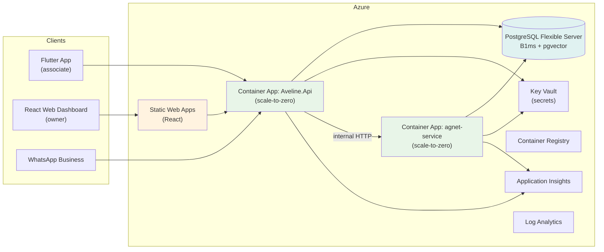

# Aveline — Azure Deployment Plan (Demo Phase)

> **Status:** Plan — to be implemented. See [ADR-006](ADR/ADR-006-deployment-platform.md) for the architectural decision.
>
> This document is the working implementation plan for deploying Aveline to Azure for the SE3090 demo phase (budget < $100) with fully automated CI/CD.

---

## 1. Goal

Host the complete Aveline backend on Azure so the mandatory cross-platform workflow runs end-to-end:

```
Flutter → API (ASP.NET Core) → Agent (LangGraph) → Database (PostgreSQL + pgvector)
        → React (approvals) → API → Flutter
```

Target operating cost: **~$0/month** via the **Azure for Students** offer, staying well under the < $100 demo budget.

---

## 2. Target architecture



All communication between clients and the agent service goes through the API — the agent service is never exposed directly (per project rules).

---

## 3. Azure service map & costs

| Resource | Service | Sizing | Est. cost/mo | Free-offer coverage |
|---|---|---|---|---|
| `Aveline.Api` | Azure Container Apps | Consumption, min 0 replicas | $0 (in grant) | 180k vCPU-sec, 360k GiB-sec, 2M req/mo |
| `agnet-service` | Azure Container Apps | Consumption, min 0 replicas | $0 (in grant) | same grant |
| Database | PostgreSQL Flexible Server | Burstable **B1ms**, 32 GB | $0 | 750 h/mo + 32 GB (12-mo offer) |
| Web dashboard | Azure Static Web Apps | Free tier | $0 | 100 GB bandwidth/mo |
| Container images | Azure Container Registry | Standard | $0 | 12-mo offer (100 GB) — *fallback: GHCR* |
| Secrets | Azure Key Vault | Free | $0 | always free |
| Observability | Application Insights + Log Analytics | Free tier | $0 | 5 GB logs/mo |
| CI/CD | GitHub Actions | OIDC (no paid runners) | $0 | public minutes |
| LLM | Azure OpenAI **or** OpenAI API | pay-per-token | ~$0–few $ | minimal demo usage |

**Assumption for ~$0:** both Container Apps are at **min replicas = 0** (scale-to-zero). An always-on 0.5-vCPU agent would exceed the free grant (~1.3M vCPU-sec/mo vs 180k free).

---

## 4. Prerequisites & account setup

1. **Azure for Students** sign-up with school email: https://azure.microsoft.com/en-us/free/students/ (no credit card; $100 credit, 12 months).
2. Install **Azure CLI** locally (`az`).
3. Create a resource group, e.g. `rg-aveline-demo` in a low-cost region.
4. Create **Microsoft Cost Management budget** (e.g. $10/mo) with email alert — set this *first*.
5. Verify GitHub repo access + `gh` CLI (already authenticated as `KavinduNirmal`).
6. Create the Clerk app (free tier) and OpenAI/LangSmith keys to store in Key Vault.

---

## 5. Implementation phases

### Phase 0 — Account & guardrails
- [ ] Sign up Azure for Students; confirm subscription `Azure for Students`.
- [ ] Create resource group + region selection.
- [ ] Create Cost Management budget ($10/mo) + alert.

### Phase 1 — Infrastructure as Code (Bicep)
Create `deploy/main.bicep` (+ `main.parameters.json`) that declares:
- Container Apps environment (consumption) + two container apps (`api`, `agent`), each with `minReplicas: 0`, HTTP scaling.
- PostgreSQL Flexible Server (B1ms) with `CREATE EXTENSION vector` available; firewall locked to the ACA environment.
- Key Vault (access policies / RBAC) + initial secrets.
- Static Web Apps (free tier).
- Log Analytics workspace + Application Insights.

Deploy idempotently:
```bash
az deployment group create \
  --resource-group rg-aveline-demo \
  --template-file deploy/main.bicep \
  --parameters @deploy/main.parameters.json
```

### Phase 2 — Container images
- `Aveline.Api/Dockerfile` and `agnet-service/Dockerfile` already exist — validate `docker build` locally.
- Build and push `api` / `agent` images to ACR (or GHCR).

### Phase 3 — CI/CD: GitHub Actions `deploy.yml`
- Add **OIDC federation** (Azure AD app registration) so GitHub can authenticate to Azure without secrets:
  ```yaml
  - name: Azure login
    uses: azure/login@<pin-sha>
    with:
      client-id: ${{ vars.AZURE_CLIENT_ID }}
      tenant-id: ${{ vars.AZURE_TENANT_ID }}
      subscription-id: ${{ vars.AZURE_SUBSCRIPTION_ID }}
  ```
- `on: push` to `development` (→ dev) and `main`/`master` (→ prod); optional manual `workflow_dispatch`.
- Jobs: login → build/push images → deploy Bicep → update Container Apps revisions → deploy React to SWA → `flutter build apk` + upload artifact/Release.
- Gate deploys on the existing `ci.yml` quality checks.

### Phase 4 — Database provisioning & migrations
- [ ] Configure Flexible Server connection string in Key Vault; reference from Container Apps via managed identity.
- [ ] Run `CREATE EXTENSION vector;` and schema migrations (EF Core) in a CI step.
- [ ] Verify LangGraph PostgreSQL checkpointer (`langgraph.checkpoint.postgres`) connects and can pause/resume across the approval interrupt.

### Phase 5 — React dashboard (Static Web Apps)
- [ ] Scaffold the React app (tech TBD) and wire SWA build + deploy; SWA provides automatic PR preview environments.

### Phase 6 — Flutter APK
- [ ] Add `flutter build apk --release` job in CI.
- [ ] Upload artifact + attach to a GitHub Release (or Firebase App Distribution).

### Phase 7 — Observability & secrets
- [ ] Point both Container Apps at Application Insights.
- [ ] Verify log flow into Log Analytics (free tier).
- [ ] Store Clerk/OpenAI/LangSmith/WhatsApp/payment keys in Key Vault; nothing in the repo or env vars.

### Phase 8 — Demo hardening
- [ ] Warm endpoints (`/openapi/v1.json`, `/health`) a few seconds before the demo, or temporarily set `minReplicas: 1`.
- [ ] Keep the PostgreSQL server stopped outside demo hours.
- [ ] Record the full workflow trace in Application Insights as assignment evidence.

---

## 6. CI/CD pipeline design (target)

```yaml
# .github/workflows/deploy.yml
name: Aveline Deploy

on:
  push:
    branches: [development, main, master]
  workflow_dispatch:

jobs:
  deploy:
    runs-on: ubuntu-latest
    permissions:
      id-token: write   # required for OIDC
      contents: read
    steps:
      - uses: actions/checkout@<pin-sha>
      - name: Azure login (OIDC)
        uses: azure/login@<pin-sha>
        with:
          client-id: ${{ vars.AZURE_CLIENT_ID }}
          tenant-id: ${{ vars.AZURE_TENANT_ID }}
          subscription-id: ${{ vars.AZURE_SUBSCRIPTION_ID }}
      - name: Build & push images
        run: |
          az acr login --name ${{ vars.ACR_NAME }}
          docker build -t $ACR/api:${GITHUB_SHA} ./Aveline.Api
          docker build -t $ACR/agent:${GITHUB_SHA} ./agnet-service
          docker push $ACR/api:${GITHUB_SHA}
          docker push $ACR/agent:${GITHUB_SHA}
      - name: Deploy infrastructure (Bicep)
        run: az deployment group create --resource-group ${{ vars.RG }} --template-file deploy/main.bicep
      - name: Update Container Apps revisions
        run: |
          az containerapp update --name api --image $ACR/api:${GITHUB_SHA} ...
          az containerapp update --name agent --image $ACR/agent:${GITHUB_SHA} ...
      - name: Deploy React to Static Web Apps
        uses: Azure/static-web-apps-deploy@<pin-sha>
      - name: Build Flutter APK
        working-directory: frontend/aveline_mobile
        run: flutter build apk --release
      - name: Upload APK
        uses: actions/upload-artifact@<pin-sha>
```

> Action versions will be resolved and SHA-pinned at implementation time (consistent with the existing `ci.yml` hardening).

---

## 7. Cost controls

1. **Scale-to-zero** on both Container Apps.
2. **Stop** PostgreSQL Flexible Server when not demoing (start/stop supported).
3. **Skip Redis** (nice-to-have; not yet used in code).
4. Use **Burstable B1ms**, never General Purpose.
5. Keep LLM calls minimal; prefer cheaper models for demo scripts.
6. **Cost Management budget + alerts** at $10/mo.
7. Prefer **GHCR** if the ACR 12-month offer is unavailable.
8. Renew Azure for Students yearly; stay within always-free tiers so cost stays ~$0 after the credit lapses.

---

## 8. Verification checklist

- [ ] `docker compose config` and both `Dockerfile`s build locally.
- [ ] `az deployment group create` succeeds idempotently (run twice, no drift).
- [ ] `GET /openapi/v1.json` and `GET /health` respond from the deployed Container Apps.
- [ ] A database migration + `CREATE EXTENSION vector` run via CI.
- [ ] A sample customer-memory semantic search returns results (pgvector path).
- [ ] A LangGraph workflow pauses for approval and resumes from the PostgreSQL checkpointer.
- [ ] React dashboard loads and an approval can be acted on; status reaches the Flutter app.
- [ ] Logs appear in Application Insights/Log Analytics.
- [ ] No secret appears in the repo, logs, or env output (Husky gate + manual check).
- [ ] Cost dashboard shows ~$0 for the month.

---

## 9. Risks & mitigations

| Risk | Mitigation |
|---|---|
| Student verification fails | Fall back to standard Azure free account ($200/30-day credit) or pay-as-you-go with same free tiers |
| $100 credit lapses | Renew yearly; stay within free tiers |
| `pgvector` not enabled | `CREATE EXTENSION vector;` in migrations; use PG 13–16 on Flexible Server |
| Scale-to-zero cold starts in a live demo | Warm endpoints ~10 s before demo, or `minReplicas: 1` for the demo hour |
| Azure OpenAI quota on student subs | Use plain OpenAI API (key in Key Vault) as fallback |
| ACR offer unavailable | Use GHCR (free) |
| React stack still TBD | Block Phase 5 until tech is decided; SWA deploy is stack-agnostic for SPAs |

---

## 10. Open decisions (tracked for later)

- **LLM provider**: Azure OpenAI vs OpenAI API.
- **React state management / hosting**: SWA assumed; confirm once React tech is decided (aligns with ADR-004).
- **APK distribution**: GitHub Release vs Firebase App Distribution.
- **Image registry**: ACR (Azure-native, free 12-mo) vs GHCR (free forever).

---

## 11. Rollback & teardown

- Container Apps revisions keep previous images — rollback by pinning a prior revision.
- Force-push guard: deploy workflow runs only on `development`/`main`/`master` (never on feature branches except SWA PR previews).
- Teardown after the demo (or to restart cleanly):
  ```bash
  az group delete --name rg-aveline-demo --yes --no-wait
  ```
  This removes all Azure resources and stops all cost.

---

## Observability tier — Prometheus + Grafana (metrics plan, OQ-2)

The metrics workstream commits **one** configuration used in both local development and production:
`docker-compose.yml` plus `observability/prometheus/**` and `observability/grafana/**`. Production
self-hosts the same images rather than using a managed Prometheus. Three consequences for the
deployment:

1. **Prometheus and Grafana must be always-on.** A TSDB cannot scale to zero and keep its data, so
   both need `minReplicas: 1` **plus persistent storage** — on Container Apps that is an Azure Files
   mount for `/prometheus` and `/var/lib/grafana`. The rest of the deployment keeps `minReplicas: 0`.
   Updating `deploy/main.bicep` for this is a **follow-up**, not part of the metrics slices; it is
   recorded here and in [`docs/backend/observability.md`](backend/observability.md).
2. **Two new Key Vault secrets** (plus one for the database exporter):
   `METRICS_SCRAPE_TOKEN` (32+ random bytes; the API refuses to boot in Production without it),
   `GRAFANA_ADMIN_PASSWORD`, and `POSTGRES_EXPORTER_PASSWORD`. They join the existing secrets at
   [`docs/deployment.md`](deployment.md) §Key Vault.
3. **A scale-to-zero API makes "the series stopped" and "the container slept" look identical.**
   The API keeps `minReplicas: 0`, so its process counters restart on every cold start and its 15 s
   overview cache is per-replica. The production runbook must say so: a flat line during a quiet
   period is not necessarily an outage.

`postgres_exporter` is internal only — no host port — and runs as a dedicated `pg_monitor` role with
no application-table access. Grafana is operator-only; the admin console does not embed it (D3).

---

## 10. Administrator console — deployment requirements

The console is served by the same SPA as the tenant dashboard, so it inherits every host decision
above. Two requirements are specific to it and neither can be satisfied from the repository, because
no production host configuration is committed.

### 10.1 SPA fallback rewrite for deep links

Every console route is a client-side path under `/admin/:userId/*`. A static host must rewrite an
unmatched path to `index.html`, or a refresh on `/admin/<id>/users` returns a `404`. The Vite dev
server does this automatically; a production host does not. Required rule (exact syntax depends on
the host):

```
/*  →  /index.html   (200)
```

This applies to the tenant app too (`/app/b/:slug`), so the rewrite is not console-specific — but the
console makes it visible, because its URLs are the ones an operator bookmarks and shares.

### 10.2 Grafana deep links

The console links out to Grafana; it never embeds it. Two environment variables must be set at build
time for the links to resolve, and both are inert when unset:

| Variable | Value | Behaviour when unset |
|---|---|---|
| `VITE_GRAFANA_ENABLED` | `true` to enable links | every link renders **disabled** with *"Grafana is not configured for this environment"* |
| `VITE_GRAFANA_BASE_URL` | e.g. `https://grafana.aveline.internal` | as above; the base is **never hard-coded**, because the compose port is DEV ONLY and no production route exists in the repository |

The four dashboard UIDs the console links to (`aveline-overview`, `aveline-business`,
`aveline-database`, `aveline-notifications`) are the **provisioned** UIDs from
`observability/grafana/dashboards/*.json`, so they survive re-provisioning.

### 10.3 The console depends on one backend fix

`GET /api/v1/auth/claims` must return a non-null `email`. Before slice A9 it returned `email: null`
for every real bearer token because the JwtBearer pipeline maps the claim to `ClaimTypes.Email`
while the endpoint read the raw name. A deployment pinned to an API build older than that fix will
show blank operator identities and will not be able to key self-approval on email (the console keys
it on the Clerk subject, so approval still behaves correctly).
