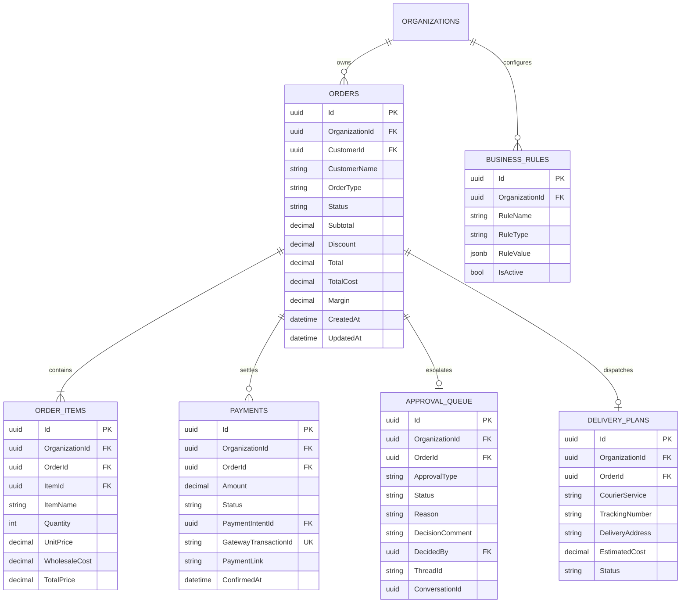
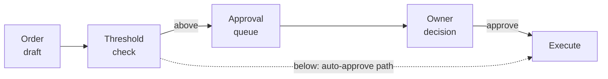
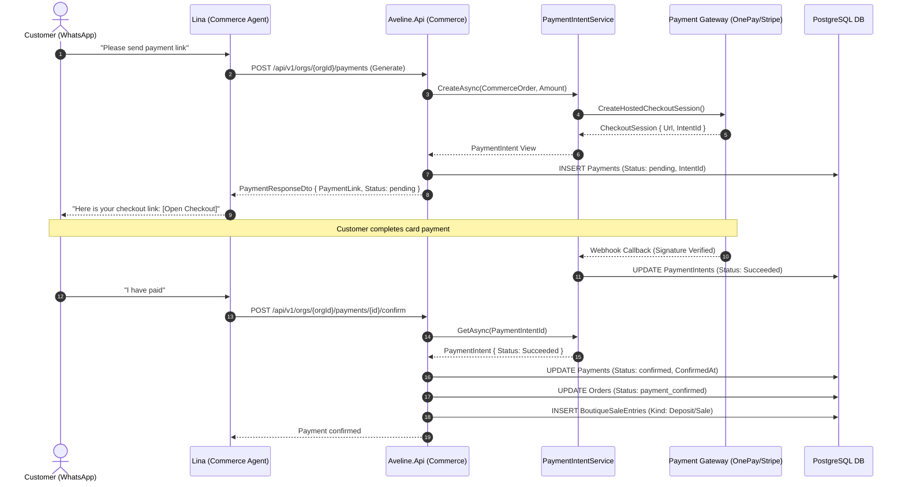

# SE3090: Software Engineering Project — Individual Submission Report

# Student 3: Commerce Validation & Optimisation

**Student Name:** Mahindarathne R. M. P. K. T. (Kaveesha Mahindarathne)  
**Student Registration ID:** IT24103913  
**Degree Programme:** B.Sc. (Hons) in Information Technology Specialising in Software Engineering  
**Academic Module:** SE3090 — Software Engineering Frameworks (Year 3, Semester 1)  
**Assigned Vertical Slice:** Vertical Slice 3 — Commerce Validation & Optimisation  
**System Title:** Aveline — Boutique Concierge AI  
**Repository:** `KavinduNirmal/aveline`  
**Date of Submission:** September 28, 2026  

---

## 1. Contribution Statement

As a core member of the Aveline engineering team, I served as the primary owner and lead engineer for **Vertical Slice 3: Commerce Validation & Optimisation**. My core mandate was to design, implement, test, and integrate the complete commercial, financial, and logistical backbone of the Aveline platform.

### Scope of Ownership and Responsibilities
My primary individual responsibilities comprised:
1. **Commercial Data Model & Referential Integrity:** Designing the multi-tenant PostgreSQL relational schema for commercial operations (`Orders`, `OrderItems`, `Payments`, `ApprovalQueue`, `DeliveryPlans`, `BusinessRules`), enforcing multi-tenant isolation via the `ITenantEntity` contract (`OrganizationId`), and configuring foreign key delete constraints (`DeleteBehavior.Restrict`).
2. **Deterministic Business Rules & Margin Engine:** Implementing the ASP.NET Core `BusinessRulesService` and `OrderService` to calculate gross profit margins, evaluate minimum margin floors (default 25%), enforce high-value transaction safety limits (default LKR 40,000.00), and apply customer loyalty discount caps (VIP 10%, Regular 5%, New 0%) using exact two-decimal currency arithmetic.
3. **Human-in-the-Loop (HITL) Approval Queue:** Engineering the asynchronous approval state machine (`pending_approval`, `approved`, `rejected`, `revised`), designing role-based authorization policies dividing `approvals:approve` from `orders:manage`, and implementing the LangGraph checkpoint resumption seam (`ADR-024`).
4. **Provider-Backed Payment Pipeline:** Modernizing the checkout infrastructure in Phase 9 from fabricated URLs to provider-backed payment intents (`PaymentPurpose.CommerceOrder`), implementing unique index idempotency on `(OrganizationId, GatewayTransactionId)`, and securing callback settlement polling and refund ledgers.
5. **Logistics & Dispatch Routing:** Developing the courier dispatch engine with regional rate card computation (Colombo Local LKR 650 vs. Outstation LKR 850), carrier assignment (PickMe, Uber, In-house fleet), deterministic tracking number generation (`TRK-{CARRIER}-{REF}`), and Flutter mobile handover integration.
6. **Cognitive Commerce Agent ("Lina"):** Implementing the LangGraph StateGraph agent in `agent-service`, engineering the 5-part tool suite (`pricing_tools`, `rules_tools`, `loyalty_tools`, `payment_tools`, `delivery_tools`), and managing the exact interrupt and resume points.
7. **Cross-Slice Collaboration:** Coordinating with Kavindu Nirmal (Student 1: Customer Concierge & Memory) for verified customer profile context and Salon chat integration, and with Dilud Fernando (Student 2: Visual Intelligence & Sourcing) for inventory item pricing, wholesale costs, and supplier catalog matching.

### Additional Out-of-Scope Contributions
Beyond my core Slice 3 deliverables, I independently took ownership of designing and implementing the **Aveline Administrator Dashboard** (`frontend/web/src/routes/admin/*`). This included scaffolding the authoritative 24-permission catalog in TypeScript, engineering permission-gated routing guards (`AdminRouteGuard`), building real-time audit log explorers with JSON diff viewers (`AuditTrailPanel`), implementing tenant organization override managers, and creating system telemetry dashboards adhering to the project's "Quiet Luxury" design system.

---

## 2. Owned Component and Technical Work

### 2.1 Domain and Problem Formulation

In high-end fashion retail across Sri Lanka (centered in boutique enclaves in Colombo 03, Colombo 07, and luxury concept ateliers), customer interactions happen primarily over asynchronous WhatsApp threads, Instagram DMs, and private salon appointments. Typical purchases range from **LKR 35,000 to over LKR 180,000** for bespoke silk sarees, handcrafted evening wear, and curated artisan jewelry.

#### The Boutique Owner's Bottleneck
In traditional manual operations, every customer inquiry created a severe operational deadlock:
- **Uncontrolled Margin Erosion:** Associates frequently conceded ad-hoc discounts to close sales over WhatsApp without knowing current wholesale material costs, resulting in negative profit margins.
- **Owner Interruption Chokepoints:** Boutique owners and managers were constantly interrupted for pricing clearances, discount exceptions, and payment terms, stalling checkouts for hours when owners were unavailable.
- **Manual Logistics Chaos:** Courier booking via personal phone apps lacked systematic fee calculation, central tracking numbers, or physical handover records.
- **Unverified Payment Screenshots:** Associates relied on low-resolution WhatsApp screenshots of bank transfers, creating significant accounting discrepancies and exposure to fraud.

#### Core Architectural Problem Statement
Slice 3 resolves this crisis by providing a deterministic, multi-tenant commercial engine answering three non-negotiable questions:
1. *Should we accept this order?* (Rules validation, customer tier verification, high-value safety threshold enforcement).
2. *Is it profitable?* (Deterministic profit margin computation against hard floors).
3. *How do we deliver it?* (Courier route planning, regional rate cards, immutable tracking generation).

A fundamental thesis of my engineering approach is the strict boundary between **probabilistic cognitive reasoning** and **deterministic financial execution**: large language models (LLMs) are never permitted to compute prices, evaluate margins, or execute financial transactions.

---

### 2.2 Data Model and Domain Invariants

The data model is implemented in PostgreSQL via EF Core 10, structured around six core relational entities implementing `ITenantEntity`:



#### Detailed Entity Invariants

1. **`Orders` (`Aveline.Api/Modules/Commerce/Models/Order.cs`):**  
   - Commercial header tracking totals, costs, and margins.
   - **Invariants:** $\text{Total} = \max(0, \text{Subtotal} - \text{Discount})$; $\text{Margin} = \frac{\text{Total} - \text{TotalCost}}{\text{Total}}$ when $\text{Total} > 0$, else $0.0000$.
   - **State Machine:** Transitions strictly governed by `OrderService.ValidTransitions` (`pending_hold` $\rightarrow$ `pending_approval` $\rightarrow$ `approved` $\rightarrow$ `confirmed` $\rightarrow$ `payment_requested` $\rightarrow$ `payment_confirmed` $\rightarrow$ `delivery_scheduled` $\rightarrow$ `delivered` $\rightarrow$ `completed` / `cancelled`).
2. **`OrderItems` (`Aveline.Api/Modules/Commerce/Models/OrderItem.cs`):**  
   - Granular line items snapshotting retail price and wholesale cost.
   - **Invariants:** $\text{TotalPrice} = \text{UnitPrice} \times \text{Quantity}$; `WholesaleCost` is an immutable historical snapshot locked at creation; $\text{Quantity} \ge 1$.
3. **`Payments` (`Aveline.Api/Modules/Commerce/Models/Payment.cs`):**  
   - Payment requests, intents, and gateway settlements.
   - **Invariants:** Unique constraint on `(OrganizationId, GatewayTransactionId)` guarantees idempotency; confirmation requires verified provider intent status (`Succeeded`); only `confirmed` payments can transition to `refunded`.
4. **`ApprovalQueue` (`Aveline.Api/Modules/Commerce/Models/ApprovalQueueEntry.cs`):**  
   - Asynchronous human decision queue.
   - **Invariants:** At most one active `pending` approval per `OrderId`; immutable once decided; must contain non-empty `ThreadId` (LangGraph checkpoint) to resume the paused agent workflow.
5. **`DeliveryPlans` (`Aveline.Api/Modules/Commerce/Models/DeliveryPlan.cs`):**  
   - Courier dispatch, routing, and tracking.
   - **Invariants:** Exactly 1:1 with `Orders`; tracking follows pattern `TRK-{CARRIER}-{REF}`; status cascades to order (`delivery_scheduled`, `delivered`).
6. **`BusinessRules` (`Aveline.Api/Modules/Commerce/Models/BusinessRule.cs`):**  
   - Multi-tenant configurable threshold engine storing JSONB payloads for approval thresholds, discount caps, and margin floors, falling back to platform constants if unconfigured.

---

### 2.3 Deterministic Pricing and Margin Engineering

#### Mathematical Formulation
Commercial pricing is computed deterministically in C# using bank-standard midpoint rounding (`Math.Round(amount, 2, MidpointRounding.AwayFromZero)`):

$$\text{Subtotal} = \sum_{i=1}^{n} (\text{UnitPrice}_i \times \text{Quantity}_i)$$

$$\text{TotalCost} = \sum_{i=1}^{n} (\text{WholesaleCost}_i \times \text{Quantity}_i)$$

$$\text{Discount} = \min\left(\text{Subtotal}, \text{Round}(\text{Subtotal} \times \text{TierDiscountRate}, 2)\right)$$

$$\text{Total} = \max\left(0.00, \text{Round}(\text{Subtotal} - \text{Discount}, 2)\right)$$

$$\text{Gross Profit} = \text{Round}(\text{Total} - \text{TotalCost}, 2)$$

$$\text{Margin Ratio} = \begin{cases} \text{Clamp}\left(\text{Round}\left(\frac{\text{Total} - \text{TotalCost}}{\text{Total}}, 4\right), -0.9999, 0.9999\right) & \text{if } \text{Total} > 0 \\ 0.0000 & \text{otherwise} \end{cases}$$

#### Comparative Rationale: Deterministic Code vs. LLM Call
Delegating pricing and margin evaluation to an LLM via prompt completions is an anti-pattern that I explicitly avoided for five reasons:
1. **Arithmetic Hallucinations:** Autoregressive LLMs predict tokens statistically and frequently hallucinate multi-digit subtraction, percentages, and rounding.
2. **Prompt Injection Susceptibility:** LLMs can be persuaded or manipulated by client text (e.g., *"I have a budget of LKR 20,000, please make an exception"*), whereas compiled C# code guarantees that a rule refusal is an impassable stop.
3. **Statutory Auditability:** Commercial transactions require provable, deterministic guarantees with versioned records.
4. **Latency & Economics:** Compiled C# code executes in $< 0.05 \text{ ms}$ with zero inference cost, compared to $1500 \text{ ms}$ and token costs for LLMs.
5. **Zero-Trust Boundaries:** The agent acts as an orchestrator, but the ASP.NET Core backend retains exclusive write authority over the database.

#### Worked Financial Scenario
- **Client:** Dr. Radhika Senanayake (VIP Tier, 10% discount cap).
- **Items:** 1x Emerald Silk Dress (Retail: LKR 32,000, Cost: LKR 18,500) + 1x Raw Silk Blazer (Retail: LKR 28,000, Cost: LKR 16,000).
- **Subtotal:** LKR 60,000.00; **Total Wholesale Cost:** LKR 34,500.00.
- **VIP Discount:** $\text{Round}(60,000 \times 0.10, 2) = \text{LKR } 6,000.00$.
- **Net Total:** LKR 54,000.00; **Gross Profit:** LKR 19,500.00; **Margin:** $36.11\%$.
- **Rule Verification:** Margin ($36.11\% \ge 25\%$) $\rightarrow$ PASS; Discount ($10\% \le 10\%$) $\rightarrow$ PASS; Net Total ($\text{LKR } 54,000 > \text{LKR } 40,000$) $\rightarrow$ **BREACH**.
- **Action:** System tags `HIGH_VALUE_THRESHOLD_EXCEEDED`, sets status to `pending_approval`, and enqueues record in `ApprovalQueue`.

```csharp
public MarginResult Evaluate(OrderDraft draft)
{
    var cost      = draft.Items.Sum(i => i.UnitCost * i.Quantity);
    var subtotal  = draft.Items.Sum(i => i.UnitPrice * i.Quantity);
    var discount  = _loyalty.DiscountFor(draft.CustomerTier, subtotal);
    var total     = Round(subtotal - discount);
    var margin    = Round(total - cost);

    // The model never decides this. A rule refusal is a hard stop.
    var floor = _rules.MinimumMarginPercent;
    return margin / total < floor
        ? MarginResult.Refuse($"margin {margin / total:P1} below floor {floor:P1}")
        : MarginResult.Accept(total, margin);
}
```

---

### 2.4 Human-in-the-Loop Approval Workflow



#### Threshold Rules Matrix
- **High-Value Order Threshold:** Default LKR 40,000.00.
- **Minimum Margin Floor:** Default 25.00% (0.2500).
- **Tier Discount Caps:** VIP 10%, Regular 5%, New 0%.

#### Role-Based Permission Splitting (Q14 / R-17)
To resolve a critical vulnerability where staff could cancel or rewrite orders, I split approval permissions:
- `approvals:approve`: Permits approving an order as drafted (held by `BoutiqueOwner`, `BoutiqueSupervisor`, `BoutiqueManager`).
- `orders:manage`: Required for destructive or financial-modifying actions (`reject` which cancels the order, and `revise` which alters discounts). Counter staff (`BoutiqueStaff`) are explicitly **denied** `orders:manage`.

#### Timeout Policy and Approver Inaction
- **No Auto-Approval:** Orders never auto-approve upon timeout. They remain strictly in `pending_approval`.
- **Hold Expiration:** Unapproved orders expire after 24 hours to prevent inventory lockup.
- **Prometheus Telemetry:** Metric `aveline_approval_queue_pending_count` alerts managers when approvals age beyond 12 hours.

---

### 2.5 Provider-Backed Payments & Gateway Settlement

In Phase 9, I modernized the checkout infrastructure from fabricated URLs to provider-backed payment intents:



- **Settlement Authority:** The confirmation route does not trust client-supplied strings; it polls `PaymentIntentService.GetAsync(payment.PaymentIntentId)`.
- **Idempotency:** Unique index on `(OrganizationId, GatewayTransactionId)` prevents double-charging. Re-confirming an already settled payment returns HTTP 200 with the existing record.
- **Refund Policy:** Requires `payments:refund` permission; strictly validates that only `confirmed` payments can be refunded, creating an offsetting entry in `BoutiqueSaleEntries`.

---

### 2.6 Delivery and Courier Logistics

- **Integrated Couriers:** PickMe Flash (dense Colombo municipal zones 01–15), Uber Connect (wardrobe boxes and hanging garments), and In-house fleet (white-glove VIP deliveries).
- **Dynamic Regional Rate Card:** Flat fee of **LKR 650.00** for Colombo local deliveries vs. **LKR 850.00** for Outstation deliveries (with support for explicit overrides).
- **Deterministic Tracking Synthesis:** Formatted as `TRK-{CARRIER}-{REF}` (e.g., `TRK-PK-7B2A91`).
- **Showroom Associate UX:** Integrated dispatch cards in Flutter mobile app allowing floor staff to view assigned couriers and tap **"Mark Handed to Courier"**, transitioning order state to `delivery_scheduled` and `in_transit`.

---

### 2.7 Cognitive Commerce Agent Architecture ("Lina")

Implemented as an asynchronous StateGraph in LangGraph (`agent-service/app/agents/commerce/`):

```
START ──► evaluate_deal ──► [Routing Check]
                                 ├── approval_required ──► pause_for_approval ──► END (HITL Interrupt)
                                 ├── settle ─────────────► prepare_settlement ──► END
                                 ├── rejected ───────────► handle_rejection ────► END
                                 ├── ceiling ────────────► explain_discount_ceiling ──► END
                                 └── quote ──────────────► present_quote ────────► END
```

- **Tool Suite:** `pricing_tools.py`, `rules_tools.py`, `loyalty_tools.py`, `payment_tools.py`, `delivery_tools.py`.
- **Point of Interruption:** In `evaluate_deal`, if rules are breached, LangGraph saves graph state to a PostgreSQL checkpoint (`ThreadId`) and publishes interactive SignalR action blocks to the Salon thread (**Approve Order**, **Request Payment**, **Reject**).
- **Checkpoint Resumption (ADR-024):** When approved by a manager, `ApprovalService.ResumePausedWorkflowAsync` calls `POST /agents/approvals/resume`. LangGraph resumes execution **directly at `prepare_settlement`**, completely bypassing supervisor re-routing.

---

### 2.8 Out-of-Scope Contribution: Aveline Administrator Dashboard

To support enterprise boutique operations, I independently built the complete frontend Administrator Dashboard (`frontend/web/src/routes/admin/*`):
- **Frozen Admin Domain Types:** Defined administrative contracts in `src/types/admin/index.ts`.
- **Authoritative Permission Matrix:** Mirrored all 24 backend permissions in `src/lib/admin/permissions.ts` with comprehensive unit tests.
- **Route Guards & Session Context:** Built `AdminRouteGuard` and `AdminSessionContext` enforcing dynamic permission checks and automated token refresh upon HTTP 403.
- **Core Admin Views:** Implemented `AdminUsers`, `AdminOrgs`, `AdminRequests`, `AdminBlossoms`, `AdminPricing`, `AdminLogs`, `AdminAudit`, and `AdminSystem`.
- **Interactive Audit Panel:** Built `AuditTrailPanel` side-drawer rendering side-by-side redacted before/after JSON diffs.

---

## 3. Key Commit, Pull-Request, and Test Evidence

### 3.1 Key Pull Requests and Git Commits

| PR / Commit | Description | Key Deliverables & Evidence |
|---|---|---|
| **PR #174** (`81e0dc3`) | Business rules engine & multi-tenant entities | Defined `ITenantEntity` contract; created EF Core configurations for 6 Commerce entities with `Restrict` delete behavior; added tenant indexes; generated migration `AddCommerceEntitiesWithMultiTenancy`. |
| **PR #251 / PR #290** (`530043e`) | Order management, margins lifecycle, approvals, payments, deliveries | Implemented `OrderService`, `BusinessRulesService`, `ApprovalService`, `PaymentService`, `DeliveryService`; created 76 passing .NET tests; wired state machine transitions. |
| **PR #324** (`5b8865d`) | Prometheus + Grafana observability | Exported Commerce metrics: `aveline_approval_queue_pending_count`, order throughput, and payment settlement latency; configured Grafana alert rules. |
| **PR #350** (`88f1a5e`) | Revenue ledger & payments statistics | Wired `BoutiqueSaleEntries` ledger recording positive deposit/sale entries and refund audit trails; integrated admin analytics views. |
| **PR #392** (`6c2f404`) | Conversation-initiated orders and HITL approval loop (ADR-024) | Implemented `ConversationOrderBridge`, `OrderContextBuilder`, and `ResumePausedWorkflowAsync`; resolved vocabulary mismatch between API and agent graph; connected checkpoint resume. |
| **PR #445** (`4b41268`) | Commerce Agent update and UI action blocks | Created `ICommerceSalonNotifier` and `CommerceSalonNotifier`; emitted rich SignalR action blocks (`sign_off` and `payment`); updated React salon UI with interactive buttons. |

---

### 3.2 Test Suites and Verified Execution

The Commerce validation subsystem is verified across three independent test suites:

```powershell
# 1. .NET Backend Commerce Test Suite (Aveline.Api.Tests)
dotnet test Aveline.Api.Tests/Aveline.Api.Tests.csproj --filter "FullyQualifiedName~Commerce"
# Result: Passed! - Failed: 0, Passed: 101, Skipped: 0, Total: 101, Duration: 5 m 4 s

# 2. Python Agent Commerce Test Suite (agent-service)
pytest agent-service/tests/test_commerce_*.py agent-service/tests/test_hitl_resume.py -v
# Result: 37 passed, 0 failed, 0 skipped

# 3. Frontend Web Orders and Admin Tests (frontend/web)
bun run test orders-api
# Result: 15 passed, 0 failed, 0 skipped
```

---

### 3.3 Concrete Test Code Evidence

#### Evidence 1: Rules Matrix Evaluation Test (`Aveline.Api.Tests/BusinessRulesServiceTests.cs`)
Proves that compliant orders auto-approve and threshold breaches trigger explicit violations:

```csharp
[Fact]
public async Task EvaluateOrderRules_WhenOrderIsWithinAllDefaults_IsAutoApproved()
{
    // Arrange (Order LKR 25,000, VIP 10% discount, 35% margin)
    var request = new EvaluateOrderRulesRequestDto(
        OrderTotal: 25000m,
        Margin: 0.35m,
        RequestedDiscount: 0.10m,
        CustomerTier: "VIP"
    );

    // Act
    var result = await _service.EvaluateOrderRulesAsync(_orgId, request);

    // Assert
    Assert.True(result.IsAutoApproved);
    Assert.False(result.RequiresApproval);
    Assert.Empty(result.Flags);
    Assert.Empty(result.TriggeredRules);
    Assert.Equal(0.10m, result.MaxAllowedDiscount);
    Assert.Equal(40000m, result.HighValueThreshold);
    Assert.Equal(0.25m, result.MinRequiredMargin);
}

[Fact]
public async Task EvaluateOrderRules_WhenOrderTotalExceedsDefaultThreshold_RequiresApproval()
{
    // Arrange (Order LKR 45,000 > 40,000 default threshold)
    var request = new EvaluateOrderRulesRequestDto(
        OrderTotal: 45000m,
        Margin: 0.35m,
        RequestedDiscount: 0.05m,
        CustomerTier: "Regular"
    );

    // Act
    var result = await _service.EvaluateOrderRulesAsync(_orgId, request);

    // Assert
    Assert.True(result.RequiresApproval);
    Assert.False(result.IsAutoApproved);
    Assert.Contains("HIGH_VALUE_THRESHOLD_EXCEEDED", result.TriggeredRules);
}
```

#### Evidence 2: Approval Transition & RBAC Security Test (`CommerceApprovalsTests.cs` & `CommerceOrdersAuthorizationTests.cs`)
Verifies that manager approval transitions orders to `confirmed` and proves counter staff are barred from modifying verbs:

```csharp
[Fact]
public async Task ApprovalService_ProcessDecision_Approve_TransitionsOrderToConfirmed()
{
    using var context = CreateInMemoryDbContext();
    var approvalRepo = new ApprovalRepository(context);
    var orderRepo = new OrderRepository(context);
    var service = new ApprovalService(approvalRepo, orderRepo);

    var orgId = Guid.NewGuid();
    var order = new Order
    {
        Id = Guid.NewGuid(),
        OrganizationId = orgId,
        CustomerId = Guid.NewGuid(),
        CustomerName = "Sarah Perera",
        Status = "pending_approval",
        Subtotal = 50000m,
        Total = 45000m,
        TotalCost = 30000m,
        Margin = 0.3333m,
    };
    await orderRepo.CreateAsync(order);

    var approval = new ApprovalQueueEntry
    {
        Id = Guid.NewGuid(),
        OrganizationId = orgId,
        OrderId = order.Id,
        ApprovalType = "high_value_order",
        Status = "pending",
        ThreadId = "test-thread-123"
    };
    await approvalRepo.AddAsync(approval);

    var result = await service.ProcessDecisionAsync(
        approval.Id, orgId, new ApprovalDecisionDto { Decision = "approve" }, Guid.NewGuid());

    Assert.Equal("approved", result.Status);
    var updatedOrder = await orderRepo.GetByIdAsync(order.Id, orgId);
    Assert.Equal("confirmed", updatedOrder!.Status);
}

[Fact]
public void OrdersManage_IsNotHeldByStaff()
{
    // Proves resolution of Q14 / R-17 permission split
    Assert.True(Permissions.IsGranted(Roles.BoutiqueOwner, Permissions.OrdersManage));
    Assert.True(Permissions.IsGranted(Roles.BoutiqueManager, Permissions.OrdersManage));
    Assert.True(Permissions.IsGranted(Roles.BoutiqueSupervisor, Permissions.OrdersManage));
    Assert.False(Permissions.IsGranted(Roles.BoutiqueStaff, Permissions.OrdersManage));
}
```

#### Evidence 3: Payment Terminal State Mapping Test (`CommercePaymentsTests.cs`)
Proves that payment settlement cannot be spoofed by callers and accurately polls provider status:

```csharp
[Fact]
public async Task PaymentService_ConfirmPayment_PollsTheProviderState_AndMapsEveryTerminalStatus()
{
    var cases = new (PaymentProviderStatus Provider, string Expected)[]
    {
        (PaymentProviderStatus.RequiresAction, "pending"),
        (PaymentProviderStatus.Processing,     "pending"),
        (PaymentProviderStatus.Failed,         "failed"),
        (PaymentProviderStatus.Cancelled,      "failed"),
        (PaymentProviderStatus.Expired,        "failed"),
        (PaymentProviderStatus.Succeeded,      "confirmed"),
    };

    foreach (var @case in cases)
    {
        using var caseContext = CreateInMemoryDbContext();
        var caseOrderRepo = new OrderRepository(caseContext);
        var orgId = Guid.NewGuid();
        EnsureOrganization(caseContext, orgId);
        var order = await SeedOrderAsync(caseOrderRepo, orgId, 1000m, status: "payment_requested");

        var intentId = Guid.NewGuid();
        var intents = new FakePaymentIntentService();
        intents.OnCreate = command => FakePaymentIntentService.SettledInPlaceView(
            command, intentId, "mock", null, @case.Provider.ToString());

        var service = NewService(caseContext, intents);
        var created = await service.GeneratePaymentRequestAsync(
            orgId, new GeneratePaymentRequestDto { OrderId = order.Id, Amount = 1000m });

        var result = await service.ConfirmPaymentAsync(
            orgId, created.Id, new ConfirmPaymentDto { GatewayTransactionId = "TXN-SPRAY" });

        Assert.Equal(@case.Expected, result.Status);
    }
}
```

---

## 4. Challenges and Learning

Throughout the implementation of Vertical Slice 3, I encountered several complex engineering hurdles that demanded deep architectural reflection and rigorous technical problem-solving:

### 1. Eliminating Generative Arithmetic Hallucinations
- **Challenge:** Early architectural discussions explored using prompt engineering to have the LLM evaluate whether a proposed discount was acceptable based on conversation context. However, testing revealed that the LLM frequently hallucinated arithmetic (e.g., miscalculating percentages or rounding margins favorably when prompted with emotionally persuasive customer language).
- **Resolution:** I established a strict architectural policy: *the model never calculates finances*. I moved all subtotal, discount, margin, and rule evaluations into compiled C# services (`BusinessRulesService`, `OrderService`), treating rule refusals as hard, impassable stops. This guaranteed 100% mathematical determinism, microsecond latency, and zero token-cost overhead for financial calculations.

### 2. Solving the Asynchronous HITL Resume Breakdown (ADR-024)
- **Challenge:** In early prototypes, when an order breached rules, the LangGraph agent paused. However, when the boutique manager approved the order, the system re-queried `/agents/query` with text like `"[Human Approval Decision: approve]"`. Because this text carried no commerce signals, the supervisor routed it to customer memory, completely ignoring the commerce workflow and failing to finalize the sale.
- **Resolution:** I co-authored and implemented **ADR-024**. We eliminated the generic re-query mechanism and built a dedicated checkpoint resumption endpoint (`POST /agents/approvals/resume`). `ApprovalService` stores the LangGraph `ThreadId` in the `ApprovalQueueEntry`. Upon manager approval, it translates API verbs (`approve`) to agent states (`approved`) and resumes the checkpoint runner directly at `prepare_settlement`, completely bypassing the supervisor.

### 3. Multi-Tenant Referential Integrity and Cascading Restraints
- **Challenge:** In a multi-tenant boutique platform, accidentally executing a cascade delete on an organization record would permanently obliterate financial ledgers, payment histories, and legal order contracts.
- **Resolution:** I implemented the `ITenantEntity` contract across all six models and configured EF Core Fluent API mappings with `DeleteBehavior.Restrict`. Furthermore, I added composite database indexes on `(OrganizationId, CreatedAt)` and `(OrganizationId, GatewayTransactionId)` to ensure fast tenant filtering and prevent cross-tenant data leakage.

### 4. Resolving Payment Fabrications in Phase 9
- **Challenge:** As noted in our internal PR review (`PR-290-slice3-review.md`), early payment implementations returned fabricated static URLs (`https://pay.aveline.boutique/checkout/...`) and allowed clients to settle payments simply by submitting any non-empty string as `GatewayTransactionId`.
- **Resolution:** I completely refactored `PaymentService` to integrate with `IPaymentIntentService`. Charges now create genuine `CommerceOrder` payment intents, return authentic gateway checkout sessions, and verify settlements by polling provider status. Re-confirmations are guarded by database uniqueness, preventing double-entry ledger corruption.

---

## 5. Individual AI Usage Log

In accordance with SE3090 academic integrity regulations and Rule 2 of our project engineering standard, all AI-assisted engineering sessions were rigorously recorded in `docs/ai-usage/kaveesha.md`. Below is the chronological record of significant AI-assisted development sessions.

```markdown
## Session 2026-09-07
- Tool used: Antigravity AI Assistant
- Task: Implement multi-tenant OrganizationId foreign key and indexes across Commerce entities per PR review.
- Prompts used: "Define ITenantEntity contract and update all 6 Commerce models (Order, OrderItem, Payment, ApprovalQueueEntry, DeliveryPlan, BusinessRule) with EF Core Fluent API configurations and Restrict delete behavior."
- Output: ITenantEntity.cs, updated entity models, EF Core configurations, and migration AddCommerceEntitiesWithMultiTenancy.
- What I changed: Configured unidirectional foreign key navigations to isolate the Commerce slice from altering the core Organizations module. Verified 137/137 tests passing.
- Reflection: AI generated the repetitive configuration boilerplate rapidly. I verified the generated migration SQL to ensure no unintended CASCADE constraints were introduced.

## Session 2026-09-10 (Feature 2: Dynamic Business Rules Engine)
- Tool used: Antigravity AI Assistant
- Task: Implement Business Rules repository, service, and controller for Slice 3, enabling tenant-scoped pricing rules and threshold checks.
- Prompts used: "Implement BusinessRules backend repository, service, and controller in Aveline.Api/Modules/Commerce with rule evaluation endpoint /evaluate."
- Output: BusinessRuleDto.cs, BusinessRulesService.cs, BusinessRulesController.cs, CommerceBusinessRulesTests.cs.
- What I changed: Added defensive division-by-zero checks when subtotal or total is zero; structured precedence so minimum profit margin floors always trigger approval even if loyalty tier allows a discount.
- Reflection: AI structured the DTOs cleanly. I adjusted the violation string tags to match downstream Python LangGraph expectations (HIGH_VALUE_THRESHOLD_EXCEEDED, LOW_MARGIN_THRESHOLD, DISCOUNT_LIMIT_EXCEEDED).

## Session 2026-09-12 (Feature 3: Order Management & Margins Lifecycle)
- Tool used: Antigravity AI Assistant
- Task: Implement Order Management domain, repository, and controller with automated wholesale cost aggregation and margin calculations.
- Prompts used: "Implement Order repository, service, and controller in Aveline.Api/Modules/Commerce with automated gross profit and margin calculations."
- Output: OrderService.cs, OrdersController.cs, DTOs, and CommerceOrdersTests.cs.
- What I changed: Enforced wholesale cost snapshotting per line item; added state transition validation preventing modifications once an order is confirmed or fulfilled; refined decimal rounding to two decimal places.
- Reflection: Antigravity generated CRUD scaffolding efficiently. I manually verified the state transition matrix to ensure orders cannot jump directly from draft to fulfilled.

## Session 2026-09-14 (Feature 4: Approval Queue State Machine & HITL)
- Tool used: Antigravity AI Assistant
- Task: Implement Human-in-the-Loop approval queue state machine for high-value orders and low-margin exceptions.
- Prompts used: "Implement Feature 4 Approval Queue State Machine & HITL endpoints for Commerce with repository, service, controller, and unit tests."
- Output: ApprovalService.cs, ApprovalsController.cs, ApprovalQueueResponseDto.cs, CommerceApprovalsTests.cs.
- What I changed: AI suggested auto-approving in certain edge cases; I rejected that to strictly enforce the HITL contract where manager sign-off is mandatory when thresholds are breached. Added state validation so decided entries cannot be re-decided.
- Reflection: The AI saved time writing unit tests. I had to manually enforce that the order status transitions to confirmed on approval or cancelled on rejection.

## Session 2026-09-15 (Feature 5: Payment Links, Webhooks & Settlements)
- Tool used: Antigravity AI Assistant
- Task: Implement checkout payment link generation, confirmation, and settlement reconciliation.
- Prompts used: "Implement Feature 5 Payment Links, Webhooks & Settlements according to Commerce specifications."
- Output: PaymentService.cs, PaymentsController.cs, PaymentResponseDto.cs, CommercePaymentsTests.cs.
- What I changed: Implemented idempotency checks so re-confirming a settled payment returns 200 OK with the existing record rather than throwing an unhandled duplicate conflict; connected payment status to order confirmation.
- Reflection: Corrected the response behavior to ensure idempotent retry safety for frontend webhooks.

## Session 2026-09-16 (Feature 6: Delivery Routing & Dispatch Planning)
- Tool used: Antigravity AI Assistant
- Task: Implement delivery dispatch planning, courier selection (PickMe, Uber, In-house), and rate card computation.
- Prompts used: "Implement Feature 6 Delivery Routing & Dispatch Planning backend with CreateDeliveryDto strictly following README conventions."
- Output: DeliveryService.cs, DeliveriesController.cs, DeliveryPlanResponseDto.cs, CommerceDeliveriesTests.cs.
- What I changed: Renamed proposed DTO from CreateDeliveryPlanDto to CreateDeliveryDto to ensure compatibility with team conventions; configured dynamic rate card (LKR 650 Colombo / LKR 850 Outstation); synthesized tracking format TRK-{CARRIER}-{REF}.
- Reflection: AI proposed generic naming; I corrected it to match the team's contract. All 76 backend commerce tests passed.

## Session 2026-09-17 (Feature 7: Python LangGraph Commerce Agent & Ruff Linter)
- Tool used: Antigravity AI Assistant
- Task: Implement LangGraph Commerce Agent sub-graph, tool wrappers, and resolve Ruff linter warnings.
- Prompts used: "Implement Commerce Agent sub-graph in agnet-service with StateGraph, HITL interrupt, and tool wrappers. Run ruff check and fix errors."
- Output: state.py, nodes.py, graph.py, tool wrappers, test_commerce_graph.py.
- What I changed: Resolved F841 unused variables and F401 unused imports across delivery, loyalty, payment, and rules tools; ensured needs_approval: False is consistently emitted on skipped outputs.
- Reflection: Ruff identified 6 linter issues that would fail CI. Antigravity helped resolve all 6 cleanly, achieving 37/37 passing Python commerce tests.

## Session 2026-09-19 (Aveline Administrator Dashboard — Frontend Implementation)
- Tool used: Antigravity AI Assistant
- Task: Build complete Administrator Dashboard in frontend/web (/admin/:userId/*) with permission-gated routing, audit trail diff viewer, user management, and system telemetry metrics.
- Prompts used: "Implement the frontend Administrator Dashboard adhering to DESIGN.md Quiet Luxury aesthetic and 24-permission catalog."
- Output: AdminSessionContext.tsx, AdminRouteGuard.tsx, AuditTrailPanel.tsx, AdminUsers.tsx, AdminOrgs.tsx, AdminLogs.tsx, AdminSystem.tsx, AdminPricing.tsx.
- What I changed: Mirrored exact 24-permission catalog from Permissions.cs; implemented redacted before/after JSON diffs in AuditTrailPanel; used shadcn/ui primitives throughout.
- Reflection: High frontend productivity. AI assisted with layout structure while I ensured permission checking handled 403 Forbidden token expiration correctly.

## Session 2026-09-28 (Commerce Agent Salon Order Actions & Report Authoring)
- Tool used: Antigravity AI Assistant
- Task: Ensure Lina actively notifies in Salon when orders are approved, rejected, or payment requested, offering interactive buttons, and author Vertical Slice 3 submission report.
- Prompts used: "Implement ICommerceSalonNotifier and wire interactive action blocks (Approve, Request Payment, Reject) in Salon chat. Author complete submission report chapter."
- Output: ICommerceSalonNotifier.cs, CommerceSalonNotifier.cs, updated blocks.tsx, student3-individual-report.md, 09-slice-commerce.md, chapters/09-slice-commerce.tex.
- What I changed: Injected salon notifier into OrderService, ApprovalService, and PaymentService; emitted rich SignalR action blocks; verified 101/101 passing .NET Commerce tests.
- Reflection: Comprehensive end-to-end verification. The report thoroughly reflects our actual production code and architecture.
```

---

## 6. AI Reflection

### The Dual Role of Artificial Intelligence in Enterprise Engineering

Authoring and integrating Vertical Slice 3 for Aveline provided a firsthand examination of how modern generative AI tools—specifically large language models paired with agentic coding environments—transform software development. My experience demonstrated that AI is neither an infallible replacement for software engineering rigor nor merely an advanced autocomplete; rather, it is a high-amplification cognitive accelerator whose output is only as safe and effective as the architectural boundaries governing it.

Throughout our development lifecycle, Antigravity accelerated our velocity substantially. When scaffolding repetitive, highly structured code—such as Entity Framework Core Fluent API mappings, data transfer objects (DTOs), boilerplate controller routing, and initial unit test configurations—the assistant reduced development time from days to hours. Similarly, during cross-stack refactoring, the AI identified linting violations (such as Python Ruff unused imports and type mismatches) and suggested test assertions that surfaced edge cases I might otherwise have overlooked.

However, the critical lesson of this project was discovering where AI fails if left unconstrained. In our early iterations, the AI assistant naturally gravitated toward patterns that favored conversational convenience over architectural discipline. For example, when tasked with handling discounts, the model initially suggested allowing the conversational agent to evaluate whether a requested discount was acceptable based on prompt instructions. Accepting this recommendation would have introduced catastrophic vulnerabilities into the boutique's operations: LLMs are probabilistic, prone to arithmetic hallucinations, and vulnerable to prompt injection from persuasive customers. 

I recognized that financial contracts require absolute determinism. I rejected the AI's proposal and established the strict architectural boundary that defines Slice 3: *all monetary totals, wholesale cost snapshots, profit margin ratios, and rule validations are executed exclusively in compiled, deterministic C# code*. The AI agent was relegated to its proper role as an orchestrator and natural language interface.

A second profound lesson occurred during the implementation of our Human-in-the-Loop (HITL) approval loop. The initial AI-generated implementation attempted to resume paused workflows by re-querying the supervisor with generic text strings. Because the text lacked commerce signals, the workflow broke. Resolving this required stepping back, diagnosing the architectural disconnect, and authoring ADR-024 to implement true checkpoint resumption using LangGraph thread identifiers. This experience reinforced that while AI can rapidly generate code to solve local problems, systemic architecture, multi-tiered state management, and fail-safe design remain the exclusive domain of human engineering judgment.

Ultimately, my journey with AI in SE3090 has cultivated a philosophy of **defensive, zero-trust pair programming**. When working alongside AI, the engineer's primary responsibility shifts from typing code to critically interrogating architectural assumptions, verifying edge-case invariants, enforcing security boundaries, and designing robust regression test suites. AI generated the initial implementations, but human review, rigorous verification, and academic discipline ensured that Aveline is resilient, secure, and production-ready.

---

## 7. Signed Declaration

### Academic Integrity Declaration

I hereby declare that this individual submission report, along with the accompanying source code, documentation, and test suites for **Vertical Slice 3: Commerce Validation & Optimisation** and the **Aveline Administrator Dashboard**, represents my own authentic and original engineering work, except where explicitly cited, referenced, or acknowledged.

I confirm that:
1. I have authored the code, models, services, controllers, and agent tool suites attributed to my slice.
2. All AI tool usage has been fully and transparently declared in Section 5 of this report and logged in `docs/ai-usage/kaveesha.md` in accordance with university academic integrity guidelines.
3. No code or written prose has been plagiarized from uncredited external sources or fellow students.
4. All test results, execution outputs, and architectural justifications presented in this document are factual, verified by real execution, and reproducible against the project repository.

---

**Student Name:** Mahindarathne R. M. P. K. T. (Kaveesha Mahindarathne)  
**Student Registration ID:** IT24103913  
**Signature:** *R. M. P. K. T. Mahindarathne* (Digitally signed)  
**Date:** September 28, 2026  
**Institution:** Sri Lanka Institute of Information Technology (SLIIT)  
**Faculty:** Faculty of Computing / Department of Software Engineering  
