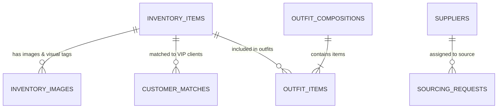
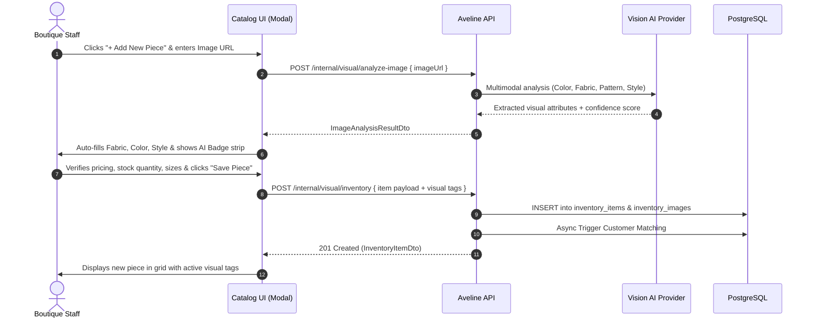
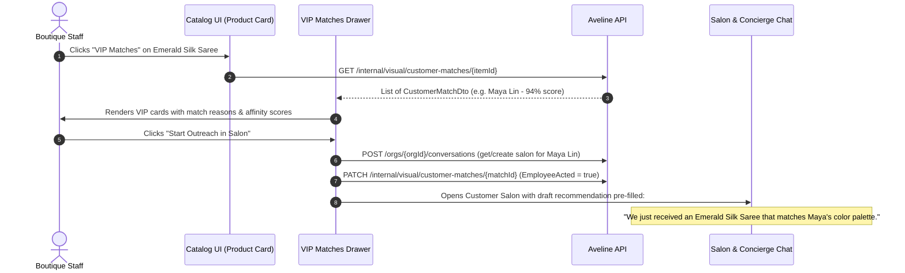
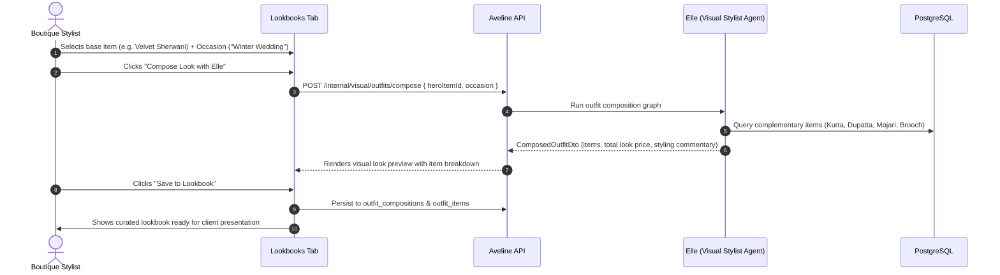
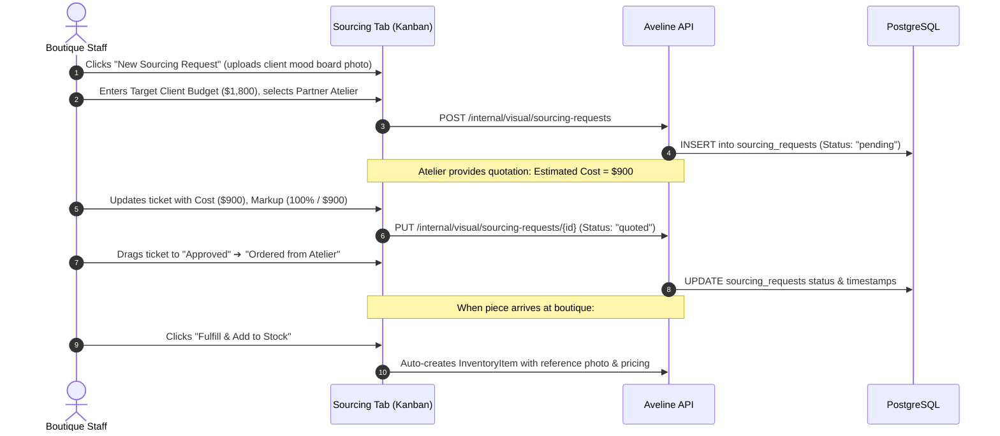

# Catalog & Visual Intelligence UI Specification

## 1. Overview & Purpose

The **Catalog** section (`Visual intelligence & sourcing`) in the Aveline Tenant Dashboard is the central workspace for managing luxury boutique pieces, visual AI attributes, client affinity matching, curated outfit lookbooks, and bespoke atelier sourcing.

This specification defines the UI layout, component hierarchy, behavioral workflows, and step-by-step implementation guide aligned directly with the underlying database schema in PostgreSQL.

---

## 2. Database Entity Mapping



| Database Table | Backend Entity | Primary Responsibility in UI |
|---|---|---|
| `inventory_items` | `InventoryItem` | Core product catalogue, pricing, SKU, fabric/color attributes, stock levels, and availability status. |
| `inventory_images` | `InventoryImage` | Product image gallery, primary image designation, and Vision AI extracted attributes (fabric, color, pattern, style, confidence score). |
| `customer_matches` | `CustomerMatch` | VIP client affinity matches per piece with confidence score, reasoning, and staff outreach action. |
| `outfit_compositions` | `OutfitComposition` | Curated ensemble styling grouped by occasion with total look pricing and stylist notes. |
| `outfit_items` | `OutfitItem` | Items assigned to specific positions in an outfit (`top`, `bottom`, `drape`, `footwear`, `accessory`). |
| `sourcing_requests` | `SourcingRequest` | Custom client sourcing tickets, reference photo uploads, status pipeline, estimated costs, and target retail markups. |
| `suppliers` | `Supplier` | Directory of partner ateliers, fabric mills, lead times, minimum order quantities (MOQ), and catalog inspection. |

---

## 3. Page Structure & Tab Layout

The Catalog view is organized into **four primary tabs**:

```
Catalog Header
├── Top Bar: Search, Category Filters, Status Filter, "Add New Piece" Button
└── Tabs Navigation:
    ├── [Tab 1] Inventory (Default)
    ├── [Tab 2] Lookbooks & Outfits
    ├── [Tab 3] Sourcing Requests
    └── [Tab 4] Partner Ateliers
```

---

### Tab 1: Inventory & Stock Management

#### Aligned Database Entities: `inventory_items`, `inventory_images`

#### UI Features & Components:
1. **Catalogue Controls Header**:
   - Real-time search by Item Name, SKU, Color, or Fabric.
   - Category filter pills (*Sarees, Lehengas, Gowns, Outerwear, Silk Blouses, Accessories*).
   - Status toggle (*All, In Stock, Low Stock, Reserved, Archived*).
   - **`+ Add New Piece`** action button.

2. **Low-Stock Alert Banner**:
   - Warns staff when items have `StockQuantity <= threshold`.
   - Quick-action to initiate a replenishment or atelier re-order.

3. **Product Card / Grid View**:
   - **Image Thumbnail**: Shows primary image (`is_primary = true`) with zoom preview on hover.
   - **Visual AI Attribute Strip**:
     - *Dominant Color*: Hex swatch + color name badge.
     - *Detected Fabric*: e.g. `Raw Silk`, `Chiffon`, `Handloom Cotton`.
     - *Detected Pattern & Style*: e.g. `Zari Embroidery`, `Contemporary Festive`.
     - *Vision AI Confidence*: e.g. `96% AI confidence`.
   - **Item Details**: Name, SKU, Category, and Price.
   - **Available Sizes**: Tag badges (`36`, `38`, `40`, `Custom`).
   - **Stock Counter & Status**: Available (green), Reserved (amber), Out of Stock (red).
   - **Action Menu**: Edit details, analyze with Vision AI, view VIP matches, or archive.

4. **"Add / Edit Piece" Modal**:
   - Input fields: Name, SKU, Category, Fabric, Color, Style, Price, Cost, Stock Quantity, Sizes.
   - Image upload / URL input with instant Vision AI attribute extraction preview.

---

### Tab 2: Lookbooks & Outfits

#### Aligned Database Entities: `outfit_compositions`, `outfit_items`

#### UI Features & Components:
1. **Lookbook Gallery**:
   - Visual grid of styled ensembles curated by Elle (the Visual Stylist Agent).
   - Filter by occasion (*Sangeet, Gala, Cocktail Reception, Bridal, Everyday Luxury*).
2. **Outfit Card Breakdown**:
   - **Ensemble Preview**: Multi-item visual composition (e.g. Saree + Blouse + Jewelry + Clutch).
   - **Item Checklist**: Interactive list of individual pieces linking to their catalog records.
   - **Combined Look Pricing**: Total retail price of all composed items combined.
   - **Stylist Notes**: Commentary and drape advice generated by Elle.
3. **"Compose New Look" Tool**:
   - Select a primary hero piece.
   - Choose target occasion and styling aesthetic.
   - Elle automatically suggests complementary pieces from active inventory.

---

### Tab 3: Sourcing Requests & Atelier Pipeline

#### Aligned Database Entities: `sourcing_requests`, `suppliers`

#### UI Features & Components:
1. **Sourcing Pipeline / Kanban**:
   - Multi-stage visual pipeline:
     - `Pending Quotation` ➔ `Quoted` ➔ `Approved by Admin` ➔ `Ordered from Atelier` ➔ `Fulfilled`.
2. **Sourcing Request Card**:
   - Reference image thumbnail / mood board photo.
   - Customer name / avatar (linked to customer profile).
   - Requested category, color, and design notes.
   - **Financial Summary**: Estimated Atelier Cost vs. Proposed Markup % vs. Target Client Retail Price.
   - Assigned partner atelier / supplier.
3. **"New Sourcing Ticket" Form**:
   - Upload client reference photo.
   - Specify target budget, color, and customer requirements.
   - Assign to preferred partner atelier.

---

### Tab 4: Partner Ateliers & Suppliers

#### Aligned Database Entities: `suppliers`

#### UI Features & Components:
1. **Atelier Directory Cards**:
   - Supplier name and specialty badge (e.g., *Varanasi Weavers, Handloom Silk Mill*).
   - Contact email, phone, and order dispatch location.
   - **Operational Stats**: Minimum Order Quantity (MOQ) and Average Delivery Lead Time (e.g., `14-21 days`).
   - Active status indicator.
2. **Supplier Catalog Viewer**:
   - Live query of supplier catalog items (`/internal/visual/suppliers/{id}/catalog`).
   - Direct option to import supplier piece into boutique inventory.

---

## 4. VIP Client Matching Drawer (Cross-Cutting Feature)

#### Aligned Database Entity: `customer_matches`

When selecting any piece in the Inventory tab, staff can open the **VIP Matches Drawer**:
* **Client Affinity List**: Displays clients whose preferences match the item's visual attributes.
* **Match Confidence Score**: Visual progress bar (e.g., `92% Match Score`).
* **Match Reason**: Clear AI explanation (e.g., *"Client frequently purchases Emerald Green, size 38, raw silk sarees"*).
* **"Open Salon Outreach" Button**: One-click action to launch a concierge conversation with this client, pre-attaching the item recommendation (`EmployeeActed = true`).

---

## 5. Detailed Behavioral Workflows

### Workflow 1: Adding a Product & Automated Vision AI Attribute Extraction



---

### Workflow 2: VIP Customer Matching & Salon Outreach



---

### Workflow 3: AI Outfit Look Composition with Elle



---

### Workflow 4: Custom Sourcing Ticket & Atelier Margin Pipeline



---

## 6. Backend API Integration Endpoints

All backend endpoints are implemented and available in `Aveline.Api/Endpoints/VisualEndpoints.cs`:

| Endpoint | Method | Description |
|---|---|---|
| `/internal/visual/inventory/search` | `POST` | Search & filter inventory with criteria. |
| `/internal/visual/inventory/{itemId}` | `GET` | Get single inventory item details & images. |
| `/internal/visual/inventory` | `POST` | Create a new inventory item. |
| `/internal/visual/inventory/{itemId}` | `PUT` | Update details of an existing inventory item. |
| `/internal/visual/inventory/{itemId}/status` | `PATCH` | Update item availability status. |
| `/internal/visual/inventory/low-stock` | `GET` | Retrieve low-stock inventory alerts. |
| `/internal/visual/analyze-image` | `POST` | Run multimodal Vision AI to extract visual tags from image. |
| `/internal/visual/customer-matches/{itemId}` | `GET` | Get VIP customer matches for an item. |
| `/internal/visual/outfits/compose` | `POST` | Generate styled outfit ensemble with Elle. |
| `/internal/visual/sourcing-requests` | `POST` | Create a new atelier sourcing ticket. |
| `/internal/visual/suppliers/{supplierId}/catalog` | `GET` | Inspect external partner atelier catalog. |

---

## 7. Frontend Component Architecture & Implementation Blueprint

### File Structure under `src/components/catalog/`:

```
frontend/web/src/
├── types/
│   └── catalog.ts                   # TypeScript interfaces matching backend DTOs
├── lib/
│   └── catalog-api.ts               # Axios API client functions for VisualEndpoints
└── components/catalog/
    ├── CatalogPanel.tsx              # Main container with tab navigation & header
    ├── InventoryTab.tsx              # Inventory product grid, filters, low-stock banner
    ├── ProductCard.tsx               # Individual piece card with AI attribute badges
    ├── AddProductDialog.tsx          # Modal to create/edit catalogue pieces with Vision AI
    ├── VisualAttributesBadge.tsx     # Color swatch, fabric tag, style badge strip
    ├── CustomerMatchesDrawer.tsx     # Slide-over showing matched VIP clients
    ├── LookbooksTab.tsx              # Outfits gallery & ensemble breakdown
    ├── ComposeOutfitDialog.tsx       # Stylist composition generator with Elle
    ├── SourcingTab.tsx               # Sourcing Kanban pipeline & ticket creator
    └── SuppliersTab.tsx              # Partner atelier directory & catalog viewer
```

---

### Step-by-Step Implementation Guide

#### Step 1: Create TypeScript Types (`src/types/catalog.ts`)
Define contracts matching backend DTOs:
- `InventoryItemDto`
- `InventoryImageDto`
- `CustomerMatchDto`
- `OutfitCompositionDto` & `OutfitItemDto`
- `SourcingRequestDto`
- `SupplierDto` & `SupplierCatalogItemDto`
- `ImageAnalysisResultDto`

#### Step 2: Build API Client (`src/lib/catalog-api.ts`)
Wrap all `/internal/visual/...` calls with error handling, authentication headers, and response typing.

#### Step 3: Implement Visual AI Badges & Product Card (`ProductCard.tsx`, `VisualAttributesBadge.tsx`)
- Display image, price, stock, SKU, category.
- Show color swatch pill, detected fabric badge, detected pattern badge, and AI confidence percentage.
- Add quick actions: Edit, VIP Matches, Archive.

#### Step 4: Implement Add Product Modal with AI Extraction (`AddProductDialog.tsx`)
- When staff pastes an image URL or uploads a photo, debounce a call to `analyzeImage()`.
- Automatically pre-populate fabric, dominant color, and style with a visual indicator showing "AI Auto-detected".
- Staff confirms pricing, quantity, and sizes before saving.

#### Step 5: Implement VIP Customer Matches Slide-over (`CustomerMatchesDrawer.tsx`)
- Renders customer cards with match scores and reasoning snippets.
- Includes a direct "Start Outreach in Salon" button that opens the Customer Salon via `ConversationsContext`.

#### Step 6: Implement Lookbooks, Sourcing & Suppliers Tabs
- `LookbooksTab`: Display styled outfits with combined pricing.
- `SourcingTab`: Kanban board with status columns (`Pending`, `Quoted`, `Approved`, `Ordered`, `Fulfilled`).
- `SuppliersTab`: Directory cards with lead times, MOQ, and catalog drawer.

#### Step 7: Wire into Dashboard Shell (`DashboardShell.tsx`)
Replace `<SectionPlaceholder title="Catalog" ... />` with `<CatalogPanel organization={organization} role={role} />`.
