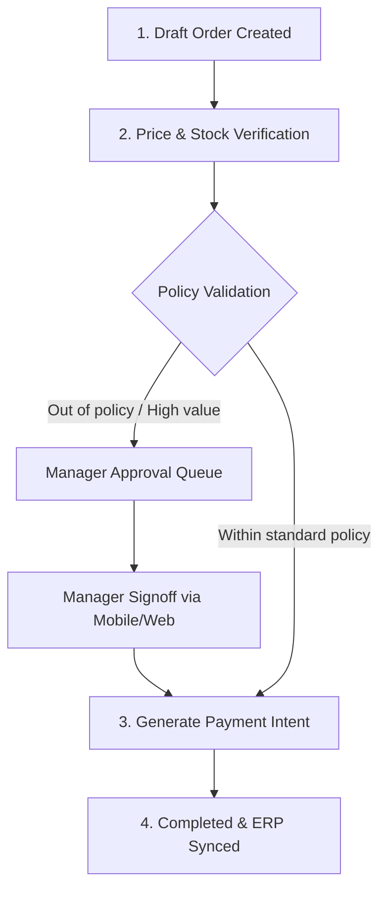

# Lina — Commerce Validation & Optimization

**Lina** is Aveline's Commerce and Optimization agent. Lina ensures that every transactional touchpoint is seamless, compliant with pricing strategies, and protected against margin erosion.

---

## Commerce Capabilities

- **Real-Time Inventory Holds:** Temporarily reserves items while lookbooks are being curated or during in-person VIP appointments.
- **Dynamic Tiered Pricing:** Automatically calculates tier incentives, VIP perks, and tax structures according to local boutique jurisdiction.
- **Discretionary Limit Checks:** Intercepts out-of-policy discounts and routes them directly to atelier managers for instantaneous approval.
- **Integrated Payment Handoff:** Generates QR-code payment links, digital invoices, and point-of-sale checkout handoffs.

---

## Transaction Lifecycles

---

## Webhook Notifications & ERP Sync

Lina synchronizes seamlessly with external ERPs and inventory backends (such as Shopify POS, Lightspeed, or bespoke SQL databases) using secure, signed HMAC webhook dispatches.
