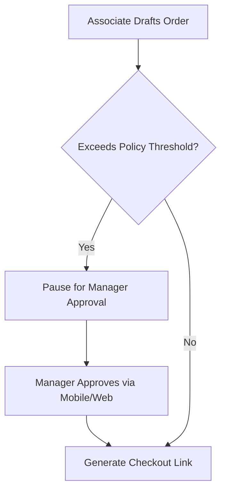

# Roles & Permissions

Security and governance in luxury retail require a nuanced hierarchy. Aveline enforces dual-tier authorization across both global platform privileges and organization-scoped boutique roles.

---

## Role Hierarchy

Every team member operating in Aveline is assigned a primary boutique role:

| Role | Scope | Key Capabilities |
|---|---|---|
| **Owner** | Boutique-wide | Full tenant ownership, subscription management, invite code issuance, approval overrides. |
| **Manager** | Atelier & Floor | Team member oversight, high-value transaction approvals, catalog curation, reporting access. |
| **Associate / Stylist** | Clienteling Floor | Client memory logging, outfit lookbook curation, sales draft composition. |
| **Administrator** | Platform Global | Platform audits, system health checks, tenant compliance verification. |

---

## Approval Gates & High-Value Workflows

To safeguard atelier margins and avoid unauthorized concessions, Lina enforces deterministic approval checkpoints:

### Configurable Thresholds

Boutique owners can configure approval policies under atelier settings:
- **Maximum Discretionary Discount:** Default is 10%. Any concession beyond this requires manager sign-off.
- **Single-Transaction Cap:** Transactions exceeding specified limits (e.g., $5,000 USD) require dual verification.
- **Custom Commission Splits:** Tailor earnings per stylist or sales tier.

---

## Modifying Team Permissions

To adjust a team member's role:
1. Navigate to the **Boutique Settings** in your management dashboard.
2. Select **Team & Staff**.
3. Select an associate profile and update the assigned tier.
4. Changes take effect on the associate's next authenticated action.
