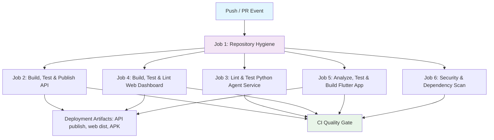

## Workflow Overview

**Purpose**: Continuous integration pipeline that builds, tests, lints, and
security-scans every component (ASP.NET Core API, Python agent service, Vite web
dashboard, Flutter mobile app), produces deployment artifacts, and enforces
repository hygiene across all Git Flow integration branches and pull requests.

**Trigger Events**: `push` and `pull_request` to `main`, `master`, and `development`.

**Target Environments**: GitHub Actions `ubuntu-latest` runners.

## Execution Flow Diagram



## Jobs & Dependencies

| Job Name | Purpose | Dependencies | Execution Context |
|----------|---------|--------------|-------------------|
| `hygiene` | Repository rules: only `bun.lock` lockfiles, no committed `.env` files | None | `ubuntu-latest` |
| `build-api` | Restore, build, test, and `dotnet publish` the ASP.NET Core API; uploads artifact | `hygiene` | `ubuntu-latest` (.NET 10.0.x) |
| `test-python` | Ruff lint + pytest for the Python agent service | `hygiene` | `ubuntu-latest` (Python 3.12) |
| `test-web` | Bun install, oxlint, Vitest, Vite build; uploads `dist` artifact | `hygiene` | `ubuntu-latest` (Bun) |
| `test-flutter` | `flutter analyze`, `flutter test`, release APK build; uploads APK | `hygiene` | `ubuntu-latest` (Flutter Stable) |
| `security-scan` | .NET vulnerable-package scan, `bun audit`, Trivy fs scan (+ SARIF upload) | `hygiene` | `ubuntu-latest` |

## Requirements Matrix

### Functional Requirements
| ID | Requirement | Priority | Acceptance Criteria |
|----|-------------|----------|-------------------|
| REQ-001 | Disallowed Lockfile Rejection | High | Fails if `package-lock.json`, `yarn.lock`, `pnpm-lock.yaml` are present. |
| REQ-002 | Secret and Environment File Guard | High | Fails if non-example `.env` files are pushed. |
| REQ-003 | ASP.NET Core Compilation & Tests | High | Restores, builds, and runs the xUnit suite for `Aveline.Api.sln`. |
| REQ-004 | Python Agent Lint & Tests | High | Ruff passes on `agnet-service/app/`; pytest passes on `agnet-service/tests/`. |
| REQ-005 | Web Build, Lint & Tests | High | oxlint, Vitest, and `tsc -b && vite build` pass in `frontend/web`. |
| REQ-006 | Flutter Analyze, Tests & APK | High | `flutter analyze`, `flutter test`, and `flutter build apk --release` pass. |
| REQ-007 | Deployment Artifacts | High | API publish, web `dist`, and mobile APK are uploaded as artifacts. |
| REQ-008 | Concurrent Run Cancellation | Medium | Outdated runs for the same branch ref are cancelled. |

### Security Requirements
| ID | Requirement | Implementation Constraint |
|----|-------------|---------------------------|
| SEC-001 | .NET Vulnerability Scan | `dotnet list package --vulnerable` fails the job when vulnerable packages exist. |
| SEC-002 | Web Dependency Scan | `bun audit --audit-level high` fails on high/critical advisories. |
| SEC-003 | Filesystem Vulnerability Scan | Trivy fs scan (CRITICAL/HIGH, ignore-unfixed) fails the job and uploads a SARIF report to GitHub Code Scanning. |
| SEC-004 | Dependency Alerts | Dependabot (`dependabot.yml`) opens security alerts + update PRs for all ecosystems. |
| SEC-005 | No Plaintext Secrets in CI | Values come from GitHub Secrets only (`VITE_CLERK_PUBLISHABLE_KEY`); never echoed or logged. |
| SEC-006 | Least-Privilege Permissions | `contents: read` by default; `security-events: write` only on `security-scan`. |

### Performance Requirements
| ID | Metric | Target | Measurement Method |
|----|-------|--------|-------------------|
| PERF-001 | Parallel Job Execution | 5 parallel sub-jobs | `build-api`, `test-python`, `test-web`, `test-flutter`, `security-scan` run concurrently after `hygiene`. |

## Input/Output Contracts

### Inputs

```yaml
# Trigger Branches
branches: [main, master, development]

# Event Types
events: [push, pull_request]
```

### Outputs

```yaml
# Status Indicators
workflow_status: success | failure

# Deployment Artifacts
artifacts: aveline-api | aveline-web | aveline-mobile-apk
```

### Secrets & Variables

| Type | Name | Purpose | Scope |
|------|------|---------|-------|
| System Variable | `GITHUB_TOKEN` | Read-only checkout; `security-events` write for SARIF upload | Workflow |
| Repository Secret | `VITE_CLERK_PUBLISHABLE_KEY` | Optional; inlined into the web bundle at build time | Web job |

## Execution Constraints

### Runtime Constraints
- **Timeout**: 15 minutes per job default (APK build may extend).
- **Concurrency**: Grouped by `${{ github.workflow }}-${{ github.ref }}` with `cancel-in-progress: true`.

### Environmental Constraints
- **Runner Requirements**: `ubuntu-latest`
- **Permissions**: `contents: read` globally; `security-events: write` on `security-scan`.

## Error Handling Strategy

| Error Type | Response | Recovery Action |
|------------|----------|-----------------|
| Hygiene Failure | Fails before build jobs start | Remove disallowed lockfile / `.env` file and re-push. |
| Build/Test Failure | Fails the owning job | Fix locally (`dotnet build`, `pytest`, `vitest`, `flutter test`). |
| Security Finding | Fails `security-scan` with the advisory output | Update the affected dependency; Dependabot PRs help. |
| SARIF Upload Failure | Does not fail the pipeline (`if: always()`) | Check Code Scanning service availability. |

## Quality Gates

| Gate | Criteria | Bypass Conditions |
|------|----------|-------------------|
| Repository Hygiene | Zero non-bun lockfiles, zero committed `.env` files | None |
| API | Clean build + 62 passing tests | None |
| Agent Service | Ruff + pytest pass | None |
| Web Dashboard | oxlint, Vitest, Vite build pass | None |
| Flutter App | Analyze, tests, release APK build pass | None |
| Security | No vulnerable .NET packages, bun audit clean, Trivy CRITICAL/HIGH clean | None |

## Monitoring & Observability

### Key Metrics
- **Success Rate**: Target 100% on `development` and `main` branches.
- **Execution Time**: Monitored via GitHub Actions run summaries.
- **Security Alerts**: Dependabot + Code Scanning dashboards in the Security tab.

## Change Management

1. **Specification Update**: Modify this specification in `spec/spec-process-cicd-ci.md` first.
2. **Implementation**: Update `.github/workflows/ci.yml`.
3. **Validation**: Test on a `feature/*` branch pull request targeting `development`.
