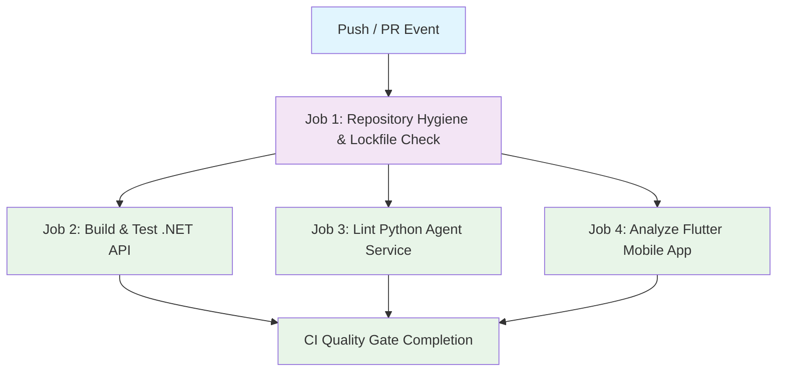

## Workflow Overview

**Purpose**: Continuous integration pipeline ensuring code hygiene, backend compilation, Python agent linting, and Flutter static analysis across all Git Flow integration branches and pull requests.  
**Trigger Events**: `push` and `pull_request` to `main`, `master`, and `development` branches.  
**Target Environments**: GitHub Actions Ubuntu 22.04 LTS runners (`ubuntu-latest`).

## Execution Flow Diagram



## Jobs & Dependencies

| Job Name | Purpose | Dependencies | Execution Context |
|----------|---------|--------------|-------------------|
| `hygiene` | Verifies repository rules (no committed `.env` files, only `bun.lock` lockfile) | None | `ubuntu-latest` |
| `build-api` | Restores dependencies and compiles ASP.NET Core 10 Web API | `hygiene` | `ubuntu-latest` (.NET 10.0.x) |
| `lint-python` | Verifies Python 3.12 dependencies and executes Ruff lint checks on agent service | `hygiene` | `ubuntu-latest` (Python 3.12) |
| `analyze-flutter` | Restores Dart dependencies and runs static analysis on mobile codebase | `hygiene` | `ubuntu-latest` (Flutter Stable) |

## Requirements Matrix

### Functional Requirements
| ID | Requirement | Priority | Acceptance Criteria |
|----|-------------|----------|-------------------|
| REQ-001 | Disallowed Lockfile Rejection | High | Fails immediately if `package-lock.json`, `yarn.lock`, or `pnpm-lock.yaml` are present in repo. |
| REQ-002 | Secret and Environment File Guard | High | Fails if non-example `.env` files are pushed. |
| REQ-003 | ASP.NET Core Compilation | High | Restores and builds `Aveline.Api/Aveline.Api.csproj` without errors. |
| REQ-004 | Python Agent Validation | Medium | Validates syntax and linting with `ruff` across `agnet-service/app/`. |
| REQ-005 | Flutter Static Analysis | Medium | Runs `flutter analyze` with `--no-fatal-infos` on `frontend/aveline_mobile`. |
| REQ-006 | Concurrent Run Cancellation | Medium | Automatically cancels outdated in-progress runs for the same branch ref. |

### Security Requirements
| ID | Requirement | Implementation Constraint |
|----|-------------|---------------------------|
| SEC-001 | No Plaintext Secrets in CI | No repository secrets are logged or echoed in steps. |
| SEC-002 | Isolated Runner Isolation | Runs on standard GitHub-hosted ephemeral virtual environments. |

### Performance Requirements
| ID | Metric | Target | Measurement Method |
|----|-------|--------|-------------------|
| PERF-001 | Total Workflow Duration | < 4 minutes | GitHub Actions workflow execution timer. |
| PERF-002 | Parallel Job Execution | 3 parallel sub-jobs | `build-api`, `lint-python`, and `analyze-flutter` run concurrently after `hygiene`. |

## Input/Output Contracts

### Inputs

```yaml
# Trigger Branches
branches: [main, master, development]

# Event Types
events: [push, pull_request]
```

### Outputs

```yaml
# Status Indicators
workflow_status: success | failure
```

### Secrets & Variables

| Type | Name | Purpose | Scope |
|------|------|---------|-------|
| System Variable | `GITHUB_TOKEN` | Read-only checkout access | Workflow |

## Execution Constraints

### Runtime Constraints
- **Timeout**: 15 minutes per job default.
- **Concurrency**: Grouped by `${{ github.workflow }}-${{ github.ref }}` with `cancel-in-progress: true`.

### Environmental Constraints
- **Runner Requirements**: `ubuntu-latest`
- **Permissions**: Default `contents: read`

## Error Handling Strategy

| Error Type | Response | Recovery Action |
|------------|----------|-----------------|
| Hygiene Failure | Fails pipeline before build jobs start | Remove disallowed lockfile / `.env` file and re-push. |
| .NET Build Failure | Fails `build-api` job with compiler errors | Fix C# compilation or missing references locally. |
| Python Lint Failure | Fails `lint-python` job with Ruff report | Run `ruff check --fix` locally and push updates. |
| Flutter Analyze Failure | Fails `analyze-flutter` job with analysis report | Run `flutter analyze` locally to resolve lint issues. |

## Quality Gates

| Gate | Criteria | Bypass Conditions |
|------|----------|-------------------|
| Repository Hygiene | Zero non-bun lockfiles, zero committed `.env` files | None |
| Backend Build | Clean `dotnet build -c Release` | None |
| Agent Service Lint | Clean Ruff lint pass | Non-blocking warning during early scaffolding phase |
| Mobile Static Analysis | Clean Flutter analyzer report | Non-blocking warning during early scaffolding phase |

## Monitoring & Observability

### Key Metrics
- **Success Rate**: Target 100% on `development` and `main` branches.
- **Execution Time**: Monitored via GitHub Actions run summaries.

## Change Management

1. **Specification Update**: Modify this specification in `spec/spec-process-cicd-ci.md` first.
2. **Implementation**: Update `.github/workflows/ci.yml`.
3. **Validation**: Test on a `feature/*` branch pull request targeting `development`.
