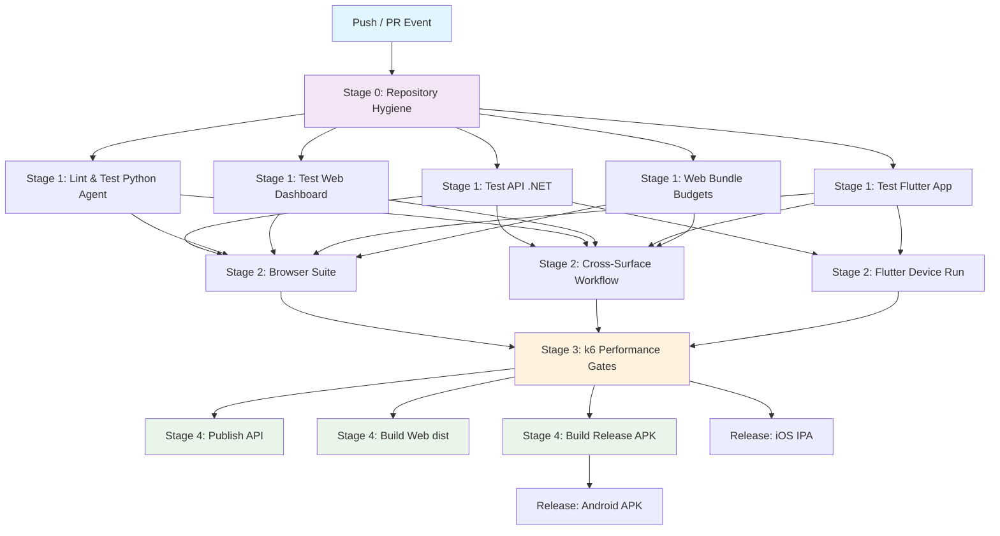

## Workflow Overview

**Purpose**: Continuous integration pipeline that runs every test layer —
file-based suites, a full end-to-end integration workflow against a composed
stack, and k6 performance gates — and only then produces deployment artifacts,
enforces repository hygiene, and security-scans every component (ASP.NET Core
API, Python agent service, Vite web dashboard, Flutter mobile app).

**Trigger Events**: `push` and `pull_request` to `main`, `master`, and
`development`; `workflow_dispatch` for an iOS build dry run.

**Target Environments**: GitHub Actions `ubuntu-latest` runners (macOS for iOS).

**Stage ordering is a contract.** The pipeline runs:

1. **Stage 0** — hygiene.
2. **Stage 1** — file-based tests (all four suites + the web bundle ratchets).
3. **Stage 2** — E2E integration tests (browser suite, cross-surface workflow, Flutter device run).
4. **Stage 3** — k6 performance tests.
5. **Stage 4** — application builds and releases.

No application build step may run before every test stage has passed. The
ordering is expressed with `needs:` only, so GitHub Actions never even schedules
a later stage whose earlier stage is unmet.

## Execution Flow Diagram


```mermaid
graph TD
    Trigger[Push / PR Event] --> Hygiene[Stage 0: Repository Hygiene]

    Hygiene --> TestApi[Stage 1: Test API .NET]
    Hygiene --> TestPython[Stage 1: Lint & Test Python Agent]
    Hygiene --> TestWeb[Stage 1: Test Web Dashboard]
    Hygiene --> TestFlutter[Stage 1: Test Flutter App]
    Hygiene --> PerfWeb[Stage 1: Web Bundle Budgets]

    TestApi --> E2EBrowser[Stage 2: Browser Suite]
    TestPython --> E2EBrowser
    TestWeb --> E2EBrowser
    TestFlutter --> E2EBrowser
    PerfWeb --> E2EBrowser

    TestApi --> E2EIntegration[Stage 2: Cross-Surface Workflow]
    TestPython --> E2EIntegration
    TestWeb --> E2EIntegration
    TestFlutter --> E2EIntegration
    PerfWeb --> E2EIntegration

    TestApi --> FlutterIntegration[Stage 2: Flutter Device Run]
    TestFlutter --> FlutterIntegration

    E2EBrowser --> K6[Stage 3: k6 Performance Gates]
    E2EIntegration --> K6
    FlutterIntegration --> K6

    K6 --> BuildApi[Stage 4: Publish API]
    K6 --> BuildWeb[Stage 4: Build Web dist]
    K6 --> BuildApk[Stage 4: Build Release APK]
    BuildApk --> ReleaseAndroid[Release: Android APK]
    K6 --> ReleaseIos[Release: iOS IPA]

    style Trigger fill:#e1f5fe
    style Hygiene fill:#f3e5f5
    style K6 fill:#fff3e0
    style BuildApi fill:#e8f5e8
    style BuildWeb fill:#e8f5e8
    style BuildApk fill:#e8f5e8
```

## Jobs & Dependencies

| Job | Stage | Purpose | Dependencies |
|-----|-------|---------|--------------|
| `hygiene` | 0 | Repository rules: only `bun.lock` lockfiles, no committed `.env` files | None |
| `test-api` | 1 | Restore, compile, `dotnet test`, coverage gate (≥30% lines), ReportGenerator HTML; uploads coverage | `hygiene` |
| `test-python` | 1 | Ruff lint + pytest with coverage gate (≥90%); uploads coverage | `hygiene` |
| `test-web` | 1 | Bun install, oxlint, three Vitest coverage runs (global / admin / tenant ratchets); uploads coverage | `hygiene` |
| `test-flutter` | 1 | `flutter analyze`, `flutter test --coverage`, mobile line-coverage floor, goldens; uploads lcov | `hygiene` |
| `perf-web` | 1 | Builds a fixture bundle, serves it with production compression headers, runs the byte-level bundle ratchets | `hygiene` |
| `security-scan` | 1 | .NET vulnerable-package scan, `bun audit`, Trivy fs scan (+ SARIF upload) | `hygiene` |
| `zap-baseline` | 1 | OWASP ZAP baseline scan of the booted API; **best effort** (non-blocking) | `hygiene` |
| `observability-config` | 1 | `promtool check config` / `check rules`, compose + collector + Grafana provisioning validation | `hygiene` |
| `e2e-browser` | 2 | The repository Playwright suite (signed-out walks) against a real browser | `test-api`, `test-python`, `test-web`, `test-flutter`, `perf-web` |
| `e2e-integration` | 2 | Boots the composed stack, seeds it, and drives the cross-surface workflow (React/API → agent → PostgreSQL) with nothing stubbed | `test-api`, `test-python`, `test-web`, `test-flutter`, `perf-web` |
| `test-flutter-integration` | 2 | `flutter test integration_test` on an Android emulator — the app driven as installed | `test-api`, `test-python`, `test-web`, `test-flutter`, `perf-web` |
| `k6-performance` | 3 | Boots the composed stack, runs both k6 gates, uploads the raw series and the summary | `e2e-browser`, `e2e-integration`, `test-flutter-integration` |
| `build-api` | 4 | `dotnet publish`, uploads `aveline-api` | `test-api`, `e2e-integration`, `k6-performance` |
| `build-web` | 4 | `tsc -b && vite build`, uploads `aveline-web` | `test-web`, `perf-web`, `e2e-integration`, `k6-performance` |
| `build-flutter-apk` | 4 | Release APK build, uploads `aveline-mobile-apk` | `test-flutter`, `e2e-integration`, `k6-performance` |
| `release-android` | 4 | Publishes the versioned APK GitHub Release (master pushes only) | `build-flutter-apk` |
| `release-ios` | 4 | Builds and publishes the unsigned IPA (master pushes / manual dry run) | `test-flutter`, `e2e-integration`, `k6-performance` |

## Requirements Matrix

### Functional Requirements
| ID | Requirement | Priority | Acceptance Criteria |
|----|-------------|----------|-------------------|
| REQ-001 | Disallowed Lockfile Rejection | High | Fails if `package-lock.json`, `yarn.lock`, `pnpm-lock.yaml` are present. |
| REQ-002 | Secret and Environment File Guard | High | Fails if non-example `.env` files are pushed. |
| REQ-003 | ASP.NET Core Compilation & Tests | High | Restores, compiles, and runs the xUnit suite for `Aveline.Api.sln`. |
| REQ-004 | Python Agent Lint & Tests | High | Ruff passes on `agent-service/app/`; pytest passes on `agent-service/tests/`. |
| REQ-005 | Web Lint & Tests | High | oxlint and the three Vitest coverage runs pass in `frontend/web`. |
| REQ-006 | Flutter Analyze, Tests & Coverage Floor | High | `flutter analyze`, `flutter test --coverage`, the golden test and the measured line-coverage floor pass. |
| REQ-007 | **Test-before-build ordering** | **High** | Every stage-4 build job `needs` `e2e-integration` and `k6-performance`; no build job can be scheduled while any test stage is unmet or failed. |
| REQ-008 | Concurrent Run Cancellation | Medium | Outdated runs for the same branch ref are cancelled. |
| REQ-009 | Coverage Reporting & Gates | High | Coverage collected for all four components and uploaded; gates fail below thresholds (.NET ≥ 30%, web ≥ 80%, Python ≥ 90%, mobile ≥ the committed floor). |
| REQ-010 | OWASP ZAP Baseline | Medium | ZAP baseline scan runs against a locally booted API; report uploaded (best effort). |
| REQ-011 | End-to-End Integration Workflow | High | A spec drives a composed stack (PostgreSQL + API + agent service) end to end and asserts a real agent answer is persisted; the API is not stubbed. |
| REQ-012 | Performance Gates (k6) | High | Both k6 scripts run in CI, exit non-zero on a threshold breach, and their results are retained as artifacts. |
| REQ-013 | Bundle Byte Ratchets | High | The Playwright byte budgets in `tests/performance/budgets.spec.ts` run against a served build in CI. |
| REQ-014 | Flutter Device Run | Medium | `flutter test integration_test` runs on an Android emulator. |

### Security Requirements
| ID | Requirement | Implementation Constraint |
|----|-------------|---------------------------|
| SEC-001 | .NET Vulnerability Scan | `dotnet list package --vulnerable` fails the job when vulnerable packages exist. |
| SEC-002 | Web Dependency Scan | `bun audit --audit-level high` fails on high/critical advisories. |
| SEC-003 | Filesystem Vulnerability Scan | Trivy fs scan (CRITICAL/HIGH, ignore-unfixed) fails the job. |
| SEC-004 | Dependency Alerts | Dependabot opens security alerts + update PRs for all ecosystems. |
| SEC-005 | No Plaintext Secrets in CI | Values come from GitHub Secrets only; k6 credentials are passed with `--env-file`, never as command-line arguments that would appear in the process list. |
| SEC-006 | Least-Privilege Permissions | `contents: read` by default; `security-events: write` only on `security-scan`; `contents: write` only on the release jobs. |
| SEC-007 | Pinned Action and Image References | Every action is pinned to a commit SHA; the k6 image is pinned by digest. |

### Performance Requirements
| ID | Metric | Target | Measurement Method |
|----|-------|--------|-------------------|
| PERF-001 | Parallel Stage-1 Execution | 8 sub-jobs | Stage-1 jobs run concurrently after `hygiene`. |
| PERF-002 | k6 telemetry budget | p(99) < 100 ms | `tests/load/k6-telemetry-overhead.js` threshold; non-zero exit on breach. |
| PERF-003 | k6 read-path budget | p(95) < 300 ms | `tests/load/k6-critical-workflows.js` `browse` scenario threshold. |
| PERF-004 | k6 write-workflow budget | p(95) < 1500 ms | `tests/load/k6-critical-workflows.js` `salon_write` scenario threshold. |

## Input/Output Contracts

### Inputs

```yaml
# Trigger Branches
branches: [main, master, development]

# Event Types
events: [push, pull_request, workflow_dispatch]
```

### Outputs

```yaml
# Status Indicators
workflow_status: success | failure

# Deployment Artifacts
artifacts: aveline-api | aveline-web | aveline-mobile-apk | aveline-mobile-ios

# Test Evidence Artifacts
evidence:
  - aveline-api-coverage
  - aveline-agent-coverage
  - aveline-web-coverage
  - aveline-mobile-coverage
  - aveline-web-bundle-budgets
  - aveline-e2e-browser-report
  - aveline-e2e-integration-report
  - aveline-flutter-integration
  - aveline-k6-performance
```

### Secrets & Variables

| Type | Name | Purpose | Scope |
|------|------|---------|-------|
| System Variable | `GITHUB_TOKEN` | Read-only checkout; `security-events` write for SARIF upload | Workflow |
| Repository Secret | `VITE_CLERK_PUBLISHABLE_KEY` | Inlined into the web bundle; also required for the E2E browser suite (the SPA throws during first render without it) | `build-web`, `perf-web`, `e2e-browser` |
| Repository Secret | `GOOGLE_SERVICES_JSON_BASE64` | Required on pushes; base64 of `android/app/google-services.json` | `build-flutter-apk` |
| Repository Secret | `GOOGLE_SERVICE_INFO_PLIST_BASE64` | Optional; base64 of `ios/Runner/GoogleService-Info.plist` | `release-ios` |

## Execution Constraints

### Runtime Constraints
- **Timeout**: per-job timeouts — 25 min (`e2e-browser`), 45 min (`e2e-integration`), 40 min (`test-flutter-integration`), 35 min (`k6-performance`), 30 min (`build-flutter-apk`), 60 min (`release-ios`).
- **Concurrency**: Grouped by `${{ github.workflow }}-${{ github.ref }}` with `cancel-in-progress: true`.

### Environmental Constraints
- **Runner Requirements**: `ubuntu-latest`; Docker is required by `e2e-integration`, `k6-performance`, `security-scan` (Trivy), `zap-baseline` and `observability-config`.
- **Composed stack**: `e2e-integration` and `k6-performance` need PostgreSQL, Redis, the API, the agent service and a stub OIDC issuer. The boot is shared between the two jobs so they cannot drift.
- **KVM**: `test-flutter-integration` needs `/dev/kvm`, which GitHub's Linux runners provide after the `udev` rule step.
- **Permissions**: `contents: read` globally; `security-events: write` on `security-scan`.

### Flakiness and Environment Dependencies

| Area | Dependency | Mitigation |
|------|-----------|------------|
| `e2e-browser` | A Clerk publishable key. Fork PRs never receive secrets, so the suite is skipped there with a warning rather than failing for an unrelated reason. | Documented; the same convention `build-flutter-apk` uses. |
| `e2e-integration` | Docker, and host ports for Postgres/Redis/API/agent/web. | The runner is a dedicated VM; the stack is torn down in an `if: always()` step. |
| `test-flutter-integration` | A working Android emulator. This is the most environment-sensitive stage. | `ReactiveCircus/android-emulator-runner` with the documented `udev` KVM step; local fallback documented in the test header. |
| `k6-performance` | Timing noise on shared runners. | Thresholds are budgets, not benchmarks; a `SMOKE=1` pre-flight runs on pull requests. |
| `perf-web` | Headless Chrome sometimes cannot paint the SPA, which would make render assertions vacuously pass. | Those assertions skip with a message naming the environment instead of asserting something never observed. |

## Error Handling Strategy

| Error Type | Response | Recovery Action |
|------------|----------|-----------------|
| Hygiene Failure | Fails before any test job starts | Remove the disallowed lockfile / `.env` file and re-push. |
| File-test Failure | Fails its own stage-1 job; no stage-2 job is scheduled | Fix locally (`dotnet test`, `pytest`, `vitest`, `flutter test`, `bun run test:perf`). |
| E2E Failure | Fails `e2e-browser` / `e2e-integration` / `test-flutter-integration`; no k6 or build job is scheduled | Open the uploaded Playwright report and the stack logs; reproduce locally with `scripts/e2e-composed-stack.sh run`. |
| k6 Threshold Breach | k6 exits non-zero; the build jobs are not scheduled | Inspect `aveline-k6-performance`; fix the regression or lower the budget deliberately in the same commit as the comment. |
| Security Finding | Fails `security-scan` with the advisory output | Update the affected dependency. |
| SARIF Upload Failure | Does not fail the pipeline (`if: always()`) | Check Code Scanning availability. |

## Quality Gates

| Gate | Criteria | Bypass Conditions |
|------|----------|-------------------|
| Repository Hygiene | Zero non-bun lockfiles, zero committed `.env` files | None |
| API | Clean build + tests pass + line coverage ≥ 30% | None |
| Agent Service | Ruff + pytest pass + coverage ≥ 90% | None |
| Web Dashboard | oxlint + three Vitest coverage runs pass | None |
| Web Bundle | Five byte-level ratchets pass against a served build | None |
| Flutter App | Analyze + tests + golden + coverage floor pass | None |
| E2E Integration | The cross-surface spec passes against the composed stack | None |
| Performance | Both k6 gates pass and results are retained | None (PRs run the `SMOKE=1` pre-flight profile) |
| Security | No vulnerable .NET packages, bun audit clean, Trivy CRITICAL/HIGH clean | ZAP baseline (best effort, non-blocking) |
| **Ordering** | No build artifact is produced unless every test stage passed | None |

## Monitoring & Observability

### Key Metrics
- **Success Rate**: Target 100% on `development` and `main` branches.
- **Execution Time**: Monitored via GitHub Actions run summaries.
- **Performance**: the k6 summary artifact records p95/p99 and per-threshold pass/fail for each run.
- **Security Alerts**: Dependabot + Code Scanning dashboards in the Security tab.

## Change Management

1. **Specification Update**: Modify this specification in `spec/spec-process-cicd-ci.md` first.
2. **Implementation**: Update `.github/workflows/ci.yml`.
3. **Validation**: Test on a `feature/*` branch pull request targeting `development`.
4. **Ordering**: never relax a stage-4 `needs:` list to skip a test stage. If a build must not depend on a test, the test does not belong in the pipeline.
